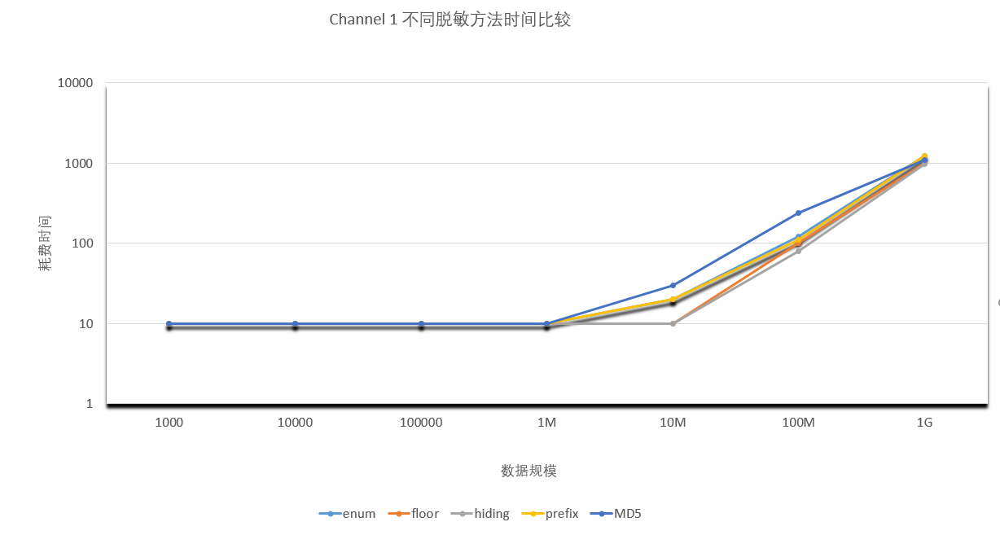
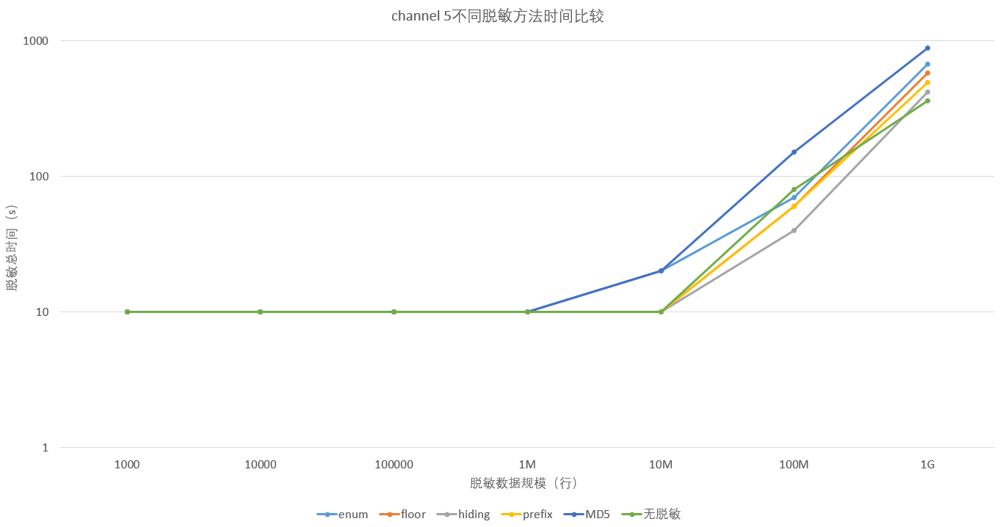
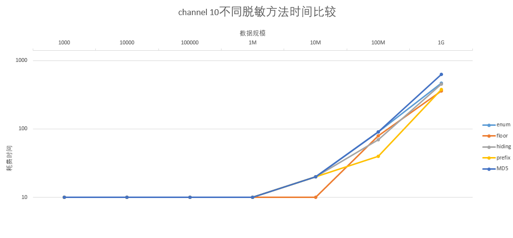
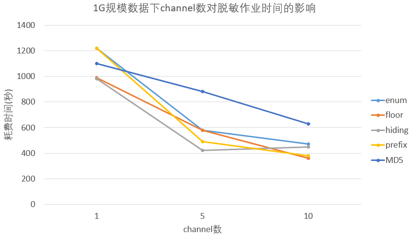

大数据脱敏性能测试
---

# 1. 测试说明
## 1.1 实验目的
得到DataX-Masking在不同数据规模、不同数据集上，几种脱敏方法的性能数据；不同参数设置下的性能表现。

## 1.2	环境配置
* 内存	64GB
* CPU	Intel(R) Core(TM) i7-6850K CPU @ 3.60GHz 12核
* 操作系统	Ubuntu 16.04.2 LTS 
* 硬盘	3TB ST3000DM001-1ER1

## 1.3	测试数据
使用多个txt文件作为数据源，数据量设置为1千行，1万行，10万行，100万行，1千万行，1亿行，10亿行。每行三列数据，类型分别为int，string，float，逗号分隔，参考[数据样例](samples.txt)。

## 1.4 脱敏方法说明
目前测试覆盖了5种常用的脱敏方法：

|脱敏方法名称|描述|示例|
|---|---|---|
|Hiding|将数据置为常量，一般用于处理不需要的敏感字段。|500 ->0 false->true|
|Floor|对整数或浮点数或者日期向下取整。|-12.68->-12 12580->12000 2018-05-10 10:17->2018-05-01 6:00|
|Enumerate|将数字映射为新值，同时保持数据的大小顺序。|500->1500 600->1860 700->2000|
|Prefix Preserve|保持前n位不变，混淆其余部分。可针对字母和数字字符在同为字母或数字范围内进行混淆，特殊符号将保留。|10.199.90.105->10.199.38.154 18965432100->18985214789|
|MD5|不可逆的hash摘要方法。将不定长的数据映射成定长的数据(长度为32的字符串)。|你好世界！->4f025928d787aa7b73beb58c1a85b11d|

# 2. 测试结果

## 2.1 声明
* 数据来源为DataX执行任务后输出的log报告。
* 测试中的主要变量包括：数据规模、并发控制（channel数），并尽可能保证其他变量一致。
## 2.2 数据走势
随着数据规模的增大，作业耗费时间基本随之线性增长。提升channel数虽然能提高效率，但channel数量和性能提高程度并不是线性关系——提高并发要结合实际情况。

channel 1

channel 5

channel 10

处理10亿规模数据，改变channel对脱敏作业时间耗费的影响

## 2.3 结果数据
<table class="MsoNormalTable" border="0" cellspacing="0" cellpadding="0" width="100%" style="width:100.0%;border-collapse:collapse;mso-yfti-tbllook:1184;mso-padding-alt:
 0cm 5.4pt 0cm 5.4pt">
 <tbody><tr style="mso-yfti-irow:0;mso-yfti-firstrow:yes;height:14.25pt">
  <td width="100%" nowrap="" colspan="3" valign="bottom" style="width:100.0%;
  border:solid windowtext 1.0pt;mso-border-alt:solid windowtext .5pt;
  ;padding:0cm 5.4pt 0cm 5.4pt;height:14.25pt">
  
时间解释说明<o:p></o:p>

  </td>
 </tr>
 <tr style="mso-yfti-irow:1;height:14.25pt">
  <td width="15%" nowrap="" valign="bottom" style="width:15.2%;border:solid windowtext 1.0pt;
  border-top:none;mso-border-left-alt:solid windowtext .5pt;mso-border-bottom-alt:
  solid windowtext .5pt;mso-border-right-alt:solid windowtext .5pt;background:
  #DDEBF7;padding:0cm 5.4pt 0cm 5.4pt;height:14.25pt">
  
<b>时间类型<o:p></o:p></b>

  </td>
  <td width="55%" nowrap="" valign="bottom" style="width:55.92%;border-top:none;
  border-left:none;border-bottom:solid windowtext 1.0pt;border-right:solid windowtext 1.0pt;
  mso-border-bottom-alt:solid windowtext .5pt;mso-border-right-alt:solid windowtext .5pt;
  ;padding:0cm 5.4pt 0cm 5.4pt;height:14.25pt">
  
<b>解释说明<o:p></o:p></b>

  </td>
  <td width="28%" nowrap="" valign="bottom" style="width:28.88%;border-top:none;
  border-left:none;border-bottom:solid windowtext 1.0pt;border-right:solid windowtext 1.0pt;
  mso-border-bottom-alt:solid windowtext .5pt;mso-border-right-alt:solid windowtext .5pt;
  ;padding:0cm 5.4pt 0cm 5.4pt;height:14.25pt">
  
<b>补充<o:p></o:p></b>

  </td>
 </tr>
 <tr style="mso-yfti-irow:2;height:14.25pt">
  <td width="15%" nowrap="" style="width:15.2%;border:solid windowtext 1.0pt;
  border-top:none;mso-border-left-alt:solid windowtext .5pt;mso-border-bottom-alt:
  solid windowtext .5pt;mso-border-right-alt:solid windowtext .5pt;background:
  #DDEBF7;padding:0cm 5.4pt 0cm 5.4pt;height:14.25pt">
  
总时间<o:p></o:p>

  </td>
  <td width="55%" nowrap="" valign="bottom" style="width:55.92%;border-top:none;
  border-left:none;border-bottom:solid windowtext 1.0pt;border-right:solid windowtext 1.0pt;
  mso-border-bottom-alt:solid windowtext .5pt;mso-border-right-alt:solid windowtext .5pt;
  ;padding:0cm 5.4pt 0cm 5.4pt;height:14.25pt">
  
处理全部数据的时间 ≈（读时间+transformer时间+写时间）<o:p></o:p>

  </td>
  <td width="28%" nowrap="" valign="bottom" style="width:28.88%;border-top:none;
  border-left:none;border-bottom:solid windowtext 1.0pt;border-right:solid windowtext 1.0pt;
  mso-border-bottom-alt:solid windowtext .5pt;mso-border-right-alt:solid windowtext .5pt;
  ;padding:0cm 5.4pt 0cm 5.4pt;height:14.25pt">
  
最小耗时 = 10s<o:p></o:p>

  </td>
 </tr>
 <tr style="mso-yfti-irow:3;height:14.25pt">
  <td width="15%" nowrap="" style="width:15.2%;border:solid windowtext 1.0pt;
  border-top:none;mso-border-left-alt:solid windowtext .5pt;mso-border-bottom-alt:
  solid windowtext .5pt;mso-border-right-alt:solid windowtext .5pt;background:
  #DDEBF7;padding:0cm 5.4pt 0cm 5.4pt;height:14.25pt">
  
transformer时间<o:p></o:p>

  </td>
  <td width="55%" nowrap="" style="width:55.92%;border-top:none;border-left:none;
  border-bottom:solid windowtext 1.0pt;border-right:solid windowtext 1.0pt;
  mso-border-bottom-alt:solid windowtext .5pt;mso-border-right-alt:solid windowtext .5pt;
  ;padding:0cm 5.4pt 0cm 5.4pt;height:14.25pt">
  
进行数据转换（脱敏）的总计耗时<o:p></o:p>

  </td>
  <td width="28%" rowspan="3" valign="top" style="width:28.88%;border-top:none;
  border-left:none;border-bottom:solid windowtext 1.0pt;border-right:solid windowtext 1.0pt;
  mso-border-left-alt:solid windowtext .5pt;mso-border-left-alt:solid windowtext .5pt;
  mso-border-bottom-alt:solid windowtext .5pt;mso-border-right-alt:solid windowtext .5pt;
  ;padding:0cm 5.4pt 0cm 5.4pt;height:14.25pt">
  
多channel情况channel之间并行执行 
  总计耗时为每个channel耗时之和<o:p></o:p>

  </td>
 </tr>
 <tr style="mso-yfti-irow:4;height:14.25pt">
  <td width="15%" nowrap="" valign="bottom" style="width:15.2%;border:solid windowtext 1.0pt;
  border-top:none;mso-border-left-alt:solid windowtext .5pt;mso-border-bottom-alt:
  solid windowtext .5pt;mso-border-right-alt:solid windowtext .5pt;background:
  #DDEBF7;padding:0cm 5.4pt 0cm 5.4pt;height:14.25pt">
  
reader时间<o:p></o:p>

  </td>
  <td width="55%" nowrap="" valign="bottom" style="width:55.92%;border-top:none;
  border-left:none;border-bottom:solid windowtext 1.0pt;border-right:solid windowtext 1.0pt;
  mso-border-bottom-alt:solid windowtext .5pt;mso-border-right-alt:solid windowtext .5pt;
  ;padding:0cm 5.4pt 0cm 5.4pt;height:14.25pt">
  
进行数据读取的总计耗时<o:p></o:p>

  </td>
 </tr>
 <tr style="mso-yfti-irow:5;mso-yfti-lastrow:yes;height:14.25pt">
  <td width="15%" nowrap="" valign="bottom" style="width:15.2%;border:solid windowtext 1.0pt;
  border-top:none;mso-border-left-alt:solid windowtext .5pt;mso-border-bottom-alt:
  solid windowtext .5pt;mso-border-right-alt:solid windowtext .5pt;background:
  #DDEBF7;padding:0cm 5.4pt 0cm 5.4pt;height:14.25pt">
  
writer时间<o:p></o:p>

  </td>
  <td width="55%" nowrap="" valign="bottom" style="width:55.92%;border-top:none;
  border-left:none;border-bottom:solid windowtext 1.0pt;border-right:solid windowtext 1.0pt;
  mso-border-bottom-alt:solid windowtext .5pt;mso-border-right-alt:solid windowtext .5pt;
  ;padding:0cm 5.4pt 0cm 5.4pt;height:14.25pt">
  
进行数据写入的总计耗时<o:p></o:p>

  </td>
 </tr>
</tbody></table>

### channel = 1
<table class="MsoNormalTable" border="0" cellspacing="0" cellpadding="0" width="100%" style="width:100.0%;border-collapse:collapse;mso-yfti-tbllook:1184;mso-padding-alt:
 0cm 5.4pt 0cm 5.4pt">
 <tbody><tr style="mso-yfti-irow:0;mso-yfti-firstrow:yes;height:14.25pt">
  <td width="26%" nowrap="" rowspan="2" style="width:26.74%;border:solid windowtext 1.0pt;
  mso-border-top-alt:1.0pt;mso-border-left-alt:1.0pt;mso-border-bottom-alt:
  .5pt;mso-border-right-alt:.5pt;mso-border-color-alt:windowtext;mso-border-style-alt:
  solid;padding:0cm 5.4pt 0cm 5.4pt;height:14.25pt">
  
　<o:p></o:p>

  </td>
  <td width="73%" colspan="7" style="width:73.26%;border-top:solid windowtext 1.0pt;
  border-left:none;border-bottom:solid windowtext 1.0pt;border-right:solid black 1.0pt;
  mso-border-top-alt:solid windowtext 1.0pt;mso-border-bottom-alt:solid windowtext .5pt;
  mso-border-right-alt:solid black 1.0pt;background:#70AD47;padding:0cm 5.4pt 0cm 5.4pt;
  height:14.25pt">
  
<b>enum<o:p></o:p></b>

  </td>
 </tr>
 <tr style="mso-yfti-irow:1;height:14.25pt">
  <td width="73%" colspan="7" style="width:73.26%;border-top:none;border-left:
  none;border-bottom:solid windowtext 1.0pt;border-right:solid black 1.0pt;
  mso-border-top-alt:solid windowtext .5pt;mso-border-top-alt:solid windowtext .5pt;
  mso-border-bottom-alt:solid windowtext .5pt;mso-border-right-alt:solid black 1.0pt;
  padding:0cm 5.4pt 0cm 5.4pt;height:14.25pt">
  
（将数字映射为新值，同时保持数据的大小顺序）<o:p></o:p>

  </td>
 </tr>
 <tr style="mso-yfti-irow:2;height:14.25pt">
  <td width="26%" style="width:26.74%;border:solid windowtext 1.0pt;border-top:
  none;mso-border-left-alt:solid windowtext 1.0pt;mso-border-bottom-alt:solid windowtext .5pt;
  mso-border-right-alt:solid windowtext .5pt;padding:0cm 5.4pt 0cm 5.4pt;
  height:14.25pt">
  
<b>数据量（条）<o:p></o:p></b>

  </td>
  <td width="8%" nowrap="" style="width:8.18%;border-top:none;border-left:none;
  border-bottom:solid windowtext 1.0pt;border-right:solid windowtext 1.0pt;
  mso-border-bottom-alt:solid windowtext .5pt;mso-border-right-alt:solid windowtext .5pt;
  padding:0cm 5.4pt 0cm 5.4pt;height:14.25pt">
  
1000<o:p></o:p>

  </td>
  <td width="9%" nowrap="" style="width:9.2%;border-top:none;border-left:none;
  border-bottom:solid windowtext 1.0pt;border-right:solid windowtext 1.0pt;
  mso-border-bottom-alt:solid windowtext .5pt;mso-border-right-alt:solid windowtext .5pt;
  padding:0cm 5.4pt 0cm 5.4pt;height:14.25pt">
  
10000<o:p></o:p>

  </td>
  <td width="10%" nowrap="" style="width:10.94%;border-top:none;border-left:none;
  border-bottom:solid windowtext 1.0pt;border-right:solid windowtext 1.0pt;
  mso-border-bottom-alt:solid windowtext .5pt;mso-border-right-alt:solid windowtext .5pt;
  padding:0cm 5.4pt 0cm 5.4pt;height:14.25pt">
  
100000<o:p></o:p>

  </td>
  <td width="9%" nowrap="" style="width:9.92%;border-top:none;border-left:none;
  border-bottom:solid windowtext 1.0pt;border-right:solid windowtext 1.0pt;
  mso-border-bottom-alt:solid windowtext .5pt;mso-border-right-alt:solid windowtext .5pt;
  padding:0cm 5.4pt 0cm 5.4pt;height:14.25pt">
  
1M<o:p></o:p>

  </td>
  <td width="9%" nowrap="" style="width:9.92%;border-top:none;border-left:none;
  border-bottom:solid windowtext 1.0pt;border-right:solid windowtext 1.0pt;
  mso-border-bottom-alt:solid windowtext .5pt;mso-border-right-alt:solid windowtext .5pt;
  padding:0cm 5.4pt 0cm 5.4pt;height:14.25pt">
  
10M<o:p></o:p>

  </td>
  <td width="11%" nowrap="" style="width:11.66%;border-top:none;border-left:none;
  border-bottom:solid windowtext 1.0pt;border-right:solid windowtext 1.0pt;
  mso-border-bottom-alt:solid windowtext .5pt;mso-border-right-alt:solid windowtext .5pt;
  padding:0cm 5.4pt 0cm 5.4pt;height:14.25pt">
  
100M<o:p></o:p>

  </td>
  <td width="13%" nowrap="" style="width:13.42%;border-top:none;border-left:none;
  border-bottom:solid windowtext 1.0pt;border-right:solid windowtext 1.0pt;
  mso-border-bottom-alt:solid windowtext .5pt;mso-border-right-alt:solid windowtext 1.0pt;
  padding:0cm 5.4pt 0cm 5.4pt;height:14.25pt">
  
1G<o:p></o:p>

  </td>
 </tr>
 <tr style="mso-yfti-irow:3;height:14.25pt">
  <td width="26%" nowrap="" style="width:26.74%;border:solid windowtext 1.0pt;
  border-top:none;mso-border-left-alt:solid windowtext 1.0pt;mso-border-bottom-alt:
  solid windowtext .5pt;mso-border-right-alt:solid windowtext .5pt;padding:
  0cm 5.4pt 0cm 5.4pt;height:14.25pt">
  
<b>总时间（s）<o:p></o:p></b>

  </td>
  <td width="8%" nowrap="" style="width:8.18%;border-top:none;border-left:none;
  border-bottom:solid windowtext 1.0pt;border-right:solid windowtext 1.0pt;
  mso-border-bottom-alt:solid windowtext .5pt;mso-border-right-alt:solid windowtext .5pt;
  padding:0cm 5.4pt 0cm 5.4pt;height:14.25pt">
  
10<o:p></o:p>

  </td>
  <td width="9%" nowrap="" style="width:9.2%;border-top:none;border-left:none;
  border-bottom:solid windowtext 1.0pt;border-right:solid windowtext 1.0pt;
  mso-border-bottom-alt:solid windowtext .5pt;mso-border-right-alt:solid windowtext .5pt;
  padding:0cm 5.4pt 0cm 5.4pt;height:14.25pt">
  
10<o:p></o:p>

  </td>
  <td width="10%" nowrap="" style="width:10.94%;border-top:none;border-left:none;
  border-bottom:solid windowtext 1.0pt;border-right:solid windowtext 1.0pt;
  mso-border-bottom-alt:solid windowtext .5pt;mso-border-right-alt:solid windowtext .5pt;
  padding:0cm 5.4pt 0cm 5.4pt;height:14.25pt">
  
10<o:p></o:p>

  </td>
  <td width="9%" nowrap="" style="width:9.92%;border-top:none;border-left:none;
  border-bottom:solid windowtext 1.0pt;border-right:solid windowtext 1.0pt;
  mso-border-bottom-alt:solid windowtext .5pt;mso-border-right-alt:solid windowtext .5pt;
  padding:0cm 5.4pt 0cm 5.4pt;height:14.25pt">
  
10<o:p></o:p>

  </td>
  <td width="9%" nowrap="" style="width:9.92%;border-top:none;border-left:none;
  border-bottom:solid windowtext 1.0pt;border-right:solid windowtext 1.0pt;
  mso-border-bottom-alt:solid windowtext .5pt;mso-border-right-alt:solid windowtext .5pt;
  padding:0cm 5.4pt 0cm 5.4pt;height:14.25pt">
  
20<o:p></o:p>

  </td>
  <td width="11%" nowrap="" style="width:11.66%;border-top:none;border-left:none;
  border-bottom:solid windowtext 1.0pt;border-right:solid windowtext 1.0pt;
  mso-border-bottom-alt:solid windowtext .5pt;mso-border-right-alt:solid windowtext .5pt;
  padding:0cm 5.4pt 0cm 5.4pt;height:14.25pt">
  
70<o:p></o:p>

  </td>
  <td width="13%" nowrap="" style="width:13.42%;border-top:none;border-left:none;
  border-bottom:solid windowtext 1.0pt;border-right:solid windowtext 1.0pt;
  mso-border-bottom-alt:solid windowtext .5pt;mso-border-right-alt:solid windowtext 1.0pt;
  padding:0cm 5.4pt 0cm 5.4pt;height:14.25pt">
  
670<o:p></o:p>

  </td>
 </tr>
 <tr style="mso-yfti-irow:4;height:14.25pt">
  <td width="26%" style="width:26.74%;border:solid windowtext 1.0pt;border-top:
  none;mso-border-left-alt:solid windowtext 1.0pt;mso-border-bottom-alt:solid windowtext .5pt;
  mso-border-right-alt:solid windowtext .5pt;padding:0cm 5.4pt 0cm 5.4pt;
  height:14.25pt">
  
<b>transformer</b><b>脱敏时间（s）<o:p></o:p></b>

  </td>
  <td width="8%" nowrap="" style="width:8.18%;border-top:none;border-left:none;
  border-bottom:solid windowtext 1.0pt;border-right:solid windowtext 1.0pt;
  mso-border-bottom-alt:solid windowtext .5pt;mso-border-right-alt:solid windowtext .5pt;
  padding:0cm 5.4pt 0cm 5.4pt;height:14.25pt">
  
0.056<o:p></o:p>

  </td>
  <td width="9%" nowrap="" style="width:9.2%;border-top:none;border-left:none;
  border-bottom:solid windowtext 1.0pt;border-right:solid windowtext 1.0pt;
  mso-border-bottom-alt:solid windowtext .5pt;mso-border-right-alt:solid windowtext .5pt;
  padding:0cm 5.4pt 0cm 5.4pt;height:14.25pt">
  
0.319<o:p></o:p>

  </td>
  <td width="10%" nowrap="" style="width:10.94%;border-top:none;border-left:none;
  border-bottom:solid windowtext 1.0pt;border-right:solid windowtext 1.0pt;
  mso-border-bottom-alt:solid windowtext .5pt;mso-border-right-alt:solid windowtext .5pt;
  padding:0cm 5.4pt 0cm 5.4pt;height:14.25pt">
  
4.252<o:p></o:p>

  </td>
  <td width="9%" nowrap="" style="width:9.92%;border-top:none;border-left:none;
  border-bottom:solid windowtext 1.0pt;border-right:solid windowtext 1.0pt;
  mso-border-bottom-alt:solid windowtext .5pt;mso-border-right-alt:solid windowtext .5pt;
  padding:0cm 5.4pt 0cm 5.4pt;height:14.25pt">
  
1.837<o:p></o:p>

  </td>
  <td width="9%" nowrap="" style="width:9.92%;border-top:none;border-left:none;
  border-bottom:solid windowtext 1.0pt;border-right:solid windowtext 1.0pt;
  mso-border-bottom-alt:solid windowtext .5pt;mso-border-right-alt:solid windowtext .5pt;
  padding:0cm 5.4pt 0cm 5.4pt;height:14.25pt">
  
13.503<o:p></o:p>

  </td>
  <td width="11%" nowrap="" style="width:11.66%;border-top:none;border-left:none;
  border-bottom:solid windowtext 1.0pt;border-right:solid windowtext 1.0pt;
  mso-border-bottom-alt:solid windowtext .5pt;mso-border-right-alt:solid windowtext .5pt;
  padding:0cm 5.4pt 0cm 5.4pt;height:14.25pt">
  
81.333<o:p></o:p>

  </td>
  <td width="13%" nowrap="" style="width:13.42%;border-top:none;border-left:none;
  border-bottom:solid windowtext 1.0pt;border-right:solid windowtext 1.0pt;
  mso-border-bottom-alt:solid windowtext .5pt;mso-border-right-alt:solid windowtext 1.0pt;
  padding:0cm 5.4pt 0cm 5.4pt;height:14.25pt">
  
774.464<o:p></o:p>

  </td>
 </tr>
 <tr style="mso-yfti-irow:5;height:14.25pt">
  <td width="26%" style="width:26.74%;border:solid windowtext 1.0pt;border-top:
  none;mso-border-left-alt:solid windowtext 1.0pt;mso-border-bottom-alt:solid windowtext .5pt;
  mso-border-right-alt:solid windowtext .5pt;padding:0cm 5.4pt 0cm 5.4pt;
  height:14.25pt">
  
<b>reader</b><b>等待时间（s）<o:p></o:p></b>

  </td>
  <td width="8%" nowrap="" style="width:8.18%;border-top:none;border-left:none;
  border-bottom:solid windowtext 1.0pt;border-right:solid windowtext 1.0pt;
  mso-border-bottom-alt:solid windowtext .5pt;mso-border-right-alt:solid windowtext .5pt;
  padding:0cm 5.4pt 0cm 5.4pt;height:14.25pt">
  
0.836<o:p></o:p>

  </td>
  <td width="9%" nowrap="" style="width:9.2%;border-top:none;border-left:none;
  border-bottom:solid windowtext 1.0pt;border-right:solid windowtext 1.0pt;
  mso-border-bottom-alt:solid windowtext .5pt;mso-border-right-alt:solid windowtext .5pt;
  padding:0cm 5.4pt 0cm 5.4pt;height:14.25pt">
  
1.202<o:p></o:p>

  </td>
  <td width="10%" nowrap="" style="width:10.94%;border-top:none;border-left:none;
  border-bottom:solid windowtext 1.0pt;border-right:solid windowtext 1.0pt;
  mso-border-bottom-alt:solid windowtext .5pt;mso-border-right-alt:solid windowtext .5pt;
  padding:0cm 5.4pt 0cm 5.4pt;height:14.25pt">
  
10.288<o:p></o:p>

  </td>
  <td width="9%" nowrap="" style="width:9.92%;border-top:none;border-left:none;
  border-bottom:solid windowtext 1.0pt;border-right:solid windowtext 1.0pt;
  mso-border-bottom-alt:solid windowtext .5pt;mso-border-right-alt:solid windowtext .5pt;
  padding:0cm 5.4pt 0cm 5.4pt;height:14.25pt">
  
8.969<o:p></o:p>

  </td>
  <td width="9%" nowrap="" style="width:9.92%;border-top:none;border-left:none;
  border-bottom:solid windowtext 1.0pt;border-right:solid windowtext 1.0pt;
  mso-border-bottom-alt:solid windowtext .5pt;mso-border-right-alt:solid windowtext .5pt;
  padding:0cm 5.4pt 0cm 5.4pt;height:14.25pt">
  
55.359<o:p></o:p>

  </td>
  <td width="11%" nowrap="" style="width:11.66%;border-top:none;border-left:none;
  border-bottom:solid windowtext 1.0pt;border-right:solid windowtext 1.0pt;
  mso-border-bottom-alt:solid windowtext .5pt;mso-border-right-alt:solid windowtext .5pt;
  padding:0cm 5.4pt 0cm 5.4pt;height:14.25pt">
  
324.091<o:p></o:p>

  </td>
  <td width="13%" nowrap="" style="width:13.42%;border-top:none;border-left:none;
  border-bottom:solid windowtext 1.0pt;border-right:solid windowtext 1.0pt;
  mso-border-bottom-alt:solid windowtext .5pt;mso-border-right-alt:solid windowtext 1.0pt;
  padding:0cm 5.4pt 0cm 5.4pt;height:14.25pt">
  
2653.187<o:p></o:p>

  </td>
 </tr>
 <tr style="mso-yfti-irow:6;height:15.0pt">
  <td width="26%" style="width:26.74%;border:solid windowtext 1.0pt;border-top:
  none;mso-border-left-alt:solid windowtext 1.0pt;mso-border-bottom-alt:solid windowtext 1.0pt;
  mso-border-right-alt:solid windowtext .5pt;padding:0cm 5.4pt 0cm 5.4pt;
  height:15.0pt">
  
<b>writer</b><b>等待时间（s）<o:p></o:p></b>

  </td>
  <td width="8%" nowrap="" style="width:8.18%;border-top:none;border-left:none;
  border-bottom:solid windowtext 1.0pt;border-right:solid windowtext 1.0pt;
  mso-border-bottom-alt:solid windowtext 1.0pt;mso-border-right-alt:solid windowtext .5pt;
  padding:0cm 5.4pt 0cm 5.4pt;height:15.0pt">
  
0.003<o:p></o:p>

  </td>
  <td width="9%" nowrap="" style="width:9.2%;border-top:none;border-left:none;
  border-bottom:solid windowtext 1.0pt;border-right:solid windowtext 1.0pt;
  mso-border-bottom-alt:solid windowtext 1.0pt;mso-border-right-alt:solid windowtext .5pt;
  padding:0cm 5.4pt 0cm 5.4pt;height:15.0pt">
  
0.023<o:p></o:p>

  </td>
  <td width="10%" nowrap="" style="width:10.94%;border-top:none;border-left:none;
  border-bottom:solid windowtext 1.0pt;border-right:solid windowtext 1.0pt;
  mso-border-bottom-alt:solid windowtext 1.0pt;mso-border-right-alt:solid windowtext .5pt;
  padding:0cm 5.4pt 0cm 5.4pt;height:15.0pt">
  
0.091<o:p></o:p>

  </td>
  <td width="9%" nowrap="" style="width:9.92%;border-top:none;border-left:none;
  border-bottom:solid windowtext 1.0pt;border-right:solid windowtext 1.0pt;
  mso-border-bottom-alt:solid windowtext 1.0pt;mso-border-right-alt:solid windowtext .5pt;
  padding:0cm 5.4pt 0cm 5.4pt;height:15.0pt">
  
0.113<o:p></o:p>

  </td>
  <td width="9%" nowrap="" style="width:9.92%;border-top:none;border-left:none;
  border-bottom:solid windowtext 1.0pt;border-right:solid windowtext 1.0pt;
  mso-border-bottom-alt:solid windowtext 1.0pt;mso-border-right-alt:solid windowtext .5pt;
  padding:0cm 5.4pt 0cm 5.4pt;height:15.0pt">
  
2.825<o:p></o:p>

  </td>
  <td width="11%" nowrap="" style="width:11.66%;border-top:none;border-left:none;
  border-bottom:solid windowtext 1.0pt;border-right:solid windowtext 1.0pt;
  mso-border-bottom-alt:solid windowtext 1.0pt;mso-border-right-alt:solid windowtext .5pt;
  padding:0cm 5.4pt 0cm 5.4pt;height:15.0pt">
  
8.402<o:p></o:p>

  </td>
  <td width="13%" nowrap="" style="width:13.42%;border-top:none;border-left:none;
  border-bottom:solid windowtext 1.0pt;border-right:solid windowtext 1.0pt;
  padding:0cm 5.4pt 0cm 5.4pt;height:15.0pt">
  
170.401<o:p></o:p>

  </td>
 </tr>
 <tr style="mso-yfti-irow:7;height:15.0pt">
  <td width="26%" nowrap="" valign="bottom" style="width:26.74%;padding:0cm 5.4pt 0cm 5.4pt;
  height:15.0pt"></td>
  <td width="8%" nowrap="" valign="bottom" style="width:8.18%;padding:0cm 5.4pt 0cm 5.4pt;
  height:15.0pt"></td>
  <td width="9%" nowrap="" valign="bottom" style="width:9.2%;padding:0cm 5.4pt 0cm 5.4pt;
  height:15.0pt"></td>
  <td width="10%" nowrap="" valign="bottom" style="width:10.94%;padding:0cm 5.4pt 0cm 5.4pt;
  height:15.0pt"></td>
  <td width="9%" nowrap="" valign="bottom" style="width:9.92%;padding:0cm 5.4pt 0cm 5.4pt;
  height:15.0pt"></td>
  <td width="9%" nowrap="" valign="bottom" style="width:9.92%;padding:0cm 5.4pt 0cm 5.4pt;
  height:15.0pt"></td>
  <td width="11%" nowrap="" valign="bottom" style="width:11.66%;padding:0cm 5.4pt 0cm 5.4pt;
  height:15.0pt"></td>
  <td width="13%" nowrap="" valign="bottom" style="width:13.42%;padding:0cm 5.4pt 0cm 5.4pt;
  height:15.0pt"></td>
 </tr>
 <tr style="mso-yfti-irow:8;height:14.25pt">
  <td width="26%" nowrap="" rowspan="2" style="width:26.74%;border:solid windowtext 1.0pt;
  mso-border-top-alt:1.0pt;mso-border-left-alt:1.0pt;mso-border-bottom-alt:
  .5pt;mso-border-right-alt:.5pt;mso-border-color-alt:windowtext;mso-border-style-alt:
  solid;padding:0cm 5.4pt 0cm 5.4pt;height:14.25pt">
  
　<o:p></o:p>

  </td>
  <td width="73%" colspan="7" style="width:73.26%;border-top:solid windowtext 1.0pt;
  border-left:none;border-bottom:solid windowtext 1.0pt;border-right:solid black 1.0pt;
  mso-border-top-alt:solid windowtext 1.0pt;mso-border-bottom-alt:solid windowtext .5pt;
  mso-border-right-alt:solid black 1.0pt;background:#70AD47;padding:0cm 5.4pt 0cm 5.4pt;
  height:14.25pt">
  
<b>floor<o:p></o:p></b>

  </td>
 </tr>
 <tr style="mso-yfti-irow:9;height:14.25pt">
  <td width="73%" colspan="7" style="width:73.26%;border-top:none;border-left:
  none;border-bottom:solid windowtext 1.0pt;border-right:solid black 1.0pt;
  mso-border-top-alt:solid windowtext .5pt;mso-border-top-alt:solid windowtext .5pt;
  mso-border-bottom-alt:solid windowtext .5pt;mso-border-right-alt:solid black 1.0pt;
  padding:0cm 5.4pt 0cm 5.4pt;height:14.25pt">
  
（对整数或浮点数或者日期向下取整）<o:p></o:p>

  </td>
 </tr>
 <tr style="mso-yfti-irow:10;height:14.25pt">
  <td width="26%" style="width:26.74%;border:solid windowtext 1.0pt;border-top:
  none;mso-border-left-alt:solid windowtext 1.0pt;mso-border-bottom-alt:solid windowtext .5pt;
  mso-border-right-alt:solid windowtext .5pt;padding:0cm 5.4pt 0cm 5.4pt;
  height:14.25pt">
  
<b>数据量（条）<o:p></o:p></b>

  </td>
  <td width="8%" nowrap="" style="width:8.18%;border-top:none;border-left:none;
  border-bottom:solid windowtext 1.0pt;border-right:solid windowtext 1.0pt;
  mso-border-bottom-alt:solid windowtext .5pt;mso-border-right-alt:solid windowtext .5pt;
  padding:0cm 5.4pt 0cm 5.4pt;height:14.25pt">
  
1000<o:p></o:p>

  </td>
  <td width="9%" nowrap="" style="width:9.2%;border-top:none;border-left:none;
  border-bottom:solid windowtext 1.0pt;border-right:solid windowtext 1.0pt;
  mso-border-bottom-alt:solid windowtext .5pt;mso-border-right-alt:solid windowtext .5pt;
  padding:0cm 5.4pt 0cm 5.4pt;height:14.25pt">
  
10000<o:p></o:p>

  </td>
  <td width="10%" nowrap="" style="width:10.94%;border-top:none;border-left:none;
  border-bottom:solid windowtext 1.0pt;border-right:solid windowtext 1.0pt;
  mso-border-bottom-alt:solid windowtext .5pt;mso-border-right-alt:solid windowtext .5pt;
  padding:0cm 5.4pt 0cm 5.4pt;height:14.25pt">
  
100000<o:p></o:p>

  </td>
  <td width="9%" nowrap="" style="width:9.92%;border-top:none;border-left:none;
  border-bottom:solid windowtext 1.0pt;border-right:solid windowtext 1.0pt;
  mso-border-bottom-alt:solid windowtext .5pt;mso-border-right-alt:solid windowtext .5pt;
  padding:0cm 5.4pt 0cm 5.4pt;height:14.25pt">
  
1M<o:p></o:p>

  </td>
  <td width="9%" nowrap="" style="width:9.92%;border-top:none;border-left:none;
  border-bottom:solid windowtext 1.0pt;border-right:solid windowtext 1.0pt;
  mso-border-bottom-alt:solid windowtext .5pt;mso-border-right-alt:solid windowtext .5pt;
  padding:0cm 5.4pt 0cm 5.4pt;height:14.25pt">
  
10M<o:p></o:p>

  </td>
  <td width="11%" nowrap="" style="width:11.66%;border-top:none;border-left:none;
  border-bottom:solid windowtext 1.0pt;border-right:solid windowtext 1.0pt;
  mso-border-bottom-alt:solid windowtext .5pt;mso-border-right-alt:solid windowtext .5pt;
  padding:0cm 5.4pt 0cm 5.4pt;height:14.25pt">
  
100M<o:p></o:p>

  </td>
  <td width="13%" nowrap="" style="width:13.42%;border-top:none;border-left:none;
  border-bottom:solid windowtext 1.0pt;border-right:solid windowtext 1.0pt;
  mso-border-bottom-alt:solid windowtext .5pt;mso-border-right-alt:solid windowtext 1.0pt;
  padding:0cm 5.4pt 0cm 5.4pt;height:14.25pt">
  
1G<o:p></o:p>

  </td>
 </tr>
 <tr style="mso-yfti-irow:11;height:14.25pt">
  <td width="26%" nowrap="" style="width:26.74%;border:solid windowtext 1.0pt;
  border-top:none;mso-border-left-alt:solid windowtext 1.0pt;mso-border-bottom-alt:
  solid windowtext .5pt;mso-border-right-alt:solid windowtext .5pt;padding:
  0cm 5.4pt 0cm 5.4pt;height:14.25pt">
  
<b>总时间（s）<o:p></o:p></b>

  </td>
  <td width="8%" nowrap="" style="width:8.18%;border-top:none;border-left:none;
  border-bottom:solid windowtext 1.0pt;border-right:solid windowtext 1.0pt;
  mso-border-bottom-alt:solid windowtext .5pt;mso-border-right-alt:solid windowtext .5pt;
  padding:0cm 5.4pt 0cm 5.4pt;height:14.25pt">
  
10<o:p></o:p>

  </td>
  <td width="9%" nowrap="" style="width:9.2%;border-top:none;border-left:none;
  border-bottom:solid windowtext 1.0pt;border-right:solid windowtext 1.0pt;
  mso-border-bottom-alt:solid windowtext .5pt;mso-border-right-alt:solid windowtext .5pt;
  padding:0cm 5.4pt 0cm 5.4pt;height:14.25pt">
  
10<o:p></o:p>

  </td>
  <td width="10%" nowrap="" style="width:10.94%;border-top:none;border-left:none;
  border-bottom:solid windowtext 1.0pt;border-right:solid windowtext 1.0pt;
  mso-border-bottom-alt:solid windowtext .5pt;mso-border-right-alt:solid windowtext .5pt;
  padding:0cm 5.4pt 0cm 5.4pt;height:14.25pt">
  
10<o:p></o:p>

  </td>
  <td width="9%" nowrap="" style="width:9.92%;border-top:none;border-left:none;
  border-bottom:solid windowtext 1.0pt;border-right:solid windowtext 1.0pt;
  mso-border-bottom-alt:solid windowtext .5pt;mso-border-right-alt:solid windowtext .5pt;
  padding:0cm 5.4pt 0cm 5.4pt;height:14.25pt">
  
10<o:p></o:p>

  </td>
  <td width="9%" nowrap="" style="width:9.92%;border-top:none;border-left:none;
  border-bottom:solid windowtext 1.0pt;border-right:solid windowtext 1.0pt;
  mso-border-bottom-alt:solid windowtext .5pt;mso-border-right-alt:solid windowtext .5pt;
  padding:0cm 5.4pt 0cm 5.4pt;height:14.25pt">
  
10<o:p></o:p>

  </td>
  <td width="11%" nowrap="" style="width:11.66%;border-top:none;border-left:none;
  border-bottom:solid windowtext 1.0pt;border-right:solid windowtext 1.0pt;
  mso-border-bottom-alt:solid windowtext .5pt;mso-border-right-alt:solid windowtext .5pt;
  padding:0cm 5.4pt 0cm 5.4pt;height:14.25pt">
  
60<o:p></o:p>

  </td>
  <td width="13%" nowrap="" style="width:13.42%;border-top:none;border-left:none;
  border-bottom:solid windowtext 1.0pt;border-right:solid windowtext 1.0pt;
  mso-border-bottom-alt:solid windowtext .5pt;mso-border-right-alt:solid windowtext 1.0pt;
  padding:0cm 5.4pt 0cm 5.4pt;height:14.25pt">
  
580<o:p></o:p>

  </td>
 </tr>
 <tr style="mso-yfti-irow:12;height:14.25pt">
  <td width="26%" style="width:26.74%;border:solid windowtext 1.0pt;border-top:
  none;mso-border-left-alt:solid windowtext 1.0pt;mso-border-bottom-alt:solid windowtext .5pt;
  mso-border-right-alt:solid windowtext .5pt;padding:0cm 5.4pt 0cm 5.4pt;
  height:14.25pt">
  
<b>transformer</b><b>脱敏时间（s）<o:p></o:p></b>

  </td>
  <td width="8%" nowrap="" style="width:8.18%;border-top:none;border-left:none;
  border-bottom:solid windowtext 1.0pt;border-right:solid windowtext 1.0pt;
  mso-border-bottom-alt:solid windowtext .5pt;mso-border-right-alt:solid windowtext .5pt;
  padding:0cm 5.4pt 0cm 5.4pt;height:14.25pt">
  
0.04<o:p></o:p>

  </td>
  <td width="9%" nowrap="" style="width:9.2%;border-top:none;border-left:none;
  border-bottom:solid windowtext 1.0pt;border-right:solid windowtext 1.0pt;
  mso-border-bottom-alt:solid windowtext .5pt;mso-border-right-alt:solid windowtext .5pt;
  padding:0cm 5.4pt 0cm 5.4pt;height:14.25pt">
  
0.23<o:p></o:p>

  </td>
  <td width="10%" nowrap="" style="width:10.94%;border-top:none;border-left:none;
  border-bottom:solid windowtext 1.0pt;border-right:solid windowtext 1.0pt;
  mso-border-bottom-alt:solid windowtext .5pt;mso-border-right-alt:solid windowtext .5pt;
  padding:0cm 5.4pt 0cm 5.4pt;height:14.25pt">
  
0.408<o:p></o:p>

  </td>
  <td width="9%" nowrap="" style="width:9.92%;border-top:none;border-left:none;
  border-bottom:solid windowtext 1.0pt;border-right:solid windowtext 1.0pt;
  mso-border-bottom-alt:solid windowtext .5pt;mso-border-right-alt:solid windowtext .5pt;
  padding:0cm 5.4pt 0cm 5.4pt;height:14.25pt">
  
0.812<o:p></o:p>

  </td>
  <td width="9%" nowrap="" style="width:9.92%;border-top:none;border-left:none;
  border-bottom:solid windowtext 1.0pt;border-right:solid windowtext 1.0pt;
  mso-border-bottom-alt:solid windowtext .5pt;mso-border-right-alt:solid windowtext .5pt;
  padding:0cm 5.4pt 0cm 5.4pt;height:14.25pt">
  
4.405<o:p></o:p>

  </td>
  <td width="11%" nowrap="" style="width:11.66%;border-top:none;border-left:none;
  border-bottom:solid windowtext 1.0pt;border-right:solid windowtext 1.0pt;
  mso-border-bottom-alt:solid windowtext .5pt;mso-border-right-alt:solid windowtext .5pt;
  padding:0cm 5.4pt 0cm 5.4pt;height:14.25pt">
  
36.639<o:p></o:p>

  </td>
  <td width="13%" nowrap="" style="width:13.42%;border-top:none;border-left:none;
  border-bottom:solid windowtext 1.0pt;border-right:solid windowtext 1.0pt;
  mso-border-bottom-alt:solid windowtext .5pt;mso-border-right-alt:solid windowtext 1.0pt;
  padding:0cm 5.4pt 0cm 5.4pt;height:14.25pt">
  
310.808<o:p></o:p>

  </td>
 </tr>
 <tr style="mso-yfti-irow:13;height:14.25pt">
  <td width="26%" style="width:26.74%;border:solid windowtext 1.0pt;border-top:
  none;mso-border-left-alt:solid windowtext 1.0pt;mso-border-bottom-alt:solid windowtext .5pt;
  mso-border-right-alt:solid windowtext .5pt;padding:0cm 5.4pt 0cm 5.4pt;
  height:14.25pt">
  
<b>reader</b><b>等待时间（s）<o:p></o:p></b>

  </td>
  <td width="8%" nowrap="" style="width:8.18%;border-top:none;border-left:none;
  border-bottom:solid windowtext 1.0pt;border-right:solid windowtext 1.0pt;
  mso-border-bottom-alt:solid windowtext .5pt;mso-border-right-alt:solid windowtext .5pt;
  padding:0cm 5.4pt 0cm 5.4pt;height:14.25pt">
  
0.329<o:p></o:p>

  </td>
  <td width="9%" nowrap="" style="width:9.2%;border-top:none;border-left:none;
  border-bottom:solid windowtext 1.0pt;border-right:solid windowtext 1.0pt;
  mso-border-bottom-alt:solid windowtext .5pt;mso-border-right-alt:solid windowtext .5pt;
  padding:0cm 5.4pt 0cm 5.4pt;height:14.25pt">
  
0.755<o:p></o:p>

  </td>
  <td width="10%" nowrap="" style="width:10.94%;border-top:none;border-left:none;
  border-bottom:solid windowtext 1.0pt;border-right:solid windowtext 1.0pt;
  mso-border-bottom-alt:solid windowtext .5pt;mso-border-right-alt:solid windowtext .5pt;
  padding:0cm 5.4pt 0cm 5.4pt;height:14.25pt">
  
1.761<o:p></o:p>

  </td>
  <td width="9%" nowrap="" style="width:9.92%;border-top:none;border-left:none;
  border-bottom:solid windowtext 1.0pt;border-right:solid windowtext 1.0pt;
  mso-border-bottom-alt:solid windowtext .5pt;mso-border-right-alt:solid windowtext .5pt;
  padding:0cm 5.4pt 0cm 5.4pt;height:14.25pt">
  
6.775<o:p></o:p>

  </td>
  <td width="9%" nowrap="" style="width:9.92%;border-top:none;border-left:none;
  border-bottom:solid windowtext 1.0pt;border-right:solid windowtext 1.0pt;
  mso-border-bottom-alt:solid windowtext .5pt;mso-border-right-alt:solid windowtext .5pt;
  padding:0cm 5.4pt 0cm 5.4pt;height:14.25pt">
  
34.49<o:p></o:p>

  </td>
  <td width="11%" nowrap="" style="width:11.66%;border-top:none;border-left:none;
  border-bottom:solid windowtext 1.0pt;border-right:solid windowtext 1.0pt;
  mso-border-bottom-alt:solid windowtext .5pt;mso-border-right-alt:solid windowtext .5pt;
  padding:0cm 5.4pt 0cm 5.4pt;height:14.25pt">
  
289.341<o:p></o:p>

  </td>
  <td width="13%" nowrap="" style="width:13.42%;border-top:none;border-left:none;
  border-bottom:solid windowtext 1.0pt;border-right:solid windowtext 1.0pt;
  mso-border-bottom-alt:solid windowtext .5pt;mso-border-right-alt:solid windowtext 1.0pt;
  padding:0cm 5.4pt 0cm 5.4pt;height:14.25pt">
  
1596.446<o:p></o:p>

  </td>
 </tr>
 <tr style="mso-yfti-irow:14;height:15.0pt">
  <td width="26%" style="width:26.74%;border:solid windowtext 1.0pt;border-top:
  none;mso-border-left-alt:solid windowtext 1.0pt;mso-border-bottom-alt:solid windowtext 1.0pt;
  mso-border-right-alt:solid windowtext .5pt;padding:0cm 5.4pt 0cm 5.4pt;
  height:15.0pt">
  
<b>writer</b><b>等待时间（s）<o:p></o:p></b>

  </td>
  <td width="8%" nowrap="" style="width:8.18%;border-top:none;border-left:none;
  border-bottom:solid windowtext 1.0pt;border-right:solid windowtext 1.0pt;
  mso-border-bottom-alt:solid windowtext 1.0pt;mso-border-right-alt:solid windowtext .5pt;
  padding:0cm 5.4pt 0cm 5.4pt;height:15.0pt">
  
0.004<o:p></o:p>

  </td>
  <td width="9%" nowrap="" style="width:9.2%;border-top:none;border-left:none;
  border-bottom:solid windowtext 1.0pt;border-right:solid windowtext 1.0pt;
  mso-border-bottom-alt:solid windowtext 1.0pt;mso-border-right-alt:solid windowtext .5pt;
  padding:0cm 5.4pt 0cm 5.4pt;height:15.0pt">
  
0.019<o:p></o:p>

  </td>
  <td width="10%" nowrap="" style="width:10.94%;border-top:none;border-left:none;
  border-bottom:solid windowtext 1.0pt;border-right:solid windowtext 1.0pt;
  mso-border-bottom-alt:solid windowtext 1.0pt;mso-border-right-alt:solid windowtext .5pt;
  padding:0cm 5.4pt 0cm 5.4pt;height:15.0pt">
  
0.036<o:p></o:p>

  </td>
  <td width="9%" nowrap="" style="width:9.92%;border-top:none;border-left:none;
  border-bottom:solid windowtext 1.0pt;border-right:solid windowtext 1.0pt;
  mso-border-bottom-alt:solid windowtext 1.0pt;mso-border-right-alt:solid windowtext .5pt;
  padding:0cm 5.4pt 0cm 5.4pt;height:15.0pt">
  
0.107<o:p></o:p>

  </td>
  <td width="9%" nowrap="" style="width:9.92%;border-top:none;border-left:none;
  border-bottom:solid windowtext 1.0pt;border-right:solid windowtext 1.0pt;
  mso-border-bottom-alt:solid windowtext 1.0pt;mso-border-right-alt:solid windowtext .5pt;
  padding:0cm 5.4pt 0cm 5.4pt;height:15.0pt">
  
0.915<o:p></o:p>

  </td>
  <td width="11%" nowrap="" style="width:11.66%;border-top:none;border-left:none;
  border-bottom:solid windowtext 1.0pt;border-right:solid windowtext 1.0pt;
  mso-border-bottom-alt:solid windowtext 1.0pt;mso-border-right-alt:solid windowtext .5pt;
  padding:0cm 5.4pt 0cm 5.4pt;height:15.0pt">
  
7.932<o:p></o:p>

  </td>
  <td width="13%" nowrap="" style="width:13.42%;border-top:none;border-left:none;
  border-bottom:solid windowtext 1.0pt;border-right:solid windowtext 1.0pt;
  padding:0cm 5.4pt 0cm 5.4pt;height:15.0pt">
  
57.915<o:p></o:p>

  </td>
 </tr>
 <tr style="mso-yfti-irow:15;height:15.0pt">
  <td width="26%" nowrap="" valign="bottom" style="width:26.74%;padding:0cm 5.4pt 0cm 5.4pt;
  height:15.0pt"></td>
  <td width="8%" nowrap="" valign="bottom" style="width:8.18%;padding:0cm 5.4pt 0cm 5.4pt;
  height:15.0pt"></td>
  <td width="9%" nowrap="" valign="bottom" style="width:9.2%;padding:0cm 5.4pt 0cm 5.4pt;
  height:15.0pt"></td>
  <td width="10%" nowrap="" valign="bottom" style="width:10.94%;padding:0cm 5.4pt 0cm 5.4pt;
  height:15.0pt"></td>
  <td width="9%" nowrap="" valign="bottom" style="width:9.92%;padding:0cm 5.4pt 0cm 5.4pt;
  height:15.0pt"></td>
  <td width="9%" nowrap="" valign="bottom" style="width:9.92%;padding:0cm 5.4pt 0cm 5.4pt;
  height:15.0pt"></td>
  <td width="11%" nowrap="" valign="bottom" style="width:11.66%;padding:0cm 5.4pt 0cm 5.4pt;
  height:15.0pt"></td>
  <td width="13%" nowrap="" valign="bottom" style="width:13.42%;padding:0cm 5.4pt 0cm 5.4pt;
  height:15.0pt"></td>
 </tr>
 <tr style="mso-yfti-irow:16;height:14.25pt">
  <td width="26%" nowrap="" rowspan="2" style="width:26.74%;border:solid windowtext 1.0pt;
  mso-border-top-alt:1.0pt;mso-border-left-alt:1.0pt;mso-border-bottom-alt:
  .5pt;mso-border-right-alt:.5pt;mso-border-color-alt:windowtext;mso-border-style-alt:
  solid;padding:0cm 5.4pt 0cm 5.4pt;height:14.25pt">
  
　<o:p></o:p>

  </td>
  <td width="73%" colspan="7" style="width:73.26%;border-top:solid windowtext 1.0pt;
  border-left:none;border-bottom:solid windowtext 1.0pt;border-right:solid black 1.0pt;
  mso-border-top-alt:solid windowtext 1.0pt;mso-border-bottom-alt:solid windowtext .5pt;
  mso-border-right-alt:solid black 1.0pt;background:#70AD47;padding:0cm 5.4pt 0cm 5.4pt;
  height:14.25pt">
  
<b>hiding<o:p></o:p></b>

  </td>
 </tr>
 <tr style="mso-yfti-irow:17;height:14.25pt">
  <td width="73%" colspan="7" style="width:73.26%;border-top:none;border-left:
  none;border-bottom:solid windowtext 1.0pt;border-right:solid black 1.0pt;
  mso-border-top-alt:solid windowtext .5pt;mso-border-top-alt:solid windowtext .5pt;
  mso-border-bottom-alt:solid windowtext .5pt;mso-border-right-alt:solid black 1.0pt;
  padding:0cm 5.4pt 0cm 5.4pt;height:14.25pt">
  
（将数据置为常量，一般用于处理不需要的敏感字段）<o:p></o:p>

  </td>
 </tr>
 <tr style="mso-yfti-irow:18;height:14.25pt">
  <td width="26%" style="width:26.74%;border:solid windowtext 1.0pt;border-top:
  none;mso-border-left-alt:solid windowtext 1.0pt;mso-border-bottom-alt:solid windowtext .5pt;
  mso-border-right-alt:solid windowtext .5pt;padding:0cm 5.4pt 0cm 5.4pt;
  height:14.25pt">
  
<b>数据量（条）<o:p></o:p></b>

  </td>
  <td width="8%" nowrap="" style="width:8.18%;border-top:none;border-left:none;
  border-bottom:solid windowtext 1.0pt;border-right:solid windowtext 1.0pt;
  mso-border-bottom-alt:solid windowtext .5pt;mso-border-right-alt:solid windowtext .5pt;
  padding:0cm 5.4pt 0cm 5.4pt;height:14.25pt">
  
1000<o:p></o:p>

  </td>
  <td width="9%" nowrap="" style="width:9.2%;border-top:none;border-left:none;
  border-bottom:solid windowtext 1.0pt;border-right:solid windowtext 1.0pt;
  mso-border-bottom-alt:solid windowtext .5pt;mso-border-right-alt:solid windowtext .5pt;
  padding:0cm 5.4pt 0cm 5.4pt;height:14.25pt">
  
10000<o:p></o:p>

  </td>
  <td width="10%" nowrap="" style="width:10.94%;border-top:none;border-left:none;
  border-bottom:solid windowtext 1.0pt;border-right:solid windowtext 1.0pt;
  mso-border-bottom-alt:solid windowtext .5pt;mso-border-right-alt:solid windowtext .5pt;
  padding:0cm 5.4pt 0cm 5.4pt;height:14.25pt">
  
100000<o:p></o:p>

  </td>
  <td width="9%" nowrap="" style="width:9.92%;border-top:none;border-left:none;
  border-bottom:solid windowtext 1.0pt;border-right:solid windowtext 1.0pt;
  mso-border-bottom-alt:solid windowtext .5pt;mso-border-right-alt:solid windowtext .5pt;
  padding:0cm 5.4pt 0cm 5.4pt;height:14.25pt">
  
1M<o:p></o:p>

  </td>
  <td width="9%" nowrap="" style="width:9.92%;border-top:none;border-left:none;
  border-bottom:solid windowtext 1.0pt;border-right:solid windowtext 1.0pt;
  mso-border-bottom-alt:solid windowtext .5pt;mso-border-right-alt:solid windowtext .5pt;
  padding:0cm 5.4pt 0cm 5.4pt;height:14.25pt">
  
10M<o:p></o:p>

  </td>
  <td width="11%" nowrap="" style="width:11.66%;border-top:none;border-left:none;
  border-bottom:solid windowtext 1.0pt;border-right:solid windowtext 1.0pt;
  mso-border-bottom-alt:solid windowtext .5pt;mso-border-right-alt:solid windowtext .5pt;
  padding:0cm 5.4pt 0cm 5.4pt;height:14.25pt">
  
100M<o:p></o:p>

  </td>
  <td width="13%" nowrap="" style="width:13.42%;border-top:none;border-left:none;
  border-bottom:solid windowtext 1.0pt;border-right:solid windowtext 1.0pt;
  mso-border-bottom-alt:solid windowtext .5pt;mso-border-right-alt:solid windowtext 1.0pt;
  padding:0cm 5.4pt 0cm 5.4pt;height:14.25pt">
  
1G<o:p></o:p>

  </td>
 </tr>
 <tr style="mso-yfti-irow:19;height:14.25pt">
  <td width="26%" nowrap="" style="width:26.74%;border:solid windowtext 1.0pt;
  border-top:none;mso-border-left-alt:solid windowtext 1.0pt;mso-border-bottom-alt:
  solid windowtext .5pt;mso-border-right-alt:solid windowtext .5pt;padding:
  0cm 5.4pt 0cm 5.4pt;height:14.25pt">
  
<b>总时间（s）<o:p></o:p></b>

  </td>
  <td width="8%" nowrap="" style="width:8.18%;border-top:none;border-left:none;
  border-bottom:solid windowtext 1.0pt;border-right:solid windowtext 1.0pt;
  mso-border-bottom-alt:solid windowtext .5pt;mso-border-right-alt:solid windowtext .5pt;
  padding:0cm 5.4pt 0cm 5.4pt;height:14.25pt">
  
10<o:p></o:p>

  </td>
  <td width="9%" nowrap="" style="width:9.2%;border-top:none;border-left:none;
  border-bottom:solid windowtext 1.0pt;border-right:solid windowtext 1.0pt;
  mso-border-bottom-alt:solid windowtext .5pt;mso-border-right-alt:solid windowtext .5pt;
  padding:0cm 5.4pt 0cm 5.4pt;height:14.25pt">
  
10<o:p></o:p>

  </td>
  <td width="10%" nowrap="" style="width:10.94%;border-top:none;border-left:none;
  border-bottom:solid windowtext 1.0pt;border-right:solid windowtext 1.0pt;
  mso-border-bottom-alt:solid windowtext .5pt;mso-border-right-alt:solid windowtext .5pt;
  padding:0cm 5.4pt 0cm 5.4pt;height:14.25pt">
  
10<o:p></o:p>

  </td>
  <td width="9%" nowrap="" style="width:9.92%;border-top:none;border-left:none;
  border-bottom:solid windowtext 1.0pt;border-right:solid windowtext 1.0pt;
  mso-border-bottom-alt:solid windowtext .5pt;mso-border-right-alt:solid windowtext .5pt;
  padding:0cm 5.4pt 0cm 5.4pt;height:14.25pt">
  
10<o:p></o:p>

  </td>
  <td width="9%" nowrap="" style="width:9.92%;border-top:none;border-left:none;
  border-bottom:solid windowtext 1.0pt;border-right:solid windowtext 1.0pt;
  mso-border-bottom-alt:solid windowtext .5pt;mso-border-right-alt:solid windowtext .5pt;
  padding:0cm 5.4pt 0cm 5.4pt;height:14.25pt">
  
10<o:p></o:p>

  </td>
  <td width="11%" nowrap="" style="width:11.66%;border-top:none;border-left:none;
  border-bottom:solid windowtext 1.0pt;border-right:solid windowtext 1.0pt;
  mso-border-bottom-alt:solid windowtext .5pt;mso-border-right-alt:solid windowtext .5pt;
  padding:0cm 5.4pt 0cm 5.4pt;height:14.25pt">
  
40<o:p></o:p>

  </td>
  <td width="13%" nowrap="" style="width:13.42%;border-top:none;border-left:none;
  border-bottom:solid windowtext 1.0pt;border-right:solid windowtext 1.0pt;
  mso-border-bottom-alt:solid windowtext .5pt;mso-border-right-alt:solid windowtext 1.0pt;
  padding:0cm 5.4pt 0cm 5.4pt;height:14.25pt">
  
420<o:p></o:p>

  </td>
 </tr>
 <tr style="mso-yfti-irow:20;height:14.25pt">
  <td width="26%" style="width:26.74%;border:solid windowtext 1.0pt;border-top:
  none;mso-border-left-alt:solid windowtext 1.0pt;mso-border-bottom-alt:solid windowtext .5pt;
  mso-border-right-alt:solid windowtext .5pt;padding:0cm 5.4pt 0cm 5.4pt;
  height:14.25pt">
  
<b>transformer</b><b>脱敏时间（s）<o:p></o:p></b>

  </td>
  <td width="8%" nowrap="" style="width:8.18%;border-top:none;border-left:none;
  border-bottom:solid windowtext 1.0pt;border-right:solid windowtext 1.0pt;
  mso-border-bottom-alt:solid windowtext .5pt;mso-border-right-alt:solid windowtext .5pt;
  padding:0cm 5.4pt 0cm 5.4pt;height:14.25pt">
  
0.01<o:p></o:p>

  </td>
  <td width="9%" nowrap="" style="width:9.2%;border-top:none;border-left:none;
  border-bottom:solid windowtext 1.0pt;border-right:solid windowtext 1.0pt;
  mso-border-bottom-alt:solid windowtext .5pt;mso-border-right-alt:solid windowtext .5pt;
  padding:0cm 5.4pt 0cm 5.4pt;height:14.25pt">
  
0.043<o:p></o:p>

  </td>
  <td width="10%" nowrap="" style="width:10.94%;border-top:none;border-left:none;
  border-bottom:solid windowtext 1.0pt;border-right:solid windowtext 1.0pt;
  mso-border-bottom-alt:solid windowtext .5pt;mso-border-right-alt:solid windowtext .5pt;
  padding:0cm 5.4pt 0cm 5.4pt;height:14.25pt">
  
0.138<o:p></o:p>

  </td>
  <td width="9%" nowrap="" style="width:9.92%;border-top:none;border-left:none;
  border-bottom:solid windowtext 1.0pt;border-right:solid windowtext 1.0pt;
  mso-border-bottom-alt:solid windowtext .5pt;mso-border-right-alt:solid windowtext .5pt;
  padding:0cm 5.4pt 0cm 5.4pt;height:14.25pt">
  
0.265<o:p></o:p>

  </td>
  <td width="9%" nowrap="" style="width:9.92%;border-top:none;border-left:none;
  border-bottom:solid windowtext 1.0pt;border-right:solid windowtext 1.0pt;
  mso-border-bottom-alt:solid windowtext .5pt;mso-border-right-alt:solid windowtext .5pt;
  padding:0cm 5.4pt 0cm 5.4pt;height:14.25pt">
  
1.325<o:p></o:p>

  </td>
  <td width="11%" nowrap="" style="width:11.66%;border-top:none;border-left:none;
  border-bottom:solid windowtext 1.0pt;border-right:solid windowtext 1.0pt;
  mso-border-bottom-alt:solid windowtext .5pt;mso-border-right-alt:solid windowtext .5pt;
  padding:0cm 5.4pt 0cm 5.4pt;height:14.25pt">
  
11.985<o:p></o:p>

  </td>
  <td width="13%" nowrap="" style="width:13.42%;border-top:none;border-left:none;
  border-bottom:solid windowtext 1.0pt;border-right:solid windowtext 1.0pt;
  mso-border-bottom-alt:solid windowtext .5pt;mso-border-right-alt:solid windowtext 1.0pt;
  padding:0cm 5.4pt 0cm 5.4pt;height:14.25pt">
  
86.237<o:p></o:p>

  </td>
 </tr>
 <tr style="mso-yfti-irow:21;height:14.25pt">
  <td width="26%" style="width:26.74%;border:solid windowtext 1.0pt;border-top:
  none;mso-border-left-alt:solid windowtext 1.0pt;mso-border-bottom-alt:solid windowtext .5pt;
  mso-border-right-alt:solid windowtext .5pt;padding:0cm 5.4pt 0cm 5.4pt;
  height:14.25pt">
  
<b>reader</b><b>等待时间（s）<o:p></o:p></b>

  </td>
  <td width="8%" nowrap="" style="width:8.18%;border-top:none;border-left:none;
  border-bottom:solid windowtext 1.0pt;border-right:solid windowtext 1.0pt;
  mso-border-bottom-alt:solid windowtext .5pt;mso-border-right-alt:solid windowtext .5pt;
  padding:0cm 5.4pt 0cm 5.4pt;height:14.25pt">
  
0.621<o:p></o:p>

  </td>
  <td width="9%" nowrap="" style="width:9.2%;border-top:none;border-left:none;
  border-bottom:solid windowtext 1.0pt;border-right:solid windowtext 1.0pt;
  mso-border-bottom-alt:solid windowtext .5pt;mso-border-right-alt:solid windowtext .5pt;
  padding:0cm 5.4pt 0cm 5.4pt;height:14.25pt">
  
1.457<o:p></o:p>

  </td>
  <td width="10%" nowrap="" style="width:10.94%;border-top:none;border-left:none;
  border-bottom:solid windowtext 1.0pt;border-right:solid windowtext 1.0pt;
  mso-border-bottom-alt:solid windowtext .5pt;mso-border-right-alt:solid windowtext .5pt;
  padding:0cm 5.4pt 0cm 5.4pt;height:14.25pt">
  
2.125<o:p></o:p>

  </td>
  <td width="9%" nowrap="" style="width:9.92%;border-top:none;border-left:none;
  border-bottom:solid windowtext 1.0pt;border-right:solid windowtext 1.0pt;
  mso-border-bottom-alt:solid windowtext .5pt;mso-border-right-alt:solid windowtext .5pt;
  padding:0cm 5.4pt 0cm 5.4pt;height:14.25pt">
  
7.783<o:p></o:p>

  </td>
  <td width="9%" nowrap="" style="width:9.92%;border-top:none;border-left:none;
  border-bottom:solid windowtext 1.0pt;border-right:solid windowtext 1.0pt;
  mso-border-bottom-alt:solid windowtext .5pt;mso-border-right-alt:solid windowtext .5pt;
  padding:0cm 5.4pt 0cm 5.4pt;height:14.25pt">
  
18.264<o:p></o:p>

  </td>
  <td width="11%" nowrap="" style="width:11.66%;border-top:none;border-left:none;
  border-bottom:solid windowtext 1.0pt;border-right:solid windowtext 1.0pt;
  mso-border-bottom-alt:solid windowtext .5pt;mso-border-right-alt:solid windowtext .5pt;
  padding:0cm 5.4pt 0cm 5.4pt;height:14.25pt">
  
153.692<o:p></o:p>

  </td>
  <td width="13%" nowrap="" style="width:13.42%;border-top:none;border-left:none;
  border-bottom:solid windowtext 1.0pt;border-right:solid windowtext 1.0pt;
  mso-border-bottom-alt:solid windowtext .5pt;mso-border-right-alt:solid windowtext 1.0pt;
  padding:0cm 5.4pt 0cm 5.4pt;height:14.25pt">
  
1818.202<o:p></o:p>

  </td>
 </tr>
 <tr style="mso-yfti-irow:22;height:15.0pt">
  <td width="26%" style="width:26.74%;border:solid windowtext 1.0pt;border-top:
  none;mso-border-left-alt:solid windowtext 1.0pt;mso-border-bottom-alt:solid windowtext 1.0pt;
  mso-border-right-alt:solid windowtext .5pt;padding:0cm 5.4pt 0cm 5.4pt;
  height:15.0pt">
  
<b>writer</b><b>等待时间（s）<o:p></o:p></b>

  </td>
  <td width="8%" nowrap="" style="width:8.18%;border-top:none;border-left:none;
  border-bottom:solid windowtext 1.0pt;border-right:solid windowtext 1.0pt;
  mso-border-bottom-alt:solid windowtext 1.0pt;mso-border-right-alt:solid windowtext .5pt;
  padding:0cm 5.4pt 0cm 5.4pt;height:15.0pt">
  
0.012<o:p></o:p>

  </td>
  <td width="9%" nowrap="" style="width:9.2%;border-top:none;border-left:none;
  border-bottom:solid windowtext 1.0pt;border-right:solid windowtext 1.0pt;
  mso-border-bottom-alt:solid windowtext 1.0pt;mso-border-right-alt:solid windowtext .5pt;
  padding:0cm 5.4pt 0cm 5.4pt;height:15.0pt">
  
0.017<o:p></o:p>

  </td>
  <td width="10%" nowrap="" style="width:10.94%;border-top:none;border-left:none;
  border-bottom:solid windowtext 1.0pt;border-right:solid windowtext 1.0pt;
  mso-border-bottom-alt:solid windowtext 1.0pt;mso-border-right-alt:solid windowtext .5pt;
  padding:0cm 5.4pt 0cm 5.4pt;height:15.0pt">
  
0.056<o:p></o:p>

  </td>
  <td width="9%" nowrap="" style="width:9.92%;border-top:none;border-left:none;
  border-bottom:solid windowtext 1.0pt;border-right:solid windowtext 1.0pt;
  mso-border-bottom-alt:solid windowtext 1.0pt;mso-border-right-alt:solid windowtext .5pt;
  padding:0cm 5.4pt 0cm 5.4pt;height:15.0pt">
  
0.292<o:p></o:p>

  </td>
  <td width="9%" nowrap="" style="width:9.92%;border-top:none;border-left:none;
  border-bottom:solid windowtext 1.0pt;border-right:solid windowtext 1.0pt;
  mso-border-bottom-alt:solid windowtext 1.0pt;mso-border-right-alt:solid windowtext .5pt;
  padding:0cm 5.4pt 0cm 5.4pt;height:15.0pt">
  
0.689<o:p></o:p>

  </td>
  <td width="11%" nowrap="" style="width:11.66%;border-top:none;border-left:none;
  border-bottom:solid windowtext 1.0pt;border-right:solid windowtext 1.0pt;
  mso-border-bottom-alt:solid windowtext 1.0pt;mso-border-right-alt:solid windowtext .5pt;
  padding:0cm 5.4pt 0cm 5.4pt;height:15.0pt">
  
6.737<o:p></o:p>

  </td>
  <td width="13%" nowrap="" style="width:13.42%;border-top:none;border-left:none;
  border-bottom:solid windowtext 1.0pt;border-right:solid windowtext 1.0pt;
  padding:0cm 5.4pt 0cm 5.4pt;height:15.0pt">
  
49.119<o:p></o:p>

  </td>
 </tr>
 <tr style="mso-yfti-irow:23;height:15.0pt">
  <td width="26%" nowrap="" valign="bottom" style="width:26.74%;padding:0cm 5.4pt 0cm 5.4pt;
  height:15.0pt"></td>
  <td width="8%" nowrap="" valign="bottom" style="width:8.18%;padding:0cm 5.4pt 0cm 5.4pt;
  height:15.0pt"></td>
  <td width="9%" nowrap="" valign="bottom" style="width:9.2%;padding:0cm 5.4pt 0cm 5.4pt;
  height:15.0pt"></td>
  <td width="10%" nowrap="" valign="bottom" style="width:10.94%;padding:0cm 5.4pt 0cm 5.4pt;
  height:15.0pt"></td>
  <td width="9%" nowrap="" valign="bottom" style="width:9.92%;padding:0cm 5.4pt 0cm 5.4pt;
  height:15.0pt"></td>
  <td width="9%" nowrap="" valign="bottom" style="width:9.92%;padding:0cm 5.4pt 0cm 5.4pt;
  height:15.0pt"></td>
  <td width="11%" nowrap="" valign="bottom" style="width:11.66%;padding:0cm 5.4pt 0cm 5.4pt;
  height:15.0pt"></td>
  <td width="13%" nowrap="" valign="bottom" style="width:13.42%;padding:0cm 5.4pt 0cm 5.4pt;
  height:15.0pt"></td>
 </tr>
 <tr style="mso-yfti-irow:24;height:14.25pt">
  <td width="26%" nowrap="" rowspan="2" style="width:26.74%;border:solid windowtext 1.0pt;
  mso-border-top-alt:1.0pt;mso-border-left-alt:1.0pt;mso-border-bottom-alt:
  .5pt;mso-border-right-alt:.5pt;mso-border-color-alt:windowtext;mso-border-style-alt:
  solid;padding:0cm 5.4pt 0cm 5.4pt;height:14.25pt">
  
　<o:p></o:p>

  </td>
  <td width="73%" colspan="7" style="width:73.26%;border-top:solid windowtext 1.0pt;
  border-left:none;border-bottom:solid windowtext 1.0pt;border-right:solid black 1.0pt;
  mso-border-top-alt:solid windowtext 1.0pt;mso-border-bottom-alt:solid windowtext .5pt;
  mso-border-right-alt:solid black 1.0pt;background:#70AD47;padding:0cm 5.4pt 0cm 5.4pt;
  height:14.25pt">
  
<b>prefix<o:p></o:p></b>

  </td>
 </tr>
 <tr style="mso-yfti-irow:25;height:14.25pt">
  <td width="73%" colspan="7" style="width:73.26%;border-top:none;border-left:
  none;border-bottom:solid windowtext 1.0pt;border-right:solid black 1.0pt;
  mso-border-top-alt:solid windowtext .5pt;mso-border-top-alt:solid windowtext .5pt;
  mso-border-bottom-alt:solid windowtext .5pt;mso-border-right-alt:solid black 1.0pt;
  padding:0cm 5.4pt 0cm 5.4pt;height:14.25pt">
  
（保持前n位不变，混淆其余部分）<o:p></o:p>

  </td>
 </tr>
 <tr style="mso-yfti-irow:26;height:14.25pt">
  <td width="26%" style="width:26.74%;border:solid windowtext 1.0pt;border-top:
  none;mso-border-left-alt:solid windowtext 1.0pt;mso-border-bottom-alt:solid windowtext .5pt;
  mso-border-right-alt:solid windowtext .5pt;padding:0cm 5.4pt 0cm 5.4pt;
  height:14.25pt">
  
<b>数据量（条）<o:p></o:p></b>

  </td>
  <td width="8%" nowrap="" style="width:8.18%;border-top:none;border-left:none;
  border-bottom:solid windowtext 1.0pt;border-right:solid windowtext 1.0pt;
  mso-border-bottom-alt:solid windowtext .5pt;mso-border-right-alt:solid windowtext .5pt;
  padding:0cm 5.4pt 0cm 5.4pt;height:14.25pt">
  
1000<o:p></o:p>

  </td>
  <td width="9%" nowrap="" style="width:9.2%;border-top:none;border-left:none;
  border-bottom:solid windowtext 1.0pt;border-right:solid windowtext 1.0pt;
  mso-border-bottom-alt:solid windowtext .5pt;mso-border-right-alt:solid windowtext .5pt;
  padding:0cm 5.4pt 0cm 5.4pt;height:14.25pt">
  
10000<o:p></o:p>

  </td>
  <td width="10%" nowrap="" style="width:10.94%;border-top:none;border-left:none;
  border-bottom:solid windowtext 1.0pt;border-right:solid windowtext 1.0pt;
  mso-border-bottom-alt:solid windowtext .5pt;mso-border-right-alt:solid windowtext .5pt;
  padding:0cm 5.4pt 0cm 5.4pt;height:14.25pt">
  
100000<o:p></o:p>

  </td>
  <td width="9%" nowrap="" style="width:9.92%;border-top:none;border-left:none;
  border-bottom:solid windowtext 1.0pt;border-right:solid windowtext 1.0pt;
  mso-border-bottom-alt:solid windowtext .5pt;mso-border-right-alt:solid windowtext .5pt;
  padding:0cm 5.4pt 0cm 5.4pt;height:14.25pt">
  
1M<o:p></o:p>

  </td>
  <td width="9%" nowrap="" style="width:9.92%;border-top:none;border-left:none;
  border-bottom:solid windowtext 1.0pt;border-right:solid windowtext 1.0pt;
  mso-border-bottom-alt:solid windowtext .5pt;mso-border-right-alt:solid windowtext .5pt;
  padding:0cm 5.4pt 0cm 5.4pt;height:14.25pt">
  
10M<o:p></o:p>

  </td>
  <td width="11%" nowrap="" style="width:11.66%;border-top:none;border-left:none;
  border-bottom:solid windowtext 1.0pt;border-right:solid windowtext 1.0pt;
  mso-border-bottom-alt:solid windowtext .5pt;mso-border-right-alt:solid windowtext .5pt;
  padding:0cm 5.4pt 0cm 5.4pt;height:14.25pt">
  
100M<o:p></o:p>

  </td>
  <td width="13%" nowrap="" style="width:13.42%;border-top:none;border-left:none;
  border-bottom:solid windowtext 1.0pt;border-right:solid windowtext 1.0pt;
  mso-border-bottom-alt:solid windowtext .5pt;mso-border-right-alt:solid windowtext 1.0pt;
  padding:0cm 5.4pt 0cm 5.4pt;height:14.25pt">
  
1G<o:p></o:p>

  </td>
 </tr>
 <tr style="mso-yfti-irow:27;height:14.25pt">
  <td width="26%" nowrap="" style="width:26.74%;border:solid windowtext 1.0pt;
  border-top:none;mso-border-left-alt:solid windowtext 1.0pt;mso-border-bottom-alt:
  solid windowtext .5pt;mso-border-right-alt:solid windowtext .5pt;padding:
  0cm 5.4pt 0cm 5.4pt;height:14.25pt">
  
<b>总时间（s）<o:p></o:p></b>

  </td>
  <td width="8%" nowrap="" style="width:8.18%;border-top:none;border-left:none;
  border-bottom:solid windowtext 1.0pt;border-right:solid windowtext 1.0pt;
  mso-border-bottom-alt:solid windowtext .5pt;mso-border-right-alt:solid windowtext .5pt;
  padding:0cm 5.4pt 0cm 5.4pt;height:14.25pt">
  
10<o:p></o:p>

  </td>
  <td width="9%" nowrap="" style="width:9.2%;border-top:none;border-left:none;
  border-bottom:solid windowtext 1.0pt;border-right:solid windowtext 1.0pt;
  mso-border-bottom-alt:solid windowtext .5pt;mso-border-right-alt:solid windowtext .5pt;
  padding:0cm 5.4pt 0cm 5.4pt;height:14.25pt">
  
10<o:p></o:p>

  </td>
  <td width="10%" nowrap="" style="width:10.94%;border-top:none;border-left:none;
  border-bottom:solid windowtext 1.0pt;border-right:solid windowtext 1.0pt;
  mso-border-bottom-alt:solid windowtext .5pt;mso-border-right-alt:solid windowtext .5pt;
  padding:0cm 5.4pt 0cm 5.4pt;height:14.25pt">
  
10<o:p></o:p>

  </td>
  <td width="9%" nowrap="" style="width:9.92%;border-top:none;border-left:none;
  border-bottom:solid windowtext 1.0pt;border-right:solid windowtext 1.0pt;
  mso-border-bottom-alt:solid windowtext .5pt;mso-border-right-alt:solid windowtext .5pt;
  padding:0cm 5.4pt 0cm 5.4pt;height:14.25pt">
  
10<o:p></o:p>

  </td>
  <td width="9%" nowrap="" style="width:9.92%;border-top:none;border-left:none;
  border-bottom:solid windowtext 1.0pt;border-right:solid windowtext 1.0pt;
  mso-border-bottom-alt:solid windowtext .5pt;mso-border-right-alt:solid windowtext .5pt;
  padding:0cm 5.4pt 0cm 5.4pt;height:14.25pt">
  
10<o:p></o:p>

  </td>
  <td width="11%" nowrap="" style="width:11.66%;border-top:none;border-left:none;
  border-bottom:solid windowtext 1.0pt;border-right:solid windowtext 1.0pt;
  mso-border-bottom-alt:solid windowtext .5pt;mso-border-right-alt:solid windowtext .5pt;
  padding:0cm 5.4pt 0cm 5.4pt;height:14.25pt">
  
60<o:p></o:p>

  </td>
  <td width="13%" nowrap="" style="width:13.42%;border-top:none;border-left:none;
  border-bottom:solid windowtext 1.0pt;border-right:solid windowtext 1.0pt;
  mso-border-bottom-alt:solid windowtext .5pt;mso-border-right-alt:solid windowtext 1.0pt;
  padding:0cm 5.4pt 0cm 5.4pt;height:14.25pt">
  
490<o:p></o:p>

  </td>
 </tr>
 <tr style="mso-yfti-irow:28;height:14.25pt">
  <td width="26%" style="width:26.74%;border:solid windowtext 1.0pt;border-top:
  none;mso-border-left-alt:solid windowtext 1.0pt;mso-border-bottom-alt:solid windowtext .5pt;
  mso-border-right-alt:solid windowtext .5pt;padding:0cm 5.4pt 0cm 5.4pt;
  height:14.25pt">
  
<b>transformer</b><b>脱敏时间（s）<o:p></o:p></b>

  </td>
  <td width="8%" nowrap="" style="width:8.18%;border-top:none;border-left:none;
  border-bottom:solid windowtext 1.0pt;border-right:solid windowtext 1.0pt;
  mso-border-bottom-alt:solid windowtext .5pt;mso-border-right-alt:solid windowtext .5pt;
  padding:0cm 5.4pt 0cm 5.4pt;height:14.25pt">
  
0.133<o:p></o:p>

  </td>
  <td width="9%" nowrap="" style="width:9.2%;border-top:none;border-left:none;
  border-bottom:solid windowtext 1.0pt;border-right:solid windowtext 1.0pt;
  mso-border-bottom-alt:solid windowtext .5pt;mso-border-right-alt:solid windowtext .5pt;
  padding:0cm 5.4pt 0cm 5.4pt;height:14.25pt">
  
0.205<o:p></o:p>

  </td>
  <td width="10%" nowrap="" style="width:10.94%;border-top:none;border-left:none;
  border-bottom:solid windowtext 1.0pt;border-right:solid windowtext 1.0pt;
  mso-border-bottom-alt:solid windowtext .5pt;mso-border-right-alt:solid windowtext .5pt;
  padding:0cm 5.4pt 0cm 5.4pt;height:14.25pt">
  
0.416<o:p></o:p>

  </td>
  <td width="9%" nowrap="" style="width:9.92%;border-top:none;border-left:none;
  border-bottom:solid windowtext 1.0pt;border-right:solid windowtext 1.0pt;
  mso-border-bottom-alt:solid windowtext .5pt;mso-border-right-alt:solid windowtext .5pt;
  padding:0cm 5.4pt 0cm 5.4pt;height:14.25pt">
  
1.294<o:p></o:p>

  </td>
  <td width="9%" nowrap="" style="width:9.92%;border-top:none;border-left:none;
  border-bottom:solid windowtext 1.0pt;border-right:solid windowtext 1.0pt;
  mso-border-bottom-alt:solid windowtext .5pt;mso-border-right-alt:solid windowtext .5pt;
  padding:0cm 5.4pt 0cm 5.4pt;height:14.25pt">
  
7.666<o:p></o:p>

  </td>
  <td width="11%" nowrap="" style="width:11.66%;border-top:none;border-left:none;
  border-bottom:solid windowtext 1.0pt;border-right:solid windowtext 1.0pt;
  mso-border-bottom-alt:solid windowtext .5pt;mso-border-right-alt:solid windowtext .5pt;
  padding:0cm 5.4pt 0cm 5.4pt;height:14.25pt">
  
73.972<o:p></o:p>

  </td>
  <td width="13%" nowrap="" style="width:13.42%;border-top:none;border-left:none;
  border-bottom:solid windowtext 1.0pt;border-right:solid windowtext 1.0pt;
  mso-border-bottom-alt:solid windowtext .5pt;mso-border-right-alt:solid windowtext 1.0pt;
  padding:0cm 5.4pt 0cm 5.4pt;height:14.25pt">
  
661.793<o:p></o:p>

  </td>
 </tr>
 <tr style="mso-yfti-irow:29;height:14.25pt">
  <td width="26%" style="width:26.74%;border:solid windowtext 1.0pt;border-top:
  none;mso-border-left-alt:solid windowtext 1.0pt;mso-border-bottom-alt:solid windowtext .5pt;
  mso-border-right-alt:solid windowtext .5pt;padding:0cm 5.4pt 0cm 5.4pt;
  height:14.25pt">
  
<b>reader</b><b>等待时间（s）<o:p></o:p></b>

  </td>
  <td width="8%" nowrap="" style="width:8.18%;border-top:none;border-left:none;
  border-bottom:solid windowtext 1.0pt;border-right:solid windowtext 1.0pt;
  mso-border-bottom-alt:solid windowtext .5pt;mso-border-right-alt:solid windowtext .5pt;
  padding:0cm 5.4pt 0cm 5.4pt;height:14.25pt">
  
0.641<o:p></o:p>

  </td>
  <td width="9%" nowrap="" style="width:9.2%;border-top:none;border-left:none;
  border-bottom:solid windowtext 1.0pt;border-right:solid windowtext 1.0pt;
  mso-border-bottom-alt:solid windowtext .5pt;mso-border-right-alt:solid windowtext .5pt;
  padding:0cm 5.4pt 0cm 5.4pt;height:14.25pt">
  
0.818<o:p></o:p>

  </td>
  <td width="10%" nowrap="" style="width:10.94%;border-top:none;border-left:none;
  border-bottom:solid windowtext 1.0pt;border-right:solid windowtext 1.0pt;
  mso-border-bottom-alt:solid windowtext .5pt;mso-border-right-alt:solid windowtext .5pt;
  padding:0cm 5.4pt 0cm 5.4pt;height:14.25pt">
  
1.985<o:p></o:p>

  </td>
  <td width="9%" nowrap="" style="width:9.92%;border-top:none;border-left:none;
  border-bottom:solid windowtext 1.0pt;border-right:solid windowtext 1.0pt;
  mso-border-bottom-alt:solid windowtext .5pt;mso-border-right-alt:solid windowtext .5pt;
  padding:0cm 5.4pt 0cm 5.4pt;height:14.25pt">
  
8.544<o:p></o:p>

  </td>
  <td width="9%" nowrap="" style="width:9.92%;border-top:none;border-left:none;
  border-bottom:solid windowtext 1.0pt;border-right:solid windowtext 1.0pt;
  mso-border-bottom-alt:solid windowtext .5pt;mso-border-right-alt:solid windowtext .5pt;
  padding:0cm 5.4pt 0cm 5.4pt;height:14.25pt">
  
32.279<o:p></o:p>

  </td>
  <td width="11%" nowrap="" style="width:11.66%;border-top:none;border-left:none;
  border-bottom:solid windowtext 1.0pt;border-right:solid windowtext 1.0pt;
  mso-border-bottom-alt:solid windowtext .5pt;mso-border-right-alt:solid windowtext .5pt;
  padding:0cm 5.4pt 0cm 5.4pt;height:14.25pt">
  
274.771<o:p></o:p>

  </td>
  <td width="13%" nowrap="" style="width:13.42%;border-top:none;border-left:none;
  border-bottom:solid windowtext 1.0pt;border-right:solid windowtext 1.0pt;
  mso-border-bottom-alt:solid windowtext .5pt;mso-border-right-alt:solid windowtext 1.0pt;
  padding:0cm 5.4pt 0cm 5.4pt;height:14.25pt">
  
1831.984<o:p></o:p>

  </td>
 </tr>
 <tr style="mso-yfti-irow:30;height:15.0pt">
  <td width="26%" style="width:26.74%;border:solid windowtext 1.0pt;border-top:
  none;mso-border-left-alt:solid windowtext 1.0pt;mso-border-bottom-alt:solid windowtext 1.0pt;
  mso-border-right-alt:solid windowtext .5pt;padding:0cm 5.4pt 0cm 5.4pt;
  height:15.0pt">
  
<b>writer</b><b>等待时间（s）<o:p></o:p></b>

  </td>
  <td width="8%" nowrap="" style="width:8.18%;border-top:none;border-left:none;
  border-bottom:solid windowtext 1.0pt;border-right:solid windowtext 1.0pt;
  mso-border-bottom-alt:solid windowtext 1.0pt;mso-border-right-alt:solid windowtext .5pt;
  padding:0cm 5.4pt 0cm 5.4pt;height:15.0pt">
  
0.003<o:p></o:p>

  </td>
  <td width="9%" nowrap="" style="width:9.2%;border-top:none;border-left:none;
  border-bottom:solid windowtext 1.0pt;border-right:solid windowtext 1.0pt;
  mso-border-bottom-alt:solid windowtext 1.0pt;mso-border-right-alt:solid windowtext .5pt;
  padding:0cm 5.4pt 0cm 5.4pt;height:15.0pt">
  
0.025<o:p></o:p>

  </td>
  <td width="10%" nowrap="" style="width:10.94%;border-top:none;border-left:none;
  border-bottom:solid windowtext 1.0pt;border-right:solid windowtext 1.0pt;
  mso-border-bottom-alt:solid windowtext 1.0pt;mso-border-right-alt:solid windowtext .5pt;
  padding:0cm 5.4pt 0cm 5.4pt;height:15.0pt">
  
0.066<o:p></o:p>

  </td>
  <td width="9%" nowrap="" style="width:9.92%;border-top:none;border-left:none;
  border-bottom:solid windowtext 1.0pt;border-right:solid windowtext 1.0pt;
  mso-border-bottom-alt:solid windowtext 1.0pt;mso-border-right-alt:solid windowtext .5pt;
  padding:0cm 5.4pt 0cm 5.4pt;height:15.0pt">
  
0.146<o:p></o:p>

  </td>
  <td width="9%" nowrap="" style="width:9.92%;border-top:none;border-left:none;
  border-bottom:solid windowtext 1.0pt;border-right:solid windowtext 1.0pt;
  mso-border-bottom-alt:solid windowtext 1.0pt;mso-border-right-alt:solid windowtext .5pt;
  padding:0cm 5.4pt 0cm 5.4pt;height:15.0pt">
  
0.946<o:p></o:p>

  </td>
  <td width="11%" nowrap="" style="width:11.66%;border-top:none;border-left:none;
  border-bottom:solid windowtext 1.0pt;border-right:solid windowtext 1.0pt;
  mso-border-bottom-alt:solid windowtext 1.0pt;mso-border-right-alt:solid windowtext .5pt;
  padding:0cm 5.4pt 0cm 5.4pt;height:15.0pt">
  
16.866<o:p></o:p>

  </td>
  <td width="13%" nowrap="" style="width:13.42%;border-top:none;border-left:none;
  border-bottom:solid windowtext 1.0pt;border-right:solid windowtext 1.0pt;
  padding:0cm 5.4pt 0cm 5.4pt;height:15.0pt">
  
50.805<o:p></o:p>

  </td>
 </tr>
 <tr style="mso-yfti-irow:31;height:15.0pt">
  <td width="26%" nowrap="" valign="bottom" style="width:26.74%;padding:0cm 5.4pt 0cm 5.4pt;
  height:15.0pt"></td>
  <td width="8%" nowrap="" valign="bottom" style="width:8.18%;padding:0cm 5.4pt 0cm 5.4pt;
  height:15.0pt"></td>
  <td width="9%" nowrap="" valign="bottom" style="width:9.2%;padding:0cm 5.4pt 0cm 5.4pt;
  height:15.0pt"></td>
  <td width="10%" nowrap="" valign="bottom" style="width:10.94%;padding:0cm 5.4pt 0cm 5.4pt;
  height:15.0pt"></td>
  <td width="9%" nowrap="" valign="bottom" style="width:9.92%;padding:0cm 5.4pt 0cm 5.4pt;
  height:15.0pt"></td>
  <td width="9%" nowrap="" valign="bottom" style="width:9.92%;padding:0cm 5.4pt 0cm 5.4pt;
  height:15.0pt"></td>
  <td width="11%" nowrap="" valign="bottom" style="width:11.66%;padding:0cm 5.4pt 0cm 5.4pt;
  height:15.0pt"></td>
  <td width="13%" nowrap="" valign="bottom" style="width:13.42%;padding:0cm 5.4pt 0cm 5.4pt;
  height:15.0pt"></td>
 </tr>
 <tr style="mso-yfti-irow:32;height:14.25pt">
  <td width="26%" nowrap="" rowspan="2" style="width:26.74%;border:solid windowtext 1.0pt;
  mso-border-top-alt:1.0pt;mso-border-left-alt:1.0pt;mso-border-bottom-alt:
  .5pt;mso-border-right-alt:.5pt;mso-border-color-alt:windowtext;mso-border-style-alt:
  solid;padding:0cm 5.4pt 0cm 5.4pt;height:14.25pt">
  
　<o:p></o:p>

  </td>
  <td width="73%" colspan="7" style="width:73.26%;border-top:solid windowtext 1.0pt;
  border-left:none;border-bottom:solid windowtext 1.0pt;border-right:solid black 1.0pt;
  mso-border-top-alt:solid windowtext 1.0pt;mso-border-bottom-alt:solid windowtext .5pt;
  mso-border-right-alt:solid black 1.0pt;background:#70AD47;padding:0cm 5.4pt 0cm 5.4pt;
  height:14.25pt">
  
<b>MD5<o:p></o:p></b>

  </td>
 </tr>
 <tr style="mso-yfti-irow:33;height:14.25pt">
  <td width="73%" colspan="7" style="width:73.26%;border-top:none;border-left:
  none;border-bottom:solid windowtext 1.0pt;border-right:solid black 1.0pt;
  mso-border-top-alt:solid windowtext .5pt;mso-border-top-alt:solid windowtext .5pt;
  mso-border-bottom-alt:solid windowtext .5pt;mso-border-right-alt:solid black 1.0pt;
  padding:0cm 5.4pt 0cm 5.4pt;height:14.25pt">
  
(不可逆的hash摘要方法)<o:p></o:p>

  </td>
 </tr>
 <tr style="mso-yfti-irow:34;height:14.25pt">
  <td width="26%" style="width:26.74%;border:solid windowtext 1.0pt;border-top:
  none;mso-border-left-alt:solid windowtext 1.0pt;mso-border-bottom-alt:solid windowtext .5pt;
  mso-border-right-alt:solid windowtext .5pt;padding:0cm 5.4pt 0cm 5.4pt;
  height:14.25pt">
  
<b>数据量（条）<o:p></o:p></b>

  </td>
  <td width="8%" nowrap="" style="width:8.18%;border-top:none;border-left:none;
  border-bottom:solid windowtext 1.0pt;border-right:solid windowtext 1.0pt;
  mso-border-bottom-alt:solid windowtext .5pt;mso-border-right-alt:solid windowtext .5pt;
  padding:0cm 5.4pt 0cm 5.4pt;height:14.25pt">
  
1000<o:p></o:p>

  </td>
  <td width="9%" nowrap="" style="width:9.2%;border-top:none;border-left:none;
  border-bottom:solid windowtext 1.0pt;border-right:solid windowtext 1.0pt;
  mso-border-bottom-alt:solid windowtext .5pt;mso-border-right-alt:solid windowtext .5pt;
  padding:0cm 5.4pt 0cm 5.4pt;height:14.25pt">
  
10000<o:p></o:p>

  </td>
  <td width="10%" nowrap="" style="width:10.94%;border-top:none;border-left:none;
  border-bottom:solid windowtext 1.0pt;border-right:solid windowtext 1.0pt;
  mso-border-bottom-alt:solid windowtext .5pt;mso-border-right-alt:solid windowtext .5pt;
  padding:0cm 5.4pt 0cm 5.4pt;height:14.25pt">
  
100000<o:p></o:p>

  </td>
  <td width="9%" nowrap="" style="width:9.92%;border-top:none;border-left:none;
  border-bottom:solid windowtext 1.0pt;border-right:solid windowtext 1.0pt;
  mso-border-bottom-alt:solid windowtext .5pt;mso-border-right-alt:solid windowtext .5pt;
  padding:0cm 5.4pt 0cm 5.4pt;height:14.25pt">
  
1M<o:p></o:p>

  </td>
  <td width="9%" nowrap="" style="width:9.92%;border-top:none;border-left:none;
  border-bottom:solid windowtext 1.0pt;border-right:solid windowtext 1.0pt;
  mso-border-bottom-alt:solid windowtext .5pt;mso-border-right-alt:solid windowtext .5pt;
  padding:0cm 5.4pt 0cm 5.4pt;height:14.25pt">
  
10M<o:p></o:p>

  </td>
  <td width="11%" nowrap="" style="width:11.66%;border-top:none;border-left:none;
  border-bottom:solid windowtext 1.0pt;border-right:solid windowtext 1.0pt;
  mso-border-bottom-alt:solid windowtext .5pt;mso-border-right-alt:solid windowtext .5pt;
  padding:0cm 5.4pt 0cm 5.4pt;height:14.25pt">
  
100M<o:p></o:p>

  </td>
  <td width="13%" nowrap="" style="width:13.42%;border-top:none;border-left:none;
  border-bottom:solid windowtext 1.0pt;border-right:solid windowtext 1.0pt;
  mso-border-bottom-alt:solid windowtext .5pt;mso-border-right-alt:solid windowtext 1.0pt;
  padding:0cm 5.4pt 0cm 5.4pt;height:14.25pt">
  
1G<o:p></o:p>

  </td>
 </tr>
 <tr style="mso-yfti-irow:35;height:14.25pt">
  <td width="26%" nowrap="" style="width:26.74%;border:solid windowtext 1.0pt;
  border-top:none;mso-border-left-alt:solid windowtext 1.0pt;mso-border-bottom-alt:
  solid windowtext .5pt;mso-border-right-alt:solid windowtext .5pt;padding:
  0cm 5.4pt 0cm 5.4pt;height:14.25pt">
  
<b>总时间（s）<o:p></o:p></b>

  </td>
  <td width="8%" nowrap="" style="width:8.18%;border-top:none;border-left:none;
  border-bottom:solid windowtext 1.0pt;border-right:solid windowtext 1.0pt;
  mso-border-bottom-alt:solid windowtext .5pt;mso-border-right-alt:solid windowtext .5pt;
  padding:0cm 5.4pt 0cm 5.4pt;height:14.25pt">
  
10<o:p></o:p>

  </td>
  <td width="9%" nowrap="" style="width:9.2%;border-top:none;border-left:none;
  border-bottom:solid windowtext 1.0pt;border-right:solid windowtext 1.0pt;
  mso-border-bottom-alt:solid windowtext .5pt;mso-border-right-alt:solid windowtext .5pt;
  padding:0cm 5.4pt 0cm 5.4pt;height:14.25pt">
  
10<o:p></o:p>

  </td>
  <td width="10%" nowrap="" style="width:10.94%;border-top:none;border-left:none;
  border-bottom:solid windowtext 1.0pt;border-right:solid windowtext 1.0pt;
  mso-border-bottom-alt:solid windowtext .5pt;mso-border-right-alt:solid windowtext .5pt;
  padding:0cm 5.4pt 0cm 5.4pt;height:14.25pt">
  
10<o:p></o:p>

  </td>
  <td width="9%" nowrap="" style="width:9.92%;border-top:none;border-left:none;
  border-bottom:solid windowtext 1.0pt;border-right:solid windowtext 1.0pt;
  mso-border-bottom-alt:solid windowtext .5pt;mso-border-right-alt:solid windowtext .5pt;
  padding:0cm 5.4pt 0cm 5.4pt;height:14.25pt">
  
10<o:p></o:p>

  </td>
  <td width="9%" nowrap="" style="width:9.92%;border-top:none;border-left:none;
  border-bottom:solid windowtext 1.0pt;border-right:solid windowtext 1.0pt;
  mso-border-bottom-alt:solid windowtext .5pt;mso-border-right-alt:solid windowtext .5pt;
  padding:0cm 5.4pt 0cm 5.4pt;height:14.25pt">
  
20<o:p></o:p>

  </td>
  <td width="11%" nowrap="" style="width:11.66%;border-top:none;border-left:none;
  border-bottom:solid windowtext 1.0pt;border-right:solid windowtext 1.0pt;
  mso-border-bottom-alt:solid windowtext .5pt;mso-border-right-alt:solid windowtext .5pt;
  padding:0cm 5.4pt 0cm 5.4pt;height:14.25pt">
  
150<o:p></o:p>

  </td>
  <td width="13%" nowrap="" valign="bottom" style="width:13.42%;border-top:none;
  border-left:none;border-bottom:solid windowtext 1.0pt;border-right:solid windowtext 1.0pt;
  mso-border-bottom-alt:solid windowtext .5pt;mso-border-right-alt:solid windowtext 1.0pt;
  padding:0cm 5.4pt 0cm 5.4pt;height:14.25pt">
  
880<o:p></o:p>

  </td>
 </tr>
 <tr style="mso-yfti-irow:36;height:14.25pt">
  <td width="26%" style="width:26.74%;border:solid windowtext 1.0pt;border-top:
  none;mso-border-left-alt:solid windowtext 1.0pt;mso-border-bottom-alt:solid windowtext .5pt;
  mso-border-right-alt:solid windowtext .5pt;padding:0cm 5.4pt 0cm 5.4pt;
  height:14.25pt">
  
<b>transformer</b><b>脱敏时间（s）<o:p></o:p></b>

  </td>
  <td width="8%" nowrap="" style="width:8.18%;border-top:none;border-left:none;
  border-bottom:solid windowtext 1.0pt;border-right:solid windowtext 1.0pt;
  mso-border-bottom-alt:solid windowtext .5pt;mso-border-right-alt:solid windowtext .5pt;
  padding:0cm 5.4pt 0cm 5.4pt;height:14.25pt">
  
0.43<o:p></o:p>

  </td>
  <td width="9%" nowrap="" style="width:9.2%;border-top:none;border-left:none;
  border-bottom:solid windowtext 1.0pt;border-right:solid windowtext 1.0pt;
  mso-border-bottom-alt:solid windowtext .5pt;mso-border-right-alt:solid windowtext .5pt;
  padding:0cm 5.4pt 0cm 5.4pt;height:14.25pt">
  
0.934<o:p></o:p>

  </td>
  <td width="10%" nowrap="" style="width:10.94%;border-top:none;border-left:none;
  border-bottom:solid windowtext 1.0pt;border-right:solid windowtext 1.0pt;
  mso-border-bottom-alt:solid windowtext .5pt;mso-border-right-alt:solid windowtext .5pt;
  padding:0cm 5.4pt 0cm 5.4pt;height:14.25pt">
  
1.547<o:p></o:p>

  </td>
  <td width="9%" nowrap="" style="width:9.92%;border-top:none;border-left:none;
  border-bottom:solid windowtext 1.0pt;border-right:solid windowtext 1.0pt;
  mso-border-bottom-alt:solid windowtext .5pt;mso-border-right-alt:solid windowtext .5pt;
  padding:0cm 5.4pt 0cm 5.4pt;height:14.25pt">
  
5.625<o:p></o:p>

  </td>
  <td width="9%" nowrap="" style="width:9.92%;border-top:none;border-left:none;
  border-bottom:solid windowtext 1.0pt;border-right:solid windowtext 1.0pt;
  mso-border-bottom-alt:solid windowtext .5pt;mso-border-right-alt:solid windowtext .5pt;
  padding:0cm 5.4pt 0cm 5.4pt;height:14.25pt">
  
42.514<o:p></o:p>

  </td>
  <td width="11%" nowrap="" style="width:11.66%;border-top:none;border-left:none;
  border-bottom:solid windowtext 1.0pt;border-right:solid windowtext 1.0pt;
  mso-border-bottom-alt:solid windowtext .5pt;mso-border-right-alt:solid windowtext .5pt;
  padding:0cm 5.4pt 0cm 5.4pt;height:14.25pt">
  
392.165<o:p></o:p>

  </td>
  <td width="13%" nowrap="" valign="bottom" style="width:13.42%;border-top:none;
  border-left:none;border-bottom:solid windowtext 1.0pt;border-right:solid windowtext 1.0pt;
  mso-border-bottom-alt:solid windowtext .5pt;mso-border-right-alt:solid windowtext 1.0pt;
  padding:0cm 5.4pt 0cm 5.4pt;height:14.25pt">
  
2136.568<o:p></o:p>

  </td>
 </tr>
 <tr style="mso-yfti-irow:37;height:14.25pt">
  <td width="26%" style="width:26.74%;border:solid windowtext 1.0pt;border-top:
  none;mso-border-left-alt:solid windowtext 1.0pt;mso-border-bottom-alt:solid windowtext .5pt;
  mso-border-right-alt:solid windowtext .5pt;padding:0cm 5.4pt 0cm 5.4pt;
  height:14.25pt">
  
<b>reader</b><b>等待时间（s）<o:p></o:p></b>

  </td>
  <td width="8%" nowrap="" style="width:8.18%;border-top:none;border-left:none;
  border-bottom:solid windowtext 1.0pt;border-right:solid windowtext 1.0pt;
  mso-border-bottom-alt:solid windowtext .5pt;mso-border-right-alt:solid windowtext .5pt;
  padding:0cm 5.4pt 0cm 5.4pt;height:14.25pt">
  
1.536<o:p></o:p>

  </td>
  <td width="9%" nowrap="" style="width:9.2%;border-top:none;border-left:none;
  border-bottom:solid windowtext 1.0pt;border-right:solid windowtext 1.0pt;
  mso-border-bottom-alt:solid windowtext .5pt;mso-border-right-alt:solid windowtext .5pt;
  padding:0cm 5.4pt 0cm 5.4pt;height:14.25pt">
  
2.176<o:p></o:p>

  </td>
  <td width="10%" nowrap="" style="width:10.94%;border-top:none;border-left:none;
  border-bottom:solid windowtext 1.0pt;border-right:solid windowtext 1.0pt;
  mso-border-bottom-alt:solid windowtext .5pt;mso-border-right-alt:solid windowtext .5pt;
  padding:0cm 5.4pt 0cm 5.4pt;height:14.25pt">
  
4.485<o:p></o:p>

  </td>
  <td width="9%" nowrap="" style="width:9.92%;border-top:none;border-left:none;
  border-bottom:solid windowtext 1.0pt;border-right:solid windowtext 1.0pt;
  mso-border-bottom-alt:solid windowtext .5pt;mso-border-right-alt:solid windowtext .5pt;
  padding:0cm 5.4pt 0cm 5.4pt;height:14.25pt">
  
13.973<o:p></o:p>

  </td>
  <td width="9%" nowrap="" style="width:9.92%;border-top:none;border-left:none;
  border-bottom:solid windowtext 1.0pt;border-right:solid windowtext 1.0pt;
  mso-border-bottom-alt:solid windowtext .5pt;mso-border-right-alt:solid windowtext .5pt;
  padding:0cm 5.4pt 0cm 5.4pt;height:14.25pt">
  
80.309<o:p></o:p>

  </td>
  <td width="11%" nowrap="" style="width:11.66%;border-top:none;border-left:none;
  border-bottom:solid windowtext 1.0pt;border-right:solid windowtext 1.0pt;
  mso-border-bottom-alt:solid windowtext .5pt;mso-border-right-alt:solid windowtext .5pt;
  padding:0cm 5.4pt 0cm 5.4pt;height:14.25pt">
  
711.103<o:p></o:p>

  </td>
  <td width="13%" nowrap="" valign="bottom" style="width:13.42%;border-top:none;
  border-left:none;border-bottom:solid windowtext 1.0pt;border-right:solid windowtext 1.0pt;
  mso-border-bottom-alt:solid windowtext .5pt;mso-border-right-alt:solid windowtext 1.0pt;
  padding:0cm 5.4pt 0cm 5.4pt;height:14.25pt">
  
4014.058<o:p></o:p>

  </td>
 </tr>
 <tr style="mso-yfti-irow:38;mso-yfti-lastrow:yes;height:15.0pt">
  <td width="26%" style="width:26.74%;border:solid windowtext 1.0pt;border-top:
  none;mso-border-left-alt:solid windowtext 1.0pt;mso-border-bottom-alt:solid windowtext 1.0pt;
  mso-border-right-alt:solid windowtext .5pt;padding:0cm 5.4pt 0cm 5.4pt;
  height:15.0pt">
  
<b>writer</b><b>等待时间（s）<o:p></o:p></b>

  </td>
  <td width="8%" nowrap="" style="width:8.18%;border-top:none;border-left:none;
  border-bottom:solid windowtext 1.0pt;border-right:solid windowtext 1.0pt;
  mso-border-bottom-alt:solid windowtext 1.0pt;mso-border-right-alt:solid windowtext .5pt;
  padding:0cm 5.4pt 0cm 5.4pt;height:15.0pt">
  
0.003<o:p></o:p>

  </td>
  <td width="9%" nowrap="" style="width:9.2%;border-top:none;border-left:none;
  border-bottom:solid windowtext 1.0pt;border-right:solid windowtext 1.0pt;
  mso-border-bottom-alt:solid windowtext 1.0pt;mso-border-right-alt:solid windowtext .5pt;
  padding:0cm 5.4pt 0cm 5.4pt;height:15.0pt">
  
0.042<o:p></o:p>

  </td>
  <td width="10%" nowrap="" style="width:10.94%;border-top:none;border-left:none;
  border-bottom:solid windowtext 1.0pt;border-right:solid windowtext 1.0pt;
  mso-border-bottom-alt:solid windowtext 1.0pt;mso-border-right-alt:solid windowtext .5pt;
  padding:0cm 5.4pt 0cm 5.4pt;height:15.0pt">
  
0.047<o:p></o:p>

  </td>
  <td width="9%" nowrap="" style="width:9.92%;border-top:none;border-left:none;
  border-bottom:solid windowtext 1.0pt;border-right:solid windowtext 1.0pt;
  mso-border-bottom-alt:solid windowtext 1.0pt;mso-border-right-alt:solid windowtext .5pt;
  padding:0cm 5.4pt 0cm 5.4pt;height:15.0pt">
  
0.292<o:p></o:p>

  </td>
  <td width="9%" nowrap="" style="width:9.92%;border-top:none;border-left:none;
  border-bottom:solid windowtext 1.0pt;border-right:solid windowtext 1.0pt;
  mso-border-bottom-alt:solid windowtext 1.0pt;mso-border-right-alt:solid windowtext .5pt;
  padding:0cm 5.4pt 0cm 5.4pt;height:15.0pt">
  
4.837<o:p></o:p>

  </td>
  <td width="11%" nowrap="" style="width:11.66%;border-top:none;border-left:none;
  border-bottom:solid windowtext 1.0pt;border-right:solid windowtext 1.0pt;
  mso-border-bottom-alt:solid windowtext 1.0pt;mso-border-right-alt:solid windowtext .5pt;
  padding:0cm 5.4pt 0cm 5.4pt;height:15.0pt">
  
71.013<o:p></o:p>

  </td>
  <td width="13%" nowrap="" valign="bottom" style="width:13.42%;border-top:none;
  border-left:none;border-bottom:solid windowtext 1.0pt;border-right:solid windowtext 1.0pt;
  padding:0cm 5.4pt 0cm 5.4pt;height:15.0pt">
  
80.022<o:p></o:p>

  </td>
 </tr>
</tbody></table>

### channel = 5
<table class="MsoNormalTable" border="0" cellspacing="0" cellpadding="0" width="100%" style="width:100.0%;border-collapse:collapse;mso-yfti-tbllook:1184;mso-padding-alt:
 0cm 5.4pt 0cm 5.4pt">
 <tbody><tr style="mso-yfti-irow:0;mso-yfti-firstrow:yes;height:14.25pt">
  <td width="26%" nowrap="" rowspan="2" style="width:26.74%;border:solid windowtext 1.0pt;
  mso-border-top-alt:1.0pt;mso-border-left-alt:1.0pt;mso-border-bottom-alt:
  .5pt;mso-border-right-alt:.5pt;mso-border-color-alt:windowtext;mso-border-style-alt:
  solid;padding:0cm 5.4pt 0cm 5.4pt;height:14.25pt"></td>
  <td width="73%" colspan="7" style="width:73.26%;border-top:solid windowtext 1.0pt;
  border-left:none;border-bottom:solid windowtext 1.0pt;border-right:solid black 1.0pt;
  mso-border-top-alt:solid windowtext 1.0pt;mso-border-bottom-alt:solid windowtext .5pt;
  mso-border-right-alt:solid black 1.0pt;background:#70AD47;padding:0cm 5.4pt 0cm 5.4pt;
  height:14.25pt">
  
<b>enum<o:p></o:p></b>

  </td>
 </tr>
 <tr style="mso-yfti-irow:1;height:14.25pt">
  <td width="73%" colspan="7" style="width:73.26%;border-top:none;border-left:
  none;border-bottom:solid windowtext 1.0pt;border-right:solid black 1.0pt;
  mso-border-top-alt:solid windowtext .5pt;mso-border-top-alt:solid windowtext .5pt;
  mso-border-bottom-alt:solid windowtext .5pt;mso-border-right-alt:solid black 1.0pt;
  padding:0cm 5.4pt 0cm 5.4pt;height:14.25pt">
  
（将数字映射为新值，同时保持数据的大小顺序）<o:p></o:p>

  </td>
 </tr>
 <tr style="mso-yfti-irow:2;height:14.25pt">
  <td width="26%" style="width:26.74%;border:solid windowtext 1.0pt;border-top:
  none;mso-border-left-alt:solid windowtext 1.0pt;mso-border-bottom-alt:solid windowtext .5pt;
  mso-border-right-alt:solid windowtext .5pt;padding:0cm 5.4pt 0cm 5.4pt;
  height:14.25pt">
  
<b>数据量（条）<o:p></o:p></b>

  </td>
  <td width="8%" nowrap="" style="width:8.18%;border-top:none;border-left:none;
  border-bottom:solid windowtext 1.0pt;border-right:solid windowtext 1.0pt;
  mso-border-bottom-alt:solid windowtext .5pt;mso-border-right-alt:solid windowtext .5pt;
  padding:0cm 5.4pt 0cm 5.4pt;height:14.25pt">
  
1000<o:p></o:p>

  </td>
  <td width="9%" nowrap="" style="width:9.2%;border-top:none;border-left:none;
  border-bottom:solid windowtext 1.0pt;border-right:solid windowtext 1.0pt;
  mso-border-bottom-alt:solid windowtext .5pt;mso-border-right-alt:solid windowtext .5pt;
  padding:0cm 5.4pt 0cm 5.4pt;height:14.25pt">
  
10000<o:p></o:p>

  </td>
  <td width="10%" nowrap="" style="width:10.94%;border-top:none;border-left:none;
  border-bottom:solid windowtext 1.0pt;border-right:solid windowtext 1.0pt;
  mso-border-bottom-alt:solid windowtext .5pt;mso-border-right-alt:solid windowtext .5pt;
  padding:0cm 5.4pt 0cm 5.4pt;height:14.25pt">
  
100000<o:p></o:p>

  </td>
  <td width="9%" nowrap="" style="width:9.92%;border-top:none;border-left:none;
  border-bottom:solid windowtext 1.0pt;border-right:solid windowtext 1.0pt;
  mso-border-bottom-alt:solid windowtext .5pt;mso-border-right-alt:solid windowtext .5pt;
  padding:0cm 5.4pt 0cm 5.4pt;height:14.25pt">
  
1M<o:p></o:p>

  </td>
  <td width="9%" nowrap="" style="width:9.92%;border-top:none;border-left:none;
  border-bottom:solid windowtext 1.0pt;border-right:solid windowtext 1.0pt;
  mso-border-bottom-alt:solid windowtext .5pt;mso-border-right-alt:solid windowtext .5pt;
  padding:0cm 5.4pt 0cm 5.4pt;height:14.25pt">
  
10M<o:p></o:p>

  </td>
  <td width="11%" nowrap="" style="width:11.66%;border-top:none;border-left:none;
  border-bottom:solid windowtext 1.0pt;border-right:solid windowtext 1.0pt;
  mso-border-bottom-alt:solid windowtext .5pt;mso-border-right-alt:solid windowtext .5pt;
  padding:0cm 5.4pt 0cm 5.4pt;height:14.25pt">
  
100M<o:p></o:p>

  </td>
  <td width="13%" nowrap="" style="width:13.42%;border-top:none;border-left:none;
  border-bottom:solid windowtext 1.0pt;border-right:solid windowtext 1.0pt;
  mso-border-bottom-alt:solid windowtext .5pt;mso-border-right-alt:solid windowtext 1.0pt;
  padding:0cm 5.4pt 0cm 5.4pt;height:14.25pt">
  
1G<o:p></o:p>

  </td>
 </tr>
 <tr style="mso-yfti-irow:3;height:14.25pt">
  <td width="26%" nowrap="" style="width:26.74%;border:solid windowtext 1.0pt;
  border-top:none;mso-border-left-alt:solid windowtext 1.0pt;mso-border-bottom-alt:
  solid windowtext .5pt;mso-border-right-alt:solid windowtext .5pt;padding:
  0cm 5.4pt 0cm 5.4pt;height:14.25pt">
  
<b>总时间（s）<o:p></o:p></b>

  </td>
  <td width="8%" nowrap="" style="width:8.18%;border-top:none;border-left:none;
  border-bottom:solid windowtext 1.0pt;border-right:solid windowtext 1.0pt;
  mso-border-bottom-alt:solid windowtext .5pt;mso-border-right-alt:solid windowtext .5pt;
  padding:0cm 5.4pt 0cm 5.4pt;height:14.25pt">
  
10<o:p></o:p>

  </td>
  <td width="9%" nowrap="" style="width:9.2%;border-top:none;border-left:none;
  border-bottom:solid windowtext 1.0pt;border-right:solid windowtext 1.0pt;
  mso-border-bottom-alt:solid windowtext .5pt;mso-border-right-alt:solid windowtext .5pt;
  padding:0cm 5.4pt 0cm 5.4pt;height:14.25pt">
  
10<o:p></o:p>

  </td>
  <td width="10%" nowrap="" style="width:10.94%;border-top:none;border-left:none;
  border-bottom:solid windowtext 1.0pt;border-right:solid windowtext 1.0pt;
  mso-border-bottom-alt:solid windowtext .5pt;mso-border-right-alt:solid windowtext .5pt;
  padding:0cm 5.4pt 0cm 5.4pt;height:14.25pt">
  
10<o:p></o:p>

  </td>
  <td width="9%" nowrap="" style="width:9.92%;border-top:none;border-left:none;
  border-bottom:solid windowtext 1.0pt;border-right:solid windowtext 1.0pt;
  mso-border-bottom-alt:solid windowtext .5pt;mso-border-right-alt:solid windowtext .5pt;
  padding:0cm 5.4pt 0cm 5.4pt;height:14.25pt">
  
10<o:p></o:p>

  </td>
  <td width="9%" nowrap="" style="width:9.92%;border-top:none;border-left:none;
  border-bottom:solid windowtext 1.0pt;border-right:solid windowtext 1.0pt;
  mso-border-bottom-alt:solid windowtext .5pt;mso-border-right-alt:solid windowtext .5pt;
  padding:0cm 5.4pt 0cm 5.4pt;height:14.25pt">
  
20<o:p></o:p>

  </td>
  <td width="11%" nowrap="" style="width:11.66%;border-top:none;border-left:none;
  border-bottom:solid windowtext 1.0pt;border-right:solid windowtext 1.0pt;
  mso-border-bottom-alt:solid windowtext .5pt;mso-border-right-alt:solid windowtext .5pt;
  padding:0cm 5.4pt 0cm 5.4pt;height:14.25pt">
  
70<o:p></o:p>

  </td>
  <td width="13%" nowrap="" style="width:13.42%;border-top:none;border-left:none;
  border-bottom:solid windowtext 1.0pt;border-right:solid windowtext 1.0pt;
  mso-border-bottom-alt:solid windowtext .5pt;mso-border-right-alt:solid windowtext 1.0pt;
  padding:0cm 5.4pt 0cm 5.4pt;height:14.25pt">
  
670<o:p></o:p>

  </td>
 </tr>
 <tr style="mso-yfti-irow:4;height:14.25pt">
  <td width="26%" style="width:26.74%;border:solid windowtext 1.0pt;border-top:
  none;mso-border-left-alt:solid windowtext 1.0pt;mso-border-bottom-alt:solid windowtext .5pt;
  mso-border-right-alt:solid windowtext .5pt;padding:0cm 5.4pt 0cm 5.4pt;
  height:14.25pt">
  
<b>transformer</b><b>脱敏时间（s）<o:p></o:p></b>

  </td>
  <td width="8%" nowrap="" style="width:8.18%;border-top:none;border-left:none;
  border-bottom:solid windowtext 1.0pt;border-right:solid windowtext 1.0pt;
  mso-border-bottom-alt:solid windowtext .5pt;mso-border-right-alt:solid windowtext .5pt;
  padding:0cm 5.4pt 0cm 5.4pt;height:14.25pt">
  
0.056<o:p></o:p>

  </td>
  <td width="9%" nowrap="" style="width:9.2%;border-top:none;border-left:none;
  border-bottom:solid windowtext 1.0pt;border-right:solid windowtext 1.0pt;
  mso-border-bottom-alt:solid windowtext .5pt;mso-border-right-alt:solid windowtext .5pt;
  padding:0cm 5.4pt 0cm 5.4pt;height:14.25pt">
  
0.319<o:p></o:p>

  </td>
  <td width="10%" nowrap="" style="width:10.94%;border-top:none;border-left:none;
  border-bottom:solid windowtext 1.0pt;border-right:solid windowtext 1.0pt;
  mso-border-bottom-alt:solid windowtext .5pt;mso-border-right-alt:solid windowtext .5pt;
  padding:0cm 5.4pt 0cm 5.4pt;height:14.25pt">
  
4.252<o:p></o:p>

  </td>
  <td width="9%" nowrap="" style="width:9.92%;border-top:none;border-left:none;
  border-bottom:solid windowtext 1.0pt;border-right:solid windowtext 1.0pt;
  mso-border-bottom-alt:solid windowtext .5pt;mso-border-right-alt:solid windowtext .5pt;
  padding:0cm 5.4pt 0cm 5.4pt;height:14.25pt">
  
1.837<o:p></o:p>

  </td>
  <td width="9%" nowrap="" style="width:9.92%;border-top:none;border-left:none;
  border-bottom:solid windowtext 1.0pt;border-right:solid windowtext 1.0pt;
  mso-border-bottom-alt:solid windowtext .5pt;mso-border-right-alt:solid windowtext .5pt;
  padding:0cm 5.4pt 0cm 5.4pt;height:14.25pt">
  
13.503<o:p></o:p>

  </td>
  <td width="11%" nowrap="" style="width:11.66%;border-top:none;border-left:none;
  border-bottom:solid windowtext 1.0pt;border-right:solid windowtext 1.0pt;
  mso-border-bottom-alt:solid windowtext .5pt;mso-border-right-alt:solid windowtext .5pt;
  padding:0cm 5.4pt 0cm 5.4pt;height:14.25pt">
  
81.333<o:p></o:p>

  </td>
  <td width="13%" nowrap="" style="width:13.42%;border-top:none;border-left:none;
  border-bottom:solid windowtext 1.0pt;border-right:solid windowtext 1.0pt;
  mso-border-bottom-alt:solid windowtext .5pt;mso-border-right-alt:solid windowtext 1.0pt;
  padding:0cm 5.4pt 0cm 5.4pt;height:14.25pt">
  
774.464<o:p></o:p>

  </td>
 </tr>
 <tr style="mso-yfti-irow:5;height:14.25pt">
  <td width="26%" style="width:26.74%;border:solid windowtext 1.0pt;border-top:
  none;mso-border-left-alt:solid windowtext 1.0pt;mso-border-bottom-alt:solid windowtext .5pt;
  mso-border-right-alt:solid windowtext .5pt;padding:0cm 5.4pt 0cm 5.4pt;
  height:14.25pt">
  
<b>reader</b><b>等待时间（s）<o:p></o:p></b>

  </td>
  <td width="8%" nowrap="" style="width:8.18%;border-top:none;border-left:none;
  border-bottom:solid windowtext 1.0pt;border-right:solid windowtext 1.0pt;
  mso-border-bottom-alt:solid windowtext .5pt;mso-border-right-alt:solid windowtext .5pt;
  padding:0cm 5.4pt 0cm 5.4pt;height:14.25pt">
  
0.836<o:p></o:p>

  </td>
  <td width="9%" nowrap="" style="width:9.2%;border-top:none;border-left:none;
  border-bottom:solid windowtext 1.0pt;border-right:solid windowtext 1.0pt;
  mso-border-bottom-alt:solid windowtext .5pt;mso-border-right-alt:solid windowtext .5pt;
  padding:0cm 5.4pt 0cm 5.4pt;height:14.25pt">
  
1.202<o:p></o:p>

  </td>
  <td width="10%" nowrap="" style="width:10.94%;border-top:none;border-left:none;
  border-bottom:solid windowtext 1.0pt;border-right:solid windowtext 1.0pt;
  mso-border-bottom-alt:solid windowtext .5pt;mso-border-right-alt:solid windowtext .5pt;
  padding:0cm 5.4pt 0cm 5.4pt;height:14.25pt">
  
10.288<o:p></o:p>

  </td>
  <td width="9%" nowrap="" style="width:9.92%;border-top:none;border-left:none;
  border-bottom:solid windowtext 1.0pt;border-right:solid windowtext 1.0pt;
  mso-border-bottom-alt:solid windowtext .5pt;mso-border-right-alt:solid windowtext .5pt;
  padding:0cm 5.4pt 0cm 5.4pt;height:14.25pt">
  
8.969<o:p></o:p>

  </td>
  <td width="9%" nowrap="" style="width:9.92%;border-top:none;border-left:none;
  border-bottom:solid windowtext 1.0pt;border-right:solid windowtext 1.0pt;
  mso-border-bottom-alt:solid windowtext .5pt;mso-border-right-alt:solid windowtext .5pt;
  padding:0cm 5.4pt 0cm 5.4pt;height:14.25pt">
  
55.359<o:p></o:p>

  </td>
  <td width="11%" nowrap="" style="width:11.66%;border-top:none;border-left:none;
  border-bottom:solid windowtext 1.0pt;border-right:solid windowtext 1.0pt;
  mso-border-bottom-alt:solid windowtext .5pt;mso-border-right-alt:solid windowtext .5pt;
  padding:0cm 5.4pt 0cm 5.4pt;height:14.25pt">
  
324.091<o:p></o:p>

  </td>
  <td width="13%" nowrap="" style="width:13.42%;border-top:none;border-left:none;
  border-bottom:solid windowtext 1.0pt;border-right:solid windowtext 1.0pt;
  mso-border-bottom-alt:solid windowtext .5pt;mso-border-right-alt:solid windowtext 1.0pt;
  padding:0cm 5.4pt 0cm 5.4pt;height:14.25pt">
  
2653.187<o:p></o:p>

  </td>
 </tr>
 <tr style="mso-yfti-irow:6;height:15.0pt">
  <td width="26%" style="width:26.74%;border:solid windowtext 1.0pt;border-top:
  none;mso-border-left-alt:solid windowtext 1.0pt;mso-border-bottom-alt:solid windowtext 1.0pt;
  mso-border-right-alt:solid windowtext .5pt;padding:0cm 5.4pt 0cm 5.4pt;
  height:15.0pt">
  
<b>writer</b><b>等待时间（s）<o:p></o:p></b>

  </td>
  <td width="8%" nowrap="" style="width:8.18%;border-top:none;border-left:none;
  border-bottom:solid windowtext 1.0pt;border-right:solid windowtext 1.0pt;
  mso-border-bottom-alt:solid windowtext 1.0pt;mso-border-right-alt:solid windowtext .5pt;
  padding:0cm 5.4pt 0cm 5.4pt;height:15.0pt">
  
0.003<o:p></o:p>

  </td>
  <td width="9%" nowrap="" style="width:9.2%;border-top:none;border-left:none;
  border-bottom:solid windowtext 1.0pt;border-right:solid windowtext 1.0pt;
  mso-border-bottom-alt:solid windowtext 1.0pt;mso-border-right-alt:solid windowtext .5pt;
  padding:0cm 5.4pt 0cm 5.4pt;height:15.0pt">
  
0.023<o:p></o:p>

  </td>
  <td width="10%" nowrap="" style="width:10.94%;border-top:none;border-left:none;
  border-bottom:solid windowtext 1.0pt;border-right:solid windowtext 1.0pt;
  mso-border-bottom-alt:solid windowtext 1.0pt;mso-border-right-alt:solid windowtext .5pt;
  padding:0cm 5.4pt 0cm 5.4pt;height:15.0pt">
  
0.091<o:p></o:p>

  </td>
  <td width="9%" nowrap="" style="width:9.92%;border-top:none;border-left:none;
  border-bottom:solid windowtext 1.0pt;border-right:solid windowtext 1.0pt;
  mso-border-bottom-alt:solid windowtext 1.0pt;mso-border-right-alt:solid windowtext .5pt;
  padding:0cm 5.4pt 0cm 5.4pt;height:15.0pt">
  
0.113<o:p></o:p>

  </td>
  <td width="9%" nowrap="" style="width:9.92%;border-top:none;border-left:none;
  border-bottom:solid windowtext 1.0pt;border-right:solid windowtext 1.0pt;
  mso-border-bottom-alt:solid windowtext 1.0pt;mso-border-right-alt:solid windowtext .5pt;
  padding:0cm 5.4pt 0cm 5.4pt;height:15.0pt">
  
2.825<o:p></o:p>

  </td>
  <td width="11%" nowrap="" style="width:11.66%;border-top:none;border-left:none;
  border-bottom:solid windowtext 1.0pt;border-right:solid windowtext 1.0pt;
  mso-border-bottom-alt:solid windowtext 1.0pt;mso-border-right-alt:solid windowtext .5pt;
  padding:0cm 5.4pt 0cm 5.4pt;height:15.0pt">
  
8.402<o:p></o:p>

  </td>
  <td width="13%" nowrap="" style="width:13.42%;border-top:none;border-left:none;
  border-bottom:solid windowtext 1.0pt;border-right:solid windowtext 1.0pt;
  padding:0cm 5.4pt 0cm 5.4pt;height:15.0pt">
  
170.401<o:p></o:p>

  </td>
 </tr>
 <tr style="mso-yfti-irow:7;height:15.0pt">
  <td width="26%" nowrap="" valign="bottom" style="width:26.74%;padding:0cm 5.4pt 0cm 5.4pt;
  height:15.0pt"></td>
  <td width="8%" nowrap="" valign="bottom" style="width:8.18%;padding:0cm 5.4pt 0cm 5.4pt;
  height:15.0pt"></td>
  <td width="9%" nowrap="" valign="bottom" style="width:9.2%;padding:0cm 5.4pt 0cm 5.4pt;
  height:15.0pt"></td>
  <td width="10%" nowrap="" valign="bottom" style="width:10.94%;padding:0cm 5.4pt 0cm 5.4pt;
  height:15.0pt"></td>
  <td width="9%" nowrap="" valign="bottom" style="width:9.92%;padding:0cm 5.4pt 0cm 5.4pt;
  height:15.0pt"></td>
  <td width="9%" nowrap="" valign="bottom" style="width:9.92%;padding:0cm 5.4pt 0cm 5.4pt;
  height:15.0pt"></td>
  <td width="11%" nowrap="" valign="bottom" style="width:11.66%;padding:0cm 5.4pt 0cm 5.4pt;
  height:15.0pt"></td>
  <td width="13%" nowrap="" valign="bottom" style="width:13.42%;padding:0cm 5.4pt 0cm 5.4pt;
  height:15.0pt"></td>
 </tr>
 <tr style="mso-yfti-irow:8;height:14.25pt">
  <td width="26%" nowrap="" rowspan="2" style="width:26.74%;border:solid windowtext 1.0pt;
  mso-border-top-alt:1.0pt;mso-border-left-alt:1.0pt;mso-border-bottom-alt:
  .5pt;mso-border-right-alt:.5pt;mso-border-color-alt:windowtext;mso-border-style-alt:
  solid;padding:0cm 5.4pt 0cm 5.4pt;height:14.25pt"></td>
  <td width="73%" colspan="7" style="width:73.26%;border-top:solid windowtext 1.0pt;
  border-left:none;border-bottom:solid windowtext 1.0pt;border-right:solid black 1.0pt;
  mso-border-top-alt:solid windowtext 1.0pt;mso-border-bottom-alt:solid windowtext .5pt;
  mso-border-right-alt:solid black 1.0pt;background:#70AD47;padding:0cm 5.4pt 0cm 5.4pt;
  height:14.25pt">
  
<b>floor<o:p></o:p></b>

  </td>
 </tr>
 <tr style="mso-yfti-irow:9;height:14.25pt">
  <td width="73%" colspan="7" style="width:73.26%;border-top:none;border-left:
  none;border-bottom:solid windowtext 1.0pt;border-right:solid black 1.0pt;
  mso-border-top-alt:solid windowtext .5pt;mso-border-top-alt:solid windowtext .5pt;
  mso-border-bottom-alt:solid windowtext .5pt;mso-border-right-alt:solid black 1.0pt;
  padding:0cm 5.4pt 0cm 5.4pt;height:14.25pt">
  
（对整数或浮点数或者日期向下取整）<o:p></o:p>

  </td>
 </tr>
 <tr style="mso-yfti-irow:10;height:14.25pt">
  <td width="26%" style="width:26.74%;border:solid windowtext 1.0pt;border-top:
  none;mso-border-left-alt:solid windowtext 1.0pt;mso-border-bottom-alt:solid windowtext .5pt;
  mso-border-right-alt:solid windowtext .5pt;padding:0cm 5.4pt 0cm 5.4pt;
  height:14.25pt">
  
<b>数据量（条）<o:p></o:p></b>

  </td>
  <td width="8%" nowrap="" style="width:8.18%;border-top:none;border-left:none;
  border-bottom:solid windowtext 1.0pt;border-right:solid windowtext 1.0pt;
  mso-border-bottom-alt:solid windowtext .5pt;mso-border-right-alt:solid windowtext .5pt;
  padding:0cm 5.4pt 0cm 5.4pt;height:14.25pt">
  
1000<o:p></o:p>

  </td>
  <td width="9%" nowrap="" style="width:9.2%;border-top:none;border-left:none;
  border-bottom:solid windowtext 1.0pt;border-right:solid windowtext 1.0pt;
  mso-border-bottom-alt:solid windowtext .5pt;mso-border-right-alt:solid windowtext .5pt;
  padding:0cm 5.4pt 0cm 5.4pt;height:14.25pt">
  
10000<o:p></o:p>

  </td>
  <td width="10%" nowrap="" style="width:10.94%;border-top:none;border-left:none;
  border-bottom:solid windowtext 1.0pt;border-right:solid windowtext 1.0pt;
  mso-border-bottom-alt:solid windowtext .5pt;mso-border-right-alt:solid windowtext .5pt;
  padding:0cm 5.4pt 0cm 5.4pt;height:14.25pt">
  
100000<o:p></o:p>

  </td>
  <td width="9%" nowrap="" style="width:9.92%;border-top:none;border-left:none;
  border-bottom:solid windowtext 1.0pt;border-right:solid windowtext 1.0pt;
  mso-border-bottom-alt:solid windowtext .5pt;mso-border-right-alt:solid windowtext .5pt;
  padding:0cm 5.4pt 0cm 5.4pt;height:14.25pt">
  
1M<o:p></o:p>

  </td>
  <td width="9%" nowrap="" style="width:9.92%;border-top:none;border-left:none;
  border-bottom:solid windowtext 1.0pt;border-right:solid windowtext 1.0pt;
  mso-border-bottom-alt:solid windowtext .5pt;mso-border-right-alt:solid windowtext .5pt;
  padding:0cm 5.4pt 0cm 5.4pt;height:14.25pt">
  
10M<o:p></o:p>

  </td>
  <td width="11%" nowrap="" style="width:11.66%;border-top:none;border-left:none;
  border-bottom:solid windowtext 1.0pt;border-right:solid windowtext 1.0pt;
  mso-border-bottom-alt:solid windowtext .5pt;mso-border-right-alt:solid windowtext .5pt;
  padding:0cm 5.4pt 0cm 5.4pt;height:14.25pt">
  
100M<o:p></o:p>

  </td>
  <td width="13%" nowrap="" style="width:13.42%;border-top:none;border-left:none;
  border-bottom:solid windowtext 1.0pt;border-right:solid windowtext 1.0pt;
  mso-border-bottom-alt:solid windowtext .5pt;mso-border-right-alt:solid windowtext 1.0pt;
  padding:0cm 5.4pt 0cm 5.4pt;height:14.25pt">
  
1G<o:p></o:p>

  </td>
 </tr>
 <tr style="mso-yfti-irow:11;height:14.25pt">
  <td width="26%" nowrap="" style="width:26.74%;border:solid windowtext 1.0pt;
  border-top:none;mso-border-left-alt:solid windowtext 1.0pt;mso-border-bottom-alt:
  solid windowtext .5pt;mso-border-right-alt:solid windowtext .5pt;padding:
  0cm 5.4pt 0cm 5.4pt;height:14.25pt">
  
<b>总时间（s）<o:p></o:p></b>

  </td>
  <td width="8%" nowrap="" style="width:8.18%;border-top:none;border-left:none;
  border-bottom:solid windowtext 1.0pt;border-right:solid windowtext 1.0pt;
  mso-border-bottom-alt:solid windowtext .5pt;mso-border-right-alt:solid windowtext .5pt;
  padding:0cm 5.4pt 0cm 5.4pt;height:14.25pt">
  
10<o:p></o:p>

  </td>
  <td width="9%" nowrap="" style="width:9.2%;border-top:none;border-left:none;
  border-bottom:solid windowtext 1.0pt;border-right:solid windowtext 1.0pt;
  mso-border-bottom-alt:solid windowtext .5pt;mso-border-right-alt:solid windowtext .5pt;
  padding:0cm 5.4pt 0cm 5.4pt;height:14.25pt">
  
10<o:p></o:p>

  </td>
  <td width="10%" nowrap="" style="width:10.94%;border-top:none;border-left:none;
  border-bottom:solid windowtext 1.0pt;border-right:solid windowtext 1.0pt;
  mso-border-bottom-alt:solid windowtext .5pt;mso-border-right-alt:solid windowtext .5pt;
  padding:0cm 5.4pt 0cm 5.4pt;height:14.25pt">
  
10<o:p></o:p>

  </td>
  <td width="9%" nowrap="" style="width:9.92%;border-top:none;border-left:none;
  border-bottom:solid windowtext 1.0pt;border-right:solid windowtext 1.0pt;
  mso-border-bottom-alt:solid windowtext .5pt;mso-border-right-alt:solid windowtext .5pt;
  padding:0cm 5.4pt 0cm 5.4pt;height:14.25pt">
  
10<o:p></o:p>

  </td>
  <td width="9%" nowrap="" style="width:9.92%;border-top:none;border-left:none;
  border-bottom:solid windowtext 1.0pt;border-right:solid windowtext 1.0pt;
  mso-border-bottom-alt:solid windowtext .5pt;mso-border-right-alt:solid windowtext .5pt;
  padding:0cm 5.4pt 0cm 5.4pt;height:14.25pt">
  
10<o:p></o:p>

  </td>
  <td width="11%" nowrap="" style="width:11.66%;border-top:none;border-left:none;
  border-bottom:solid windowtext 1.0pt;border-right:solid windowtext 1.0pt;
  mso-border-bottom-alt:solid windowtext .5pt;mso-border-right-alt:solid windowtext .5pt;
  padding:0cm 5.4pt 0cm 5.4pt;height:14.25pt">
  
60<o:p></o:p>

  </td>
  <td width="13%" nowrap="" style="width:13.42%;border-top:none;border-left:none;
  border-bottom:solid windowtext 1.0pt;border-right:solid windowtext 1.0pt;
  mso-border-bottom-alt:solid windowtext .5pt;mso-border-right-alt:solid windowtext 1.0pt;
  padding:0cm 5.4pt 0cm 5.4pt;height:14.25pt">
  
580<o:p></o:p>

  </td>
 </tr>
 <tr style="mso-yfti-irow:12;height:14.25pt">
  <td width="26%" style="width:26.74%;border:solid windowtext 1.0pt;border-top:
  none;mso-border-left-alt:solid windowtext 1.0pt;mso-border-bottom-alt:solid windowtext .5pt;
  mso-border-right-alt:solid windowtext .5pt;padding:0cm 5.4pt 0cm 5.4pt;
  height:14.25pt">
  
<b>transformer</b><b>脱敏时间（s）<o:p></o:p></b>

  </td>
  <td width="8%" nowrap="" style="width:8.18%;border-top:none;border-left:none;
  border-bottom:solid windowtext 1.0pt;border-right:solid windowtext 1.0pt;
  mso-border-bottom-alt:solid windowtext .5pt;mso-border-right-alt:solid windowtext .5pt;
  padding:0cm 5.4pt 0cm 5.4pt;height:14.25pt">
  
0.04<o:p></o:p>

  </td>
  <td width="9%" nowrap="" style="width:9.2%;border-top:none;border-left:none;
  border-bottom:solid windowtext 1.0pt;border-right:solid windowtext 1.0pt;
  mso-border-bottom-alt:solid windowtext .5pt;mso-border-right-alt:solid windowtext .5pt;
  padding:0cm 5.4pt 0cm 5.4pt;height:14.25pt">
  
0.23<o:p></o:p>

  </td>
  <td width="10%" nowrap="" style="width:10.94%;border-top:none;border-left:none;
  border-bottom:solid windowtext 1.0pt;border-right:solid windowtext 1.0pt;
  mso-border-bottom-alt:solid windowtext .5pt;mso-border-right-alt:solid windowtext .5pt;
  padding:0cm 5.4pt 0cm 5.4pt;height:14.25pt">
  
0.408<o:p></o:p>

  </td>
  <td width="9%" nowrap="" style="width:9.92%;border-top:none;border-left:none;
  border-bottom:solid windowtext 1.0pt;border-right:solid windowtext 1.0pt;
  mso-border-bottom-alt:solid windowtext .5pt;mso-border-right-alt:solid windowtext .5pt;
  padding:0cm 5.4pt 0cm 5.4pt;height:14.25pt">
  
0.812<o:p></o:p>

  </td>
  <td width="9%" nowrap="" style="width:9.92%;border-top:none;border-left:none;
  border-bottom:solid windowtext 1.0pt;border-right:solid windowtext 1.0pt;
  mso-border-bottom-alt:solid windowtext .5pt;mso-border-right-alt:solid windowtext .5pt;
  padding:0cm 5.4pt 0cm 5.4pt;height:14.25pt">
  
4.405<o:p></o:p>

  </td>
  <td width="11%" nowrap="" style="width:11.66%;border-top:none;border-left:none;
  border-bottom:solid windowtext 1.0pt;border-right:solid windowtext 1.0pt;
  mso-border-bottom-alt:solid windowtext .5pt;mso-border-right-alt:solid windowtext .5pt;
  padding:0cm 5.4pt 0cm 5.4pt;height:14.25pt">
  
36.639<o:p></o:p>

  </td>
  <td width="13%" nowrap="" style="width:13.42%;border-top:none;border-left:none;
  border-bottom:solid windowtext 1.0pt;border-right:solid windowtext 1.0pt;
  mso-border-bottom-alt:solid windowtext .5pt;mso-border-right-alt:solid windowtext 1.0pt;
  padding:0cm 5.4pt 0cm 5.4pt;height:14.25pt">
  
310.808<o:p></o:p>

  </td>
 </tr>
 <tr style="mso-yfti-irow:13;height:14.25pt">
  <td width="26%" style="width:26.74%;border:solid windowtext 1.0pt;border-top:
  none;mso-border-left-alt:solid windowtext 1.0pt;mso-border-bottom-alt:solid windowtext .5pt;
  mso-border-right-alt:solid windowtext .5pt;padding:0cm 5.4pt 0cm 5.4pt;
  height:14.25pt">
  
<b>reader</b><b>等待时间（s）<o:p></o:p></b>

  </td>
  <td width="8%" nowrap="" style="width:8.18%;border-top:none;border-left:none;
  border-bottom:solid windowtext 1.0pt;border-right:solid windowtext 1.0pt;
  mso-border-bottom-alt:solid windowtext .5pt;mso-border-right-alt:solid windowtext .5pt;
  padding:0cm 5.4pt 0cm 5.4pt;height:14.25pt">
  
0.329<o:p></o:p>

  </td>
  <td width="9%" nowrap="" style="width:9.2%;border-top:none;border-left:none;
  border-bottom:solid windowtext 1.0pt;border-right:solid windowtext 1.0pt;
  mso-border-bottom-alt:solid windowtext .5pt;mso-border-right-alt:solid windowtext .5pt;
  padding:0cm 5.4pt 0cm 5.4pt;height:14.25pt">
  
0.755<o:p></o:p>

  </td>
  <td width="10%" nowrap="" style="width:10.94%;border-top:none;border-left:none;
  border-bottom:solid windowtext 1.0pt;border-right:solid windowtext 1.0pt;
  mso-border-bottom-alt:solid windowtext .5pt;mso-border-right-alt:solid windowtext .5pt;
  padding:0cm 5.4pt 0cm 5.4pt;height:14.25pt">
  
1.761<o:p></o:p>

  </td>
  <td width="9%" nowrap="" style="width:9.92%;border-top:none;border-left:none;
  border-bottom:solid windowtext 1.0pt;border-right:solid windowtext 1.0pt;
  mso-border-bottom-alt:solid windowtext .5pt;mso-border-right-alt:solid windowtext .5pt;
  padding:0cm 5.4pt 0cm 5.4pt;height:14.25pt">
  
6.775<o:p></o:p>

  </td>
  <td width="9%" nowrap="" style="width:9.92%;border-top:none;border-left:none;
  border-bottom:solid windowtext 1.0pt;border-right:solid windowtext 1.0pt;
  mso-border-bottom-alt:solid windowtext .5pt;mso-border-right-alt:solid windowtext .5pt;
  padding:0cm 5.4pt 0cm 5.4pt;height:14.25pt">
  
34.49<o:p></o:p>

  </td>
  <td width="11%" nowrap="" style="width:11.66%;border-top:none;border-left:none;
  border-bottom:solid windowtext 1.0pt;border-right:solid windowtext 1.0pt;
  mso-border-bottom-alt:solid windowtext .5pt;mso-border-right-alt:solid windowtext .5pt;
  padding:0cm 5.4pt 0cm 5.4pt;height:14.25pt">
  
289.341<o:p></o:p>

  </td>
  <td width="13%" nowrap="" style="width:13.42%;border-top:none;border-left:none;
  border-bottom:solid windowtext 1.0pt;border-right:solid windowtext 1.0pt;
  mso-border-bottom-alt:solid windowtext .5pt;mso-border-right-alt:solid windowtext 1.0pt;
  padding:0cm 5.4pt 0cm 5.4pt;height:14.25pt">
  
1596.446<o:p></o:p>

  </td>
 </tr>
 <tr style="mso-yfti-irow:14;height:15.0pt">
  <td width="26%" style="width:26.74%;border:solid windowtext 1.0pt;border-top:
  none;mso-border-left-alt:solid windowtext 1.0pt;mso-border-bottom-alt:solid windowtext 1.0pt;
  mso-border-right-alt:solid windowtext .5pt;padding:0cm 5.4pt 0cm 5.4pt;
  height:15.0pt">
  
<b>writer</b><b>等待时间（s）<o:p></o:p></b>

  </td>
  <td width="8%" nowrap="" style="width:8.18%;border-top:none;border-left:none;
  border-bottom:solid windowtext 1.0pt;border-right:solid windowtext 1.0pt;
  mso-border-bottom-alt:solid windowtext 1.0pt;mso-border-right-alt:solid windowtext .5pt;
  padding:0cm 5.4pt 0cm 5.4pt;height:15.0pt">
  
0.004<o:p></o:p>

  </td>
  <td width="9%" nowrap="" style="width:9.2%;border-top:none;border-left:none;
  border-bottom:solid windowtext 1.0pt;border-right:solid windowtext 1.0pt;
  mso-border-bottom-alt:solid windowtext 1.0pt;mso-border-right-alt:solid windowtext .5pt;
  padding:0cm 5.4pt 0cm 5.4pt;height:15.0pt">
  
0.019<o:p></o:p>

  </td>
  <td width="10%" nowrap="" style="width:10.94%;border-top:none;border-left:none;
  border-bottom:solid windowtext 1.0pt;border-right:solid windowtext 1.0pt;
  mso-border-bottom-alt:solid windowtext 1.0pt;mso-border-right-alt:solid windowtext .5pt;
  padding:0cm 5.4pt 0cm 5.4pt;height:15.0pt">
  
0.036<o:p></o:p>

  </td>
  <td width="9%" nowrap="" style="width:9.92%;border-top:none;border-left:none;
  border-bottom:solid windowtext 1.0pt;border-right:solid windowtext 1.0pt;
  mso-border-bottom-alt:solid windowtext 1.0pt;mso-border-right-alt:solid windowtext .5pt;
  padding:0cm 5.4pt 0cm 5.4pt;height:15.0pt">
  
0.107<o:p></o:p>

  </td>
  <td width="9%" nowrap="" style="width:9.92%;border-top:none;border-left:none;
  border-bottom:solid windowtext 1.0pt;border-right:solid windowtext 1.0pt;
  mso-border-bottom-alt:solid windowtext 1.0pt;mso-border-right-alt:solid windowtext .5pt;
  padding:0cm 5.4pt 0cm 5.4pt;height:15.0pt">
  
0.915<o:p></o:p>

  </td>
  <td width="11%" nowrap="" style="width:11.66%;border-top:none;border-left:none;
  border-bottom:solid windowtext 1.0pt;border-right:solid windowtext 1.0pt;
  mso-border-bottom-alt:solid windowtext 1.0pt;mso-border-right-alt:solid windowtext .5pt;
  padding:0cm 5.4pt 0cm 5.4pt;height:15.0pt">
  
7.932<o:p></o:p>

  </td>
  <td width="13%" nowrap="" style="width:13.42%;border-top:none;border-left:none;
  border-bottom:solid windowtext 1.0pt;border-right:solid windowtext 1.0pt;
  padding:0cm 5.4pt 0cm 5.4pt;height:15.0pt">
  
57.915<o:p></o:p>

  </td>
 </tr>
 <tr style="mso-yfti-irow:15;height:15.0pt">
  <td width="26%" nowrap="" valign="bottom" style="width:26.74%;padding:0cm 5.4pt 0cm 5.4pt;
  height:15.0pt"></td>
  <td width="8%" nowrap="" valign="bottom" style="width:8.18%;padding:0cm 5.4pt 0cm 5.4pt;
  height:15.0pt"></td>
  <td width="9%" nowrap="" valign="bottom" style="width:9.2%;padding:0cm 5.4pt 0cm 5.4pt;
  height:15.0pt"></td>
  <td width="10%" nowrap="" valign="bottom" style="width:10.94%;padding:0cm 5.4pt 0cm 5.4pt;
  height:15.0pt"></td>
  <td width="9%" nowrap="" valign="bottom" style="width:9.92%;padding:0cm 5.4pt 0cm 5.4pt;
  height:15.0pt"></td>
  <td width="9%" nowrap="" valign="bottom" style="width:9.92%;padding:0cm 5.4pt 0cm 5.4pt;
  height:15.0pt"></td>
  <td width="11%" nowrap="" valign="bottom" style="width:11.66%;padding:0cm 5.4pt 0cm 5.4pt;
  height:15.0pt"></td>
  <td width="13%" nowrap="" valign="bottom" style="width:13.42%;padding:0cm 5.4pt 0cm 5.4pt;
  height:15.0pt"></td>
 </tr>
 <tr style="mso-yfti-irow:16;height:14.25pt">
  <td width="26%" nowrap="" rowspan="2" style="width:26.74%;border:solid windowtext 1.0pt;
  mso-border-top-alt:1.0pt;mso-border-left-alt:1.0pt;mso-border-bottom-alt:
  .5pt;mso-border-right-alt:.5pt;mso-border-color-alt:windowtext;mso-border-style-alt:
  solid;padding:0cm 5.4pt 0cm 5.4pt;height:14.25pt"></td>
  <td width="73%" colspan="7" style="width:73.26%;border-top:solid windowtext 1.0pt;
  border-left:none;border-bottom:solid windowtext 1.0pt;border-right:solid black 1.0pt;
  mso-border-top-alt:solid windowtext 1.0pt;mso-border-bottom-alt:solid windowtext .5pt;
  mso-border-right-alt:solid black 1.0pt;background:#70AD47;padding:0cm 5.4pt 0cm 5.4pt;
  height:14.25pt">
  
<b>hiding<o:p></o:p></b>

  </td>
 </tr>
 <tr style="mso-yfti-irow:17;height:14.25pt">
  <td width="73%" colspan="7" style="width:73.26%;border-top:none;border-left:
  none;border-bottom:solid windowtext 1.0pt;border-right:solid black 1.0pt;
  mso-border-top-alt:solid windowtext .5pt;mso-border-top-alt:solid windowtext .5pt;
  mso-border-bottom-alt:solid windowtext .5pt;mso-border-right-alt:solid black 1.0pt;
  padding:0cm 5.4pt 0cm 5.4pt;height:14.25pt">
  
（将数据置为常量，一般用于处理不需要的敏感字段）<o:p></o:p>

  </td>
 </tr>
 <tr style="mso-yfti-irow:18;height:14.25pt">
  <td width="26%" style="width:26.74%;border:solid windowtext 1.0pt;border-top:
  none;mso-border-left-alt:solid windowtext 1.0pt;mso-border-bottom-alt:solid windowtext .5pt;
  mso-border-right-alt:solid windowtext .5pt;padding:0cm 5.4pt 0cm 5.4pt;
  height:14.25pt">
  
<b>数据量（条）<o:p></o:p></b>

  </td>
  <td width="8%" nowrap="" style="width:8.18%;border-top:none;border-left:none;
  border-bottom:solid windowtext 1.0pt;border-right:solid windowtext 1.0pt;
  mso-border-bottom-alt:solid windowtext .5pt;mso-border-right-alt:solid windowtext .5pt;
  padding:0cm 5.4pt 0cm 5.4pt;height:14.25pt">
  
1000<o:p></o:p>

  </td>
  <td width="9%" nowrap="" style="width:9.2%;border-top:none;border-left:none;
  border-bottom:solid windowtext 1.0pt;border-right:solid windowtext 1.0pt;
  mso-border-bottom-alt:solid windowtext .5pt;mso-border-right-alt:solid windowtext .5pt;
  padding:0cm 5.4pt 0cm 5.4pt;height:14.25pt">
  
10000<o:p></o:p>

  </td>
  <td width="10%" nowrap="" style="width:10.94%;border-top:none;border-left:none;
  border-bottom:solid windowtext 1.0pt;border-right:solid windowtext 1.0pt;
  mso-border-bottom-alt:solid windowtext .5pt;mso-border-right-alt:solid windowtext .5pt;
  padding:0cm 5.4pt 0cm 5.4pt;height:14.25pt">
  
100000<o:p></o:p>

  </td>
  <td width="9%" nowrap="" style="width:9.92%;border-top:none;border-left:none;
  border-bottom:solid windowtext 1.0pt;border-right:solid windowtext 1.0pt;
  mso-border-bottom-alt:solid windowtext .5pt;mso-border-right-alt:solid windowtext .5pt;
  padding:0cm 5.4pt 0cm 5.4pt;height:14.25pt">
  
1M<o:p></o:p>

  </td>
  <td width="9%" nowrap="" style="width:9.92%;border-top:none;border-left:none;
  border-bottom:solid windowtext 1.0pt;border-right:solid windowtext 1.0pt;
  mso-border-bottom-alt:solid windowtext .5pt;mso-border-right-alt:solid windowtext .5pt;
  padding:0cm 5.4pt 0cm 5.4pt;height:14.25pt">
  
10M<o:p></o:p>

  </td>
  <td width="11%" nowrap="" style="width:11.66%;border-top:none;border-left:none;
  border-bottom:solid windowtext 1.0pt;border-right:solid windowtext 1.0pt;
  mso-border-bottom-alt:solid windowtext .5pt;mso-border-right-alt:solid windowtext .5pt;
  padding:0cm 5.4pt 0cm 5.4pt;height:14.25pt">
  
100M<o:p></o:p>

  </td>
  <td width="13%" nowrap="" style="width:13.42%;border-top:none;border-left:none;
  border-bottom:solid windowtext 1.0pt;border-right:solid windowtext 1.0pt;
  mso-border-bottom-alt:solid windowtext .5pt;mso-border-right-alt:solid windowtext 1.0pt;
  padding:0cm 5.4pt 0cm 5.4pt;height:14.25pt">
  
1G<o:p></o:p>

  </td>
 </tr>
 <tr style="mso-yfti-irow:19;height:14.25pt">
  <td width="26%" nowrap="" style="width:26.74%;border:solid windowtext 1.0pt;
  border-top:none;mso-border-left-alt:solid windowtext 1.0pt;mso-border-bottom-alt:
  solid windowtext .5pt;mso-border-right-alt:solid windowtext .5pt;padding:
  0cm 5.4pt 0cm 5.4pt;height:14.25pt">
  
<b>总时间（s）<o:p></o:p></b>

  </td>
  <td width="8%" nowrap="" style="width:8.18%;border-top:none;border-left:none;
  border-bottom:solid windowtext 1.0pt;border-right:solid windowtext 1.0pt;
  mso-border-bottom-alt:solid windowtext .5pt;mso-border-right-alt:solid windowtext .5pt;
  padding:0cm 5.4pt 0cm 5.4pt;height:14.25pt">
  
10<o:p></o:p>

  </td>
  <td width="9%" nowrap="" style="width:9.2%;border-top:none;border-left:none;
  border-bottom:solid windowtext 1.0pt;border-right:solid windowtext 1.0pt;
  mso-border-bottom-alt:solid windowtext .5pt;mso-border-right-alt:solid windowtext .5pt;
  padding:0cm 5.4pt 0cm 5.4pt;height:14.25pt">
  
10<o:p></o:p>

  </td>
  <td width="10%" nowrap="" style="width:10.94%;border-top:none;border-left:none;
  border-bottom:solid windowtext 1.0pt;border-right:solid windowtext 1.0pt;
  mso-border-bottom-alt:solid windowtext .5pt;mso-border-right-alt:solid windowtext .5pt;
  padding:0cm 5.4pt 0cm 5.4pt;height:14.25pt">
  
10<o:p></o:p>

  </td>
  <td width="9%" nowrap="" style="width:9.92%;border-top:none;border-left:none;
  border-bottom:solid windowtext 1.0pt;border-right:solid windowtext 1.0pt;
  mso-border-bottom-alt:solid windowtext .5pt;mso-border-right-alt:solid windowtext .5pt;
  padding:0cm 5.4pt 0cm 5.4pt;height:14.25pt">
  
10<o:p></o:p>

  </td>
  <td width="9%" nowrap="" style="width:9.92%;border-top:none;border-left:none;
  border-bottom:solid windowtext 1.0pt;border-right:solid windowtext 1.0pt;
  mso-border-bottom-alt:solid windowtext .5pt;mso-border-right-alt:solid windowtext .5pt;
  padding:0cm 5.4pt 0cm 5.4pt;height:14.25pt">
  
10<o:p></o:p>

  </td>
  <td width="11%" nowrap="" style="width:11.66%;border-top:none;border-left:none;
  border-bottom:solid windowtext 1.0pt;border-right:solid windowtext 1.0pt;
  mso-border-bottom-alt:solid windowtext .5pt;mso-border-right-alt:solid windowtext .5pt;
  padding:0cm 5.4pt 0cm 5.4pt;height:14.25pt">
  
40<o:p></o:p>

  </td>
  <td width="13%" nowrap="" style="width:13.42%;border-top:none;border-left:none;
  border-bottom:solid windowtext 1.0pt;border-right:solid windowtext 1.0pt;
  mso-border-bottom-alt:solid windowtext .5pt;mso-border-right-alt:solid windowtext 1.0pt;
  padding:0cm 5.4pt 0cm 5.4pt;height:14.25pt">
  
420<o:p></o:p>

  </td>
 </tr>
 <tr style="mso-yfti-irow:20;height:14.25pt">
  <td width="26%" style="width:26.74%;border:solid windowtext 1.0pt;border-top:
  none;mso-border-left-alt:solid windowtext 1.0pt;mso-border-bottom-alt:solid windowtext .5pt;
  mso-border-right-alt:solid windowtext .5pt;padding:0cm 5.4pt 0cm 5.4pt;
  height:14.25pt">
  
<b>transformer</b><b>脱敏时间（s）<o:p></o:p></b>

  </td>
  <td width="8%" nowrap="" style="width:8.18%;border-top:none;border-left:none;
  border-bottom:solid windowtext 1.0pt;border-right:solid windowtext 1.0pt;
  mso-border-bottom-alt:solid windowtext .5pt;mso-border-right-alt:solid windowtext .5pt;
  padding:0cm 5.4pt 0cm 5.4pt;height:14.25pt">
  
0.01<o:p></o:p>

  </td>
  <td width="9%" nowrap="" style="width:9.2%;border-top:none;border-left:none;
  border-bottom:solid windowtext 1.0pt;border-right:solid windowtext 1.0pt;
  mso-border-bottom-alt:solid windowtext .5pt;mso-border-right-alt:solid windowtext .5pt;
  padding:0cm 5.4pt 0cm 5.4pt;height:14.25pt">
  
0.043<o:p></o:p>

  </td>
  <td width="10%" nowrap="" style="width:10.94%;border-top:none;border-left:none;
  border-bottom:solid windowtext 1.0pt;border-right:solid windowtext 1.0pt;
  mso-border-bottom-alt:solid windowtext .5pt;mso-border-right-alt:solid windowtext .5pt;
  padding:0cm 5.4pt 0cm 5.4pt;height:14.25pt">
  
0.138<o:p></o:p>

  </td>
  <td width="9%" nowrap="" style="width:9.92%;border-top:none;border-left:none;
  border-bottom:solid windowtext 1.0pt;border-right:solid windowtext 1.0pt;
  mso-border-bottom-alt:solid windowtext .5pt;mso-border-right-alt:solid windowtext .5pt;
  padding:0cm 5.4pt 0cm 5.4pt;height:14.25pt">
  
0.265<o:p></o:p>

  </td>
  <td width="9%" nowrap="" style="width:9.92%;border-top:none;border-left:none;
  border-bottom:solid windowtext 1.0pt;border-right:solid windowtext 1.0pt;
  mso-border-bottom-alt:solid windowtext .5pt;mso-border-right-alt:solid windowtext .5pt;
  padding:0cm 5.4pt 0cm 5.4pt;height:14.25pt">
  
1.325<o:p></o:p>

  </td>
  <td width="11%" nowrap="" style="width:11.66%;border-top:none;border-left:none;
  border-bottom:solid windowtext 1.0pt;border-right:solid windowtext 1.0pt;
  mso-border-bottom-alt:solid windowtext .5pt;mso-border-right-alt:solid windowtext .5pt;
  padding:0cm 5.4pt 0cm 5.4pt;height:14.25pt">
  
11.985<o:p></o:p>

  </td>
  <td width="13%" nowrap="" style="width:13.42%;border-top:none;border-left:none;
  border-bottom:solid windowtext 1.0pt;border-right:solid windowtext 1.0pt;
  mso-border-bottom-alt:solid windowtext .5pt;mso-border-right-alt:solid windowtext 1.0pt;
  padding:0cm 5.4pt 0cm 5.4pt;height:14.25pt">
  
86.237<o:p></o:p>

  </td>
 </tr>
 <tr style="mso-yfti-irow:21;height:14.25pt">
  <td width="26%" style="width:26.74%;border:solid windowtext 1.0pt;border-top:
  none;mso-border-left-alt:solid windowtext 1.0pt;mso-border-bottom-alt:solid windowtext .5pt;
  mso-border-right-alt:solid windowtext .5pt;padding:0cm 5.4pt 0cm 5.4pt;
  height:14.25pt">
  
<b>reader</b><b>等待时间（s）<o:p></o:p></b>

  </td>
  <td width="8%" nowrap="" style="width:8.18%;border-top:none;border-left:none;
  border-bottom:solid windowtext 1.0pt;border-right:solid windowtext 1.0pt;
  mso-border-bottom-alt:solid windowtext .5pt;mso-border-right-alt:solid windowtext .5pt;
  padding:0cm 5.4pt 0cm 5.4pt;height:14.25pt">
  
0.621<o:p></o:p>

  </td>
  <td width="9%" nowrap="" style="width:9.2%;border-top:none;border-left:none;
  border-bottom:solid windowtext 1.0pt;border-right:solid windowtext 1.0pt;
  mso-border-bottom-alt:solid windowtext .5pt;mso-border-right-alt:solid windowtext .5pt;
  padding:0cm 5.4pt 0cm 5.4pt;height:14.25pt">
  
1.457<o:p></o:p>

  </td>
  <td width="10%" nowrap="" style="width:10.94%;border-top:none;border-left:none;
  border-bottom:solid windowtext 1.0pt;border-right:solid windowtext 1.0pt;
  mso-border-bottom-alt:solid windowtext .5pt;mso-border-right-alt:solid windowtext .5pt;
  padding:0cm 5.4pt 0cm 5.4pt;height:14.25pt">
  
2.125<o:p></o:p>

  </td>
  <td width="9%" nowrap="" style="width:9.92%;border-top:none;border-left:none;
  border-bottom:solid windowtext 1.0pt;border-right:solid windowtext 1.0pt;
  mso-border-bottom-alt:solid windowtext .5pt;mso-border-right-alt:solid windowtext .5pt;
  padding:0cm 5.4pt 0cm 5.4pt;height:14.25pt">
  
7.783<o:p></o:p>

  </td>
  <td width="9%" nowrap="" style="width:9.92%;border-top:none;border-left:none;
  border-bottom:solid windowtext 1.0pt;border-right:solid windowtext 1.0pt;
  mso-border-bottom-alt:solid windowtext .5pt;mso-border-right-alt:solid windowtext .5pt;
  padding:0cm 5.4pt 0cm 5.4pt;height:14.25pt">
  
18.264<o:p></o:p>

  </td>
  <td width="11%" nowrap="" style="width:11.66%;border-top:none;border-left:none;
  border-bottom:solid windowtext 1.0pt;border-right:solid windowtext 1.0pt;
  mso-border-bottom-alt:solid windowtext .5pt;mso-border-right-alt:solid windowtext .5pt;
  padding:0cm 5.4pt 0cm 5.4pt;height:14.25pt">
  
153.692<o:p></o:p>

  </td>
  <td width="13%" nowrap="" style="width:13.42%;border-top:none;border-left:none;
  border-bottom:solid windowtext 1.0pt;border-right:solid windowtext 1.0pt;
  mso-border-bottom-alt:solid windowtext .5pt;mso-border-right-alt:solid windowtext 1.0pt;
  padding:0cm 5.4pt 0cm 5.4pt;height:14.25pt">
  
1818.202<o:p></o:p>

  </td>
 </tr>
 <tr style="mso-yfti-irow:22;height:15.0pt">
  <td width="26%" style="width:26.74%;border:solid windowtext 1.0pt;border-top:
  none;mso-border-left-alt:solid windowtext 1.0pt;mso-border-bottom-alt:solid windowtext 1.0pt;
  mso-border-right-alt:solid windowtext .5pt;padding:0cm 5.4pt 0cm 5.4pt;
  height:15.0pt">
  
<b>writer</b><b>等待时间（s）<o:p></o:p></b>

  </td>
  <td width="8%" nowrap="" style="width:8.18%;border-top:none;border-left:none;
  border-bottom:solid windowtext 1.0pt;border-right:solid windowtext 1.0pt;
  mso-border-bottom-alt:solid windowtext 1.0pt;mso-border-right-alt:solid windowtext .5pt;
  padding:0cm 5.4pt 0cm 5.4pt;height:15.0pt">
  
0.012<o:p></o:p>

  </td>
  <td width="9%" nowrap="" style="width:9.2%;border-top:none;border-left:none;
  border-bottom:solid windowtext 1.0pt;border-right:solid windowtext 1.0pt;
  mso-border-bottom-alt:solid windowtext 1.0pt;mso-border-right-alt:solid windowtext .5pt;
  padding:0cm 5.4pt 0cm 5.4pt;height:15.0pt">
  
0.017<o:p></o:p>

  </td>
  <td width="10%" nowrap="" style="width:10.94%;border-top:none;border-left:none;
  border-bottom:solid windowtext 1.0pt;border-right:solid windowtext 1.0pt;
  mso-border-bottom-alt:solid windowtext 1.0pt;mso-border-right-alt:solid windowtext .5pt;
  padding:0cm 5.4pt 0cm 5.4pt;height:15.0pt">
  
0.056<o:p></o:p>

  </td>
  <td width="9%" nowrap="" style="width:9.92%;border-top:none;border-left:none;
  border-bottom:solid windowtext 1.0pt;border-right:solid windowtext 1.0pt;
  mso-border-bottom-alt:solid windowtext 1.0pt;mso-border-right-alt:solid windowtext .5pt;
  padding:0cm 5.4pt 0cm 5.4pt;height:15.0pt">
  
0.292<o:p></o:p>

  </td>
  <td width="9%" nowrap="" style="width:9.92%;border-top:none;border-left:none;
  border-bottom:solid windowtext 1.0pt;border-right:solid windowtext 1.0pt;
  mso-border-bottom-alt:solid windowtext 1.0pt;mso-border-right-alt:solid windowtext .5pt;
  padding:0cm 5.4pt 0cm 5.4pt;height:15.0pt">
  
0.689<o:p></o:p>

  </td>
  <td width="11%" nowrap="" style="width:11.66%;border-top:none;border-left:none;
  border-bottom:solid windowtext 1.0pt;border-right:solid windowtext 1.0pt;
  mso-border-bottom-alt:solid windowtext 1.0pt;mso-border-right-alt:solid windowtext .5pt;
  padding:0cm 5.4pt 0cm 5.4pt;height:15.0pt">
  
6.737<o:p></o:p>

  </td>
  <td width="13%" nowrap="" style="width:13.42%;border-top:none;border-left:none;
  border-bottom:solid windowtext 1.0pt;border-right:solid windowtext 1.0pt;
  padding:0cm 5.4pt 0cm 5.4pt;height:15.0pt">
  
49.119<o:p></o:p>

  </td>
 </tr>
 <tr style="mso-yfti-irow:23;height:15.0pt">
  <td width="26%" nowrap="" valign="bottom" style="width:26.74%;padding:0cm 5.4pt 0cm 5.4pt;
  height:15.0pt"></td>
  <td width="8%" nowrap="" valign="bottom" style="width:8.18%;padding:0cm 5.4pt 0cm 5.4pt;
  height:15.0pt"></td>
  <td width="9%" nowrap="" valign="bottom" style="width:9.2%;padding:0cm 5.4pt 0cm 5.4pt;
  height:15.0pt"></td>
  <td width="10%" nowrap="" valign="bottom" style="width:10.94%;padding:0cm 5.4pt 0cm 5.4pt;
  height:15.0pt"></td>
  <td width="9%" nowrap="" valign="bottom" style="width:9.92%;padding:0cm 5.4pt 0cm 5.4pt;
  height:15.0pt"></td>
  <td width="9%" nowrap="" valign="bottom" style="width:9.92%;padding:0cm 5.4pt 0cm 5.4pt;
  height:15.0pt"></td>
  <td width="11%" nowrap="" valign="bottom" style="width:11.66%;padding:0cm 5.4pt 0cm 5.4pt;
  height:15.0pt"></td>
  <td width="13%" nowrap="" valign="bottom" style="width:13.42%;padding:0cm 5.4pt 0cm 5.4pt;
  height:15.0pt"></td>
 </tr>
 <tr style="mso-yfti-irow:24;height:14.25pt">
  <td width="26%" nowrap="" rowspan="2" style="width:26.74%;border:solid windowtext 1.0pt;
  mso-border-top-alt:1.0pt;mso-border-left-alt:1.0pt;mso-border-bottom-alt:
  .5pt;mso-border-right-alt:.5pt;mso-border-color-alt:windowtext;mso-border-style-alt:
  solid;padding:0cm 5.4pt 0cm 5.4pt;height:14.25pt"></td>
  <td width="73%" colspan="7" style="width:73.26%;border-top:solid windowtext 1.0pt;
  border-left:none;border-bottom:solid windowtext 1.0pt;border-right:solid black 1.0pt;
  mso-border-top-alt:solid windowtext 1.0pt;mso-border-bottom-alt:solid windowtext .5pt;
  mso-border-right-alt:solid black 1.0pt;background:#70AD47;padding:0cm 5.4pt 0cm 5.4pt;
  height:14.25pt">
  
<b>prefix<o:p></o:p></b>

  </td>
 </tr>
 <tr style="mso-yfti-irow:25;height:14.25pt">
  <td width="73%" colspan="7" style="width:73.26%;border-top:none;border-left:
  none;border-bottom:solid windowtext 1.0pt;border-right:solid black 1.0pt;
  mso-border-top-alt:solid windowtext .5pt;mso-border-top-alt:solid windowtext .5pt;
  mso-border-bottom-alt:solid windowtext .5pt;mso-border-right-alt:solid black 1.0pt;
  padding:0cm 5.4pt 0cm 5.4pt;height:14.25pt">
  
（保持前n位不变，混淆其余部分）<o:p></o:p>

  </td>
 </tr>
 <tr style="mso-yfti-irow:26;height:14.25pt">
  <td width="26%" style="width:26.74%;border:solid windowtext 1.0pt;border-top:
  none;mso-border-left-alt:solid windowtext 1.0pt;mso-border-bottom-alt:solid windowtext .5pt;
  mso-border-right-alt:solid windowtext .5pt;padding:0cm 5.4pt 0cm 5.4pt;
  height:14.25pt">
  
<b>数据量（条）<o:p></o:p></b>

  </td>
  <td width="8%" nowrap="" style="width:8.18%;border-top:none;border-left:none;
  border-bottom:solid windowtext 1.0pt;border-right:solid windowtext 1.0pt;
  mso-border-bottom-alt:solid windowtext .5pt;mso-border-right-alt:solid windowtext .5pt;
  padding:0cm 5.4pt 0cm 5.4pt;height:14.25pt">
  
1000<o:p></o:p>

  </td>
  <td width="9%" nowrap="" style="width:9.2%;border-top:none;border-left:none;
  border-bottom:solid windowtext 1.0pt;border-right:solid windowtext 1.0pt;
  mso-border-bottom-alt:solid windowtext .5pt;mso-border-right-alt:solid windowtext .5pt;
  padding:0cm 5.4pt 0cm 5.4pt;height:14.25pt">
  
10000<o:p></o:p>

  </td>
  <td width="10%" nowrap="" style="width:10.94%;border-top:none;border-left:none;
  border-bottom:solid windowtext 1.0pt;border-right:solid windowtext 1.0pt;
  mso-border-bottom-alt:solid windowtext .5pt;mso-border-right-alt:solid windowtext .5pt;
  padding:0cm 5.4pt 0cm 5.4pt;height:14.25pt">
  
100000<o:p></o:p>

  </td>
  <td width="9%" nowrap="" style="width:9.92%;border-top:none;border-left:none;
  border-bottom:solid windowtext 1.0pt;border-right:solid windowtext 1.0pt;
  mso-border-bottom-alt:solid windowtext .5pt;mso-border-right-alt:solid windowtext .5pt;
  padding:0cm 5.4pt 0cm 5.4pt;height:14.25pt">
  
1M<o:p></o:p>

  </td>
  <td width="9%" nowrap="" style="width:9.92%;border-top:none;border-left:none;
  border-bottom:solid windowtext 1.0pt;border-right:solid windowtext 1.0pt;
  mso-border-bottom-alt:solid windowtext .5pt;mso-border-right-alt:solid windowtext .5pt;
  padding:0cm 5.4pt 0cm 5.4pt;height:14.25pt">
  
10M<o:p></o:p>

  </td>
  <td width="11%" nowrap="" style="width:11.66%;border-top:none;border-left:none;
  border-bottom:solid windowtext 1.0pt;border-right:solid windowtext 1.0pt;
  mso-border-bottom-alt:solid windowtext .5pt;mso-border-right-alt:solid windowtext .5pt;
  padding:0cm 5.4pt 0cm 5.4pt;height:14.25pt">
  
100M<o:p></o:p>

  </td>
  <td width="13%" nowrap="" style="width:13.42%;border-top:none;border-left:none;
  border-bottom:solid windowtext 1.0pt;border-right:solid windowtext 1.0pt;
  mso-border-bottom-alt:solid windowtext .5pt;mso-border-right-alt:solid windowtext 1.0pt;
  padding:0cm 5.4pt 0cm 5.4pt;height:14.25pt">
  
1G<o:p></o:p>

  </td>
 </tr>
 <tr style="mso-yfti-irow:27;height:14.25pt">
  <td width="26%" nowrap="" style="width:26.74%;border:solid windowtext 1.0pt;
  border-top:none;mso-border-left-alt:solid windowtext 1.0pt;mso-border-bottom-alt:
  solid windowtext .5pt;mso-border-right-alt:solid windowtext .5pt;padding:
  0cm 5.4pt 0cm 5.4pt;height:14.25pt">
  
<b>总时间（s）<o:p></o:p></b>

  </td>
  <td width="8%" nowrap="" style="width:8.18%;border-top:none;border-left:none;
  border-bottom:solid windowtext 1.0pt;border-right:solid windowtext 1.0pt;
  mso-border-bottom-alt:solid windowtext .5pt;mso-border-right-alt:solid windowtext .5pt;
  padding:0cm 5.4pt 0cm 5.4pt;height:14.25pt">
  
10<o:p></o:p>

  </td>
  <td width="9%" nowrap="" style="width:9.2%;border-top:none;border-left:none;
  border-bottom:solid windowtext 1.0pt;border-right:solid windowtext 1.0pt;
  mso-border-bottom-alt:solid windowtext .5pt;mso-border-right-alt:solid windowtext .5pt;
  padding:0cm 5.4pt 0cm 5.4pt;height:14.25pt">
  
10<o:p></o:p>

  </td>
  <td width="10%" nowrap="" style="width:10.94%;border-top:none;border-left:none;
  border-bottom:solid windowtext 1.0pt;border-right:solid windowtext 1.0pt;
  mso-border-bottom-alt:solid windowtext .5pt;mso-border-right-alt:solid windowtext .5pt;
  padding:0cm 5.4pt 0cm 5.4pt;height:14.25pt">
  
10<o:p></o:p>

  </td>
  <td width="9%" nowrap="" style="width:9.92%;border-top:none;border-left:none;
  border-bottom:solid windowtext 1.0pt;border-right:solid windowtext 1.0pt;
  mso-border-bottom-alt:solid windowtext .5pt;mso-border-right-alt:solid windowtext .5pt;
  padding:0cm 5.4pt 0cm 5.4pt;height:14.25pt">
  
10<o:p></o:p>

  </td>
  <td width="9%" nowrap="" style="width:9.92%;border-top:none;border-left:none;
  border-bottom:solid windowtext 1.0pt;border-right:solid windowtext 1.0pt;
  mso-border-bottom-alt:solid windowtext .5pt;mso-border-right-alt:solid windowtext .5pt;
  padding:0cm 5.4pt 0cm 5.4pt;height:14.25pt">
  
10<o:p></o:p>

  </td>
  <td width="11%" nowrap="" style="width:11.66%;border-top:none;border-left:none;
  border-bottom:solid windowtext 1.0pt;border-right:solid windowtext 1.0pt;
  mso-border-bottom-alt:solid windowtext .5pt;mso-border-right-alt:solid windowtext .5pt;
  padding:0cm 5.4pt 0cm 5.4pt;height:14.25pt">
  
60<o:p></o:p>

  </td>
  <td width="13%" nowrap="" style="width:13.42%;border-top:none;border-left:none;
  border-bottom:solid windowtext 1.0pt;border-right:solid windowtext 1.0pt;
  mso-border-bottom-alt:solid windowtext .5pt;mso-border-right-alt:solid windowtext 1.0pt;
  padding:0cm 5.4pt 0cm 5.4pt;height:14.25pt">
  
490<o:p></o:p>

  </td>
 </tr>
 <tr style="mso-yfti-irow:28;height:14.25pt">
  <td width="26%" style="width:26.74%;border:solid windowtext 1.0pt;border-top:
  none;mso-border-left-alt:solid windowtext 1.0pt;mso-border-bottom-alt:solid windowtext .5pt;
  mso-border-right-alt:solid windowtext .5pt;padding:0cm 5.4pt 0cm 5.4pt;
  height:14.25pt">
  
<b>transformer</b><b>脱敏时间（s）<o:p></o:p></b>

  </td>
  <td width="8%" nowrap="" style="width:8.18%;border-top:none;border-left:none;
  border-bottom:solid windowtext 1.0pt;border-right:solid windowtext 1.0pt;
  mso-border-bottom-alt:solid windowtext .5pt;mso-border-right-alt:solid windowtext .5pt;
  padding:0cm 5.4pt 0cm 5.4pt;height:14.25pt">
  
0.133<o:p></o:p>

  </td>
  <td width="9%" nowrap="" style="width:9.2%;border-top:none;border-left:none;
  border-bottom:solid windowtext 1.0pt;border-right:solid windowtext 1.0pt;
  mso-border-bottom-alt:solid windowtext .5pt;mso-border-right-alt:solid windowtext .5pt;
  padding:0cm 5.4pt 0cm 5.4pt;height:14.25pt">
  
0.205<o:p></o:p>

  </td>
  <td width="10%" nowrap="" style="width:10.94%;border-top:none;border-left:none;
  border-bottom:solid windowtext 1.0pt;border-right:solid windowtext 1.0pt;
  mso-border-bottom-alt:solid windowtext .5pt;mso-border-right-alt:solid windowtext .5pt;
  padding:0cm 5.4pt 0cm 5.4pt;height:14.25pt">
  
0.416<o:p></o:p>

  </td>
  <td width="9%" nowrap="" style="width:9.92%;border-top:none;border-left:none;
  border-bottom:solid windowtext 1.0pt;border-right:solid windowtext 1.0pt;
  mso-border-bottom-alt:solid windowtext .5pt;mso-border-right-alt:solid windowtext .5pt;
  padding:0cm 5.4pt 0cm 5.4pt;height:14.25pt">
  
1.294<o:p></o:p>

  </td>
  <td width="9%" nowrap="" style="width:9.92%;border-top:none;border-left:none;
  border-bottom:solid windowtext 1.0pt;border-right:solid windowtext 1.0pt;
  mso-border-bottom-alt:solid windowtext .5pt;mso-border-right-alt:solid windowtext .5pt;
  padding:0cm 5.4pt 0cm 5.4pt;height:14.25pt">
  
7.666<o:p></o:p>

  </td>
  <td width="11%" nowrap="" style="width:11.66%;border-top:none;border-left:none;
  border-bottom:solid windowtext 1.0pt;border-right:solid windowtext 1.0pt;
  mso-border-bottom-alt:solid windowtext .5pt;mso-border-right-alt:solid windowtext .5pt;
  padding:0cm 5.4pt 0cm 5.4pt;height:14.25pt">
  
73.972<o:p></o:p>

  </td>
  <td width="13%" nowrap="" style="width:13.42%;border-top:none;border-left:none;
  border-bottom:solid windowtext 1.0pt;border-right:solid windowtext 1.0pt;
  mso-border-bottom-alt:solid windowtext .5pt;mso-border-right-alt:solid windowtext 1.0pt;
  padding:0cm 5.4pt 0cm 5.4pt;height:14.25pt">
  
661.793<o:p></o:p>

  </td>
 </tr>
 <tr style="mso-yfti-irow:29;height:14.25pt">
  <td width="26%" style="width:26.74%;border:solid windowtext 1.0pt;border-top:
  none;mso-border-left-alt:solid windowtext 1.0pt;mso-border-bottom-alt:solid windowtext .5pt;
  mso-border-right-alt:solid windowtext .5pt;padding:0cm 5.4pt 0cm 5.4pt;
  height:14.25pt">
  
<b>reader</b><b>等待时间（s）<o:p></o:p></b>

  </td>
  <td width="8%" nowrap="" style="width:8.18%;border-top:none;border-left:none;
  border-bottom:solid windowtext 1.0pt;border-right:solid windowtext 1.0pt;
  mso-border-bottom-alt:solid windowtext .5pt;mso-border-right-alt:solid windowtext .5pt;
  padding:0cm 5.4pt 0cm 5.4pt;height:14.25pt">
  
0.641<o:p></o:p>

  </td>
  <td width="9%" nowrap="" style="width:9.2%;border-top:none;border-left:none;
  border-bottom:solid windowtext 1.0pt;border-right:solid windowtext 1.0pt;
  mso-border-bottom-alt:solid windowtext .5pt;mso-border-right-alt:solid windowtext .5pt;
  padding:0cm 5.4pt 0cm 5.4pt;height:14.25pt">
  
0.818<o:p></o:p>

  </td>
  <td width="10%" nowrap="" style="width:10.94%;border-top:none;border-left:none;
  border-bottom:solid windowtext 1.0pt;border-right:solid windowtext 1.0pt;
  mso-border-bottom-alt:solid windowtext .5pt;mso-border-right-alt:solid windowtext .5pt;
  padding:0cm 5.4pt 0cm 5.4pt;height:14.25pt">
  
1.985<o:p></o:p>

  </td>
  <td width="9%" nowrap="" style="width:9.92%;border-top:none;border-left:none;
  border-bottom:solid windowtext 1.0pt;border-right:solid windowtext 1.0pt;
  mso-border-bottom-alt:solid windowtext .5pt;mso-border-right-alt:solid windowtext .5pt;
  padding:0cm 5.4pt 0cm 5.4pt;height:14.25pt">
  
8.544<o:p></o:p>

  </td>
  <td width="9%" nowrap="" style="width:9.92%;border-top:none;border-left:none;
  border-bottom:solid windowtext 1.0pt;border-right:solid windowtext 1.0pt;
  mso-border-bottom-alt:solid windowtext .5pt;mso-border-right-alt:solid windowtext .5pt;
  padding:0cm 5.4pt 0cm 5.4pt;height:14.25pt">
  
32.279<o:p></o:p>

  </td>
  <td width="11%" nowrap="" style="width:11.66%;border-top:none;border-left:none;
  border-bottom:solid windowtext 1.0pt;border-right:solid windowtext 1.0pt;
  mso-border-bottom-alt:solid windowtext .5pt;mso-border-right-alt:solid windowtext .5pt;
  padding:0cm 5.4pt 0cm 5.4pt;height:14.25pt">
  
274.771<o:p></o:p>

  </td>
  <td width="13%" nowrap="" style="width:13.42%;border-top:none;border-left:none;
  border-bottom:solid windowtext 1.0pt;border-right:solid windowtext 1.0pt;
  mso-border-bottom-alt:solid windowtext .5pt;mso-border-right-alt:solid windowtext 1.0pt;
  padding:0cm 5.4pt 0cm 5.4pt;height:14.25pt">
  
1831.984<o:p></o:p>

  </td>
 </tr>
 <tr style="mso-yfti-irow:30;height:15.0pt">
  <td width="26%" style="width:26.74%;border:solid windowtext 1.0pt;border-top:
  none;mso-border-left-alt:solid windowtext 1.0pt;mso-border-bottom-alt:solid windowtext 1.0pt;
  mso-border-right-alt:solid windowtext .5pt;padding:0cm 5.4pt 0cm 5.4pt;
  height:15.0pt">
  
<b>writer</b><b>等待时间（s）<o:p></o:p></b>

  </td>
  <td width="8%" nowrap="" style="width:8.18%;border-top:none;border-left:none;
  border-bottom:solid windowtext 1.0pt;border-right:solid windowtext 1.0pt;
  mso-border-bottom-alt:solid windowtext 1.0pt;mso-border-right-alt:solid windowtext .5pt;
  padding:0cm 5.4pt 0cm 5.4pt;height:15.0pt">
  
0.003<o:p></o:p>

  </td>
  <td width="9%" nowrap="" style="width:9.2%;border-top:none;border-left:none;
  border-bottom:solid windowtext 1.0pt;border-right:solid windowtext 1.0pt;
  mso-border-bottom-alt:solid windowtext 1.0pt;mso-border-right-alt:solid windowtext .5pt;
  padding:0cm 5.4pt 0cm 5.4pt;height:15.0pt">
  
0.025<o:p></o:p>

  </td>
  <td width="10%" nowrap="" style="width:10.94%;border-top:none;border-left:none;
  border-bottom:solid windowtext 1.0pt;border-right:solid windowtext 1.0pt;
  mso-border-bottom-alt:solid windowtext 1.0pt;mso-border-right-alt:solid windowtext .5pt;
  padding:0cm 5.4pt 0cm 5.4pt;height:15.0pt">
  
0.066<o:p></o:p>

  </td>
  <td width="9%" nowrap="" style="width:9.92%;border-top:none;border-left:none;
  border-bottom:solid windowtext 1.0pt;border-right:solid windowtext 1.0pt;
  mso-border-bottom-alt:solid windowtext 1.0pt;mso-border-right-alt:solid windowtext .5pt;
  padding:0cm 5.4pt 0cm 5.4pt;height:15.0pt">
  
0.146<o:p></o:p>

  </td>
  <td width="9%" nowrap="" style="width:9.92%;border-top:none;border-left:none;
  border-bottom:solid windowtext 1.0pt;border-right:solid windowtext 1.0pt;
  mso-border-bottom-alt:solid windowtext 1.0pt;mso-border-right-alt:solid windowtext .5pt;
  padding:0cm 5.4pt 0cm 5.4pt;height:15.0pt">
  
0.946<o:p></o:p>

  </td>
  <td width="11%" nowrap="" style="width:11.66%;border-top:none;border-left:none;
  border-bottom:solid windowtext 1.0pt;border-right:solid windowtext 1.0pt;
  mso-border-bottom-alt:solid windowtext 1.0pt;mso-border-right-alt:solid windowtext .5pt;
  padding:0cm 5.4pt 0cm 5.4pt;height:15.0pt">
  
16.866<o:p></o:p>

  </td>
  <td width="13%" nowrap="" style="width:13.42%;border-top:none;border-left:none;
  border-bottom:solid windowtext 1.0pt;border-right:solid windowtext 1.0pt;
  padding:0cm 5.4pt 0cm 5.4pt;height:15.0pt">
  
50.805<o:p></o:p>

  </td>
 </tr>
 <tr style="mso-yfti-irow:31;height:15.0pt">
  <td width="26%" nowrap="" valign="bottom" style="width:26.74%;padding:0cm 5.4pt 0cm 5.4pt;
  height:15.0pt"></td>
  <td width="8%" nowrap="" valign="bottom" style="width:8.18%;padding:0cm 5.4pt 0cm 5.4pt;
  height:15.0pt"></td>
  <td width="9%" nowrap="" valign="bottom" style="width:9.2%;padding:0cm 5.4pt 0cm 5.4pt;
  height:15.0pt"></td>
  <td width="10%" nowrap="" valign="bottom" style="width:10.94%;padding:0cm 5.4pt 0cm 5.4pt;
  height:15.0pt"></td>
  <td width="9%" nowrap="" valign="bottom" style="width:9.92%;padding:0cm 5.4pt 0cm 5.4pt;
  height:15.0pt"></td>
  <td width="9%" nowrap="" valign="bottom" style="width:9.92%;padding:0cm 5.4pt 0cm 5.4pt;
  height:15.0pt"></td>
  <td width="11%" nowrap="" valign="bottom" style="width:11.66%;padding:0cm 5.4pt 0cm 5.4pt;
  height:15.0pt"></td>
  <td width="13%" nowrap="" valign="bottom" style="width:13.42%;padding:0cm 5.4pt 0cm 5.4pt;
  height:15.0pt"></td>
 </tr>
 <tr style="mso-yfti-irow:32;height:14.25pt">
  <td width="26%" nowrap="" rowspan="2" style="width:26.74%;border:solid windowtext 1.0pt;
  mso-border-top-alt:1.0pt;mso-border-left-alt:1.0pt;mso-border-bottom-alt:
  .5pt;mso-border-right-alt:.5pt;mso-border-color-alt:windowtext;mso-border-style-alt:
  solid;padding:0cm 5.4pt 0cm 5.4pt;height:14.25pt"></td>
  <td width="73%" colspan="7" style="width:73.26%;border-top:solid windowtext 1.0pt;
  border-left:none;border-bottom:solid windowtext 1.0pt;border-right:solid black 1.0pt;
  mso-border-top-alt:solid windowtext 1.0pt;mso-border-bottom-alt:solid windowtext .5pt;
  mso-border-right-alt:solid black 1.0pt;background:#70AD47;padding:0cm 5.4pt 0cm 5.4pt;
  height:14.25pt">
  
<b>MD5<o:p></o:p></b>

  </td>
 </tr>
 <tr style="mso-yfti-irow:33;height:14.25pt">
  <td width="73%" colspan="7" style="width:73.26%;border-top:none;border-left:
  none;border-bottom:solid windowtext 1.0pt;border-right:solid black 1.0pt;
  mso-border-top-alt:solid windowtext .5pt;mso-border-top-alt:solid windowtext .5pt;
  mso-border-bottom-alt:solid windowtext .5pt;mso-border-right-alt:solid black 1.0pt;
  padding:0cm 5.4pt 0cm 5.4pt;height:14.25pt">
  
(不可逆的hash摘要方法)<o:p></o:p>

  </td>
 </tr>
 <tr style="mso-yfti-irow:34;height:14.25pt">
  <td width="26%" style="width:26.74%;border:solid windowtext 1.0pt;border-top:
  none;mso-border-left-alt:solid windowtext 1.0pt;mso-border-bottom-alt:solid windowtext .5pt;
  mso-border-right-alt:solid windowtext .5pt;padding:0cm 5.4pt 0cm 5.4pt;
  height:14.25pt">
  
<b>数据量（条）<o:p></o:p></b>

  </td>
  <td width="8%" nowrap="" style="width:8.18%;border-top:none;border-left:none;
  border-bottom:solid windowtext 1.0pt;border-right:solid windowtext 1.0pt;
  mso-border-bottom-alt:solid windowtext .5pt;mso-border-right-alt:solid windowtext .5pt;
  padding:0cm 5.4pt 0cm 5.4pt;height:14.25pt">
  
1000<o:p></o:p>

  </td>
  <td width="9%" nowrap="" style="width:9.2%;border-top:none;border-left:none;
  border-bottom:solid windowtext 1.0pt;border-right:solid windowtext 1.0pt;
  mso-border-bottom-alt:solid windowtext .5pt;mso-border-right-alt:solid windowtext .5pt;
  padding:0cm 5.4pt 0cm 5.4pt;height:14.25pt">
  
10000<o:p></o:p>

  </td>
  <td width="10%" nowrap="" style="width:10.94%;border-top:none;border-left:none;
  border-bottom:solid windowtext 1.0pt;border-right:solid windowtext 1.0pt;
  mso-border-bottom-alt:solid windowtext .5pt;mso-border-right-alt:solid windowtext .5pt;
  padding:0cm 5.4pt 0cm 5.4pt;height:14.25pt">
  
100000<o:p></o:p>

  </td>
  <td width="9%" nowrap="" style="width:9.92%;border-top:none;border-left:none;
  border-bottom:solid windowtext 1.0pt;border-right:solid windowtext 1.0pt;
  mso-border-bottom-alt:solid windowtext .5pt;mso-border-right-alt:solid windowtext .5pt;
  padding:0cm 5.4pt 0cm 5.4pt;height:14.25pt">
  
1M<o:p></o:p>

  </td>
  <td width="9%" nowrap="" style="width:9.92%;border-top:none;border-left:none;
  border-bottom:solid windowtext 1.0pt;border-right:solid windowtext 1.0pt;
  mso-border-bottom-alt:solid windowtext .5pt;mso-border-right-alt:solid windowtext .5pt;
  padding:0cm 5.4pt 0cm 5.4pt;height:14.25pt">
  
10M<o:p></o:p>

  </td>
  <td width="11%" nowrap="" style="width:11.66%;border-top:none;border-left:none;
  border-bottom:solid windowtext 1.0pt;border-right:solid windowtext 1.0pt;
  mso-border-bottom-alt:solid windowtext .5pt;mso-border-right-alt:solid windowtext .5pt;
  padding:0cm 5.4pt 0cm 5.4pt;height:14.25pt">
  
100M<o:p></o:p>

  </td>
  <td width="13%" nowrap="" style="width:13.42%;border-top:none;border-left:none;
  border-bottom:solid windowtext 1.0pt;border-right:solid windowtext 1.0pt;
  mso-border-bottom-alt:solid windowtext .5pt;mso-border-right-alt:solid windowtext 1.0pt;
  padding:0cm 5.4pt 0cm 5.4pt;height:14.25pt">
  
1G<o:p></o:p>

  </td>
 </tr>
 <tr style="mso-yfti-irow:35;height:14.25pt">
  <td width="26%" nowrap="" style="width:26.74%;border:solid windowtext 1.0pt;
  border-top:none;mso-border-left-alt:solid windowtext 1.0pt;mso-border-bottom-alt:
  solid windowtext .5pt;mso-border-right-alt:solid windowtext .5pt;padding:
  0cm 5.4pt 0cm 5.4pt;height:14.25pt">
  
<b>总时间（s）<o:p></o:p></b>

  </td>
  <td width="8%" nowrap="" style="width:8.18%;border-top:none;border-left:none;
  border-bottom:solid windowtext 1.0pt;border-right:solid windowtext 1.0pt;
  mso-border-bottom-alt:solid windowtext .5pt;mso-border-right-alt:solid windowtext .5pt;
  padding:0cm 5.4pt 0cm 5.4pt;height:14.25pt">
  
10<o:p></o:p>

  </td>
  <td width="9%" nowrap="" style="width:9.2%;border-top:none;border-left:none;
  border-bottom:solid windowtext 1.0pt;border-right:solid windowtext 1.0pt;
  mso-border-bottom-alt:solid windowtext .5pt;mso-border-right-alt:solid windowtext .5pt;
  padding:0cm 5.4pt 0cm 5.4pt;height:14.25pt">
  
10<o:p></o:p>

  </td>
  <td width="10%" nowrap="" style="width:10.94%;border-top:none;border-left:none;
  border-bottom:solid windowtext 1.0pt;border-right:solid windowtext 1.0pt;
  mso-border-bottom-alt:solid windowtext .5pt;mso-border-right-alt:solid windowtext .5pt;
  padding:0cm 5.4pt 0cm 5.4pt;height:14.25pt">
  
10<o:p></o:p>

  </td>
  <td width="9%" nowrap="" style="width:9.92%;border-top:none;border-left:none;
  border-bottom:solid windowtext 1.0pt;border-right:solid windowtext 1.0pt;
  mso-border-bottom-alt:solid windowtext .5pt;mso-border-right-alt:solid windowtext .5pt;
  padding:0cm 5.4pt 0cm 5.4pt;height:14.25pt">
  
10<o:p></o:p>

  </td>
  <td width="9%" nowrap="" style="width:9.92%;border-top:none;border-left:none;
  border-bottom:solid windowtext 1.0pt;border-right:solid windowtext 1.0pt;
  mso-border-bottom-alt:solid windowtext .5pt;mso-border-right-alt:solid windowtext .5pt;
  padding:0cm 5.4pt 0cm 5.4pt;height:14.25pt">
  
20<o:p></o:p>

  </td>
  <td width="11%" nowrap="" style="width:11.66%;border-top:none;border-left:none;
  border-bottom:solid windowtext 1.0pt;border-right:solid windowtext 1.0pt;
  mso-border-bottom-alt:solid windowtext .5pt;mso-border-right-alt:solid windowtext .5pt;
  padding:0cm 5.4pt 0cm 5.4pt;height:14.25pt">
  
150<o:p></o:p>

  </td>
  <td width="13%" nowrap="" valign="bottom" style="width:13.42%;border-top:none;
  border-left:none;border-bottom:solid windowtext 1.0pt;border-right:solid windowtext 1.0pt;
  mso-border-bottom-alt:solid windowtext .5pt;mso-border-right-alt:solid windowtext 1.0pt;
  padding:0cm 5.4pt 0cm 5.4pt;height:14.25pt">
  
880<o:p></o:p>

  </td>
 </tr>
 <tr style="mso-yfti-irow:36;height:14.25pt">
  <td width="26%" style="width:26.74%;border:solid windowtext 1.0pt;border-top:
  none;mso-border-left-alt:solid windowtext 1.0pt;mso-border-bottom-alt:solid windowtext .5pt;
  mso-border-right-alt:solid windowtext .5pt;padding:0cm 5.4pt 0cm 5.4pt;
  height:14.25pt">
  
<b>transformer</b><b>脱敏时间（s）<o:p></o:p></b>

  </td>
  <td width="8%" nowrap="" style="width:8.18%;border-top:none;border-left:none;
  border-bottom:solid windowtext 1.0pt;border-right:solid windowtext 1.0pt;
  mso-border-bottom-alt:solid windowtext .5pt;mso-border-right-alt:solid windowtext .5pt;
  padding:0cm 5.4pt 0cm 5.4pt;height:14.25pt">
  
0.43<o:p></o:p>

  </td>
  <td width="9%" nowrap="" style="width:9.2%;border-top:none;border-left:none;
  border-bottom:solid windowtext 1.0pt;border-right:solid windowtext 1.0pt;
  mso-border-bottom-alt:solid windowtext .5pt;mso-border-right-alt:solid windowtext .5pt;
  padding:0cm 5.4pt 0cm 5.4pt;height:14.25pt">
  
0.934<o:p></o:p>

  </td>
  <td width="10%" nowrap="" style="width:10.94%;border-top:none;border-left:none;
  border-bottom:solid windowtext 1.0pt;border-right:solid windowtext 1.0pt;
  mso-border-bottom-alt:solid windowtext .5pt;mso-border-right-alt:solid windowtext .5pt;
  padding:0cm 5.4pt 0cm 5.4pt;height:14.25pt">
  
1.547<o:p></o:p>

  </td>
  <td width="9%" nowrap="" style="width:9.92%;border-top:none;border-left:none;
  border-bottom:solid windowtext 1.0pt;border-right:solid windowtext 1.0pt;
  mso-border-bottom-alt:solid windowtext .5pt;mso-border-right-alt:solid windowtext .5pt;
  padding:0cm 5.4pt 0cm 5.4pt;height:14.25pt">
  
5.625<o:p></o:p>

  </td>
  <td width="9%" nowrap="" style="width:9.92%;border-top:none;border-left:none;
  border-bottom:solid windowtext 1.0pt;border-right:solid windowtext 1.0pt;
  mso-border-bottom-alt:solid windowtext .5pt;mso-border-right-alt:solid windowtext .5pt;
  padding:0cm 5.4pt 0cm 5.4pt;height:14.25pt">
  
42.514<o:p></o:p>

  </td>
  <td width="11%" nowrap="" style="width:11.66%;border-top:none;border-left:none;
  border-bottom:solid windowtext 1.0pt;border-right:solid windowtext 1.0pt;
  mso-border-bottom-alt:solid windowtext .5pt;mso-border-right-alt:solid windowtext .5pt;
  padding:0cm 5.4pt 0cm 5.4pt;height:14.25pt">
  
392.165<o:p></o:p>

  </td>
  <td width="13%" nowrap="" valign="bottom" style="width:13.42%;border-top:none;
  border-left:none;border-bottom:solid windowtext 1.0pt;border-right:solid windowtext 1.0pt;
  mso-border-bottom-alt:solid windowtext .5pt;mso-border-right-alt:solid windowtext 1.0pt;
  padding:0cm 5.4pt 0cm 5.4pt;height:14.25pt">
  
2136.568<o:p></o:p>

  </td>
 </tr>
 <tr style="mso-yfti-irow:37;height:14.25pt">
  <td width="26%" style="width:26.74%;border:solid windowtext 1.0pt;border-top:
  none;mso-border-left-alt:solid windowtext 1.0pt;mso-border-bottom-alt:solid windowtext .5pt;
  mso-border-right-alt:solid windowtext .5pt;padding:0cm 5.4pt 0cm 5.4pt;
  height:14.25pt">
  
<b>reader</b><b>等待时间（s）<o:p></o:p></b>

  </td>
  <td width="8%" nowrap="" style="width:8.18%;border-top:none;border-left:none;
  border-bottom:solid windowtext 1.0pt;border-right:solid windowtext 1.0pt;
  mso-border-bottom-alt:solid windowtext .5pt;mso-border-right-alt:solid windowtext .5pt;
  padding:0cm 5.4pt 0cm 5.4pt;height:14.25pt">
  
1.536<o:p></o:p>

  </td>
  <td width="9%" nowrap="" style="width:9.2%;border-top:none;border-left:none;
  border-bottom:solid windowtext 1.0pt;border-right:solid windowtext 1.0pt;
  mso-border-bottom-alt:solid windowtext .5pt;mso-border-right-alt:solid windowtext .5pt;
  padding:0cm 5.4pt 0cm 5.4pt;height:14.25pt">
  
2.176<o:p></o:p>

  </td>
  <td width="10%" nowrap="" style="width:10.94%;border-top:none;border-left:none;
  border-bottom:solid windowtext 1.0pt;border-right:solid windowtext 1.0pt;
  mso-border-bottom-alt:solid windowtext .5pt;mso-border-right-alt:solid windowtext .5pt;
  padding:0cm 5.4pt 0cm 5.4pt;height:14.25pt">
  
4.485<o:p></o:p>

  </td>
  <td width="9%" nowrap="" style="width:9.92%;border-top:none;border-left:none;
  border-bottom:solid windowtext 1.0pt;border-right:solid windowtext 1.0pt;
  mso-border-bottom-alt:solid windowtext .5pt;mso-border-right-alt:solid windowtext .5pt;
  padding:0cm 5.4pt 0cm 5.4pt;height:14.25pt">
  
13.973<o:p></o:p>

  </td>
  <td width="9%" nowrap="" style="width:9.92%;border-top:none;border-left:none;
  border-bottom:solid windowtext 1.0pt;border-right:solid windowtext 1.0pt;
  mso-border-bottom-alt:solid windowtext .5pt;mso-border-right-alt:solid windowtext .5pt;
  padding:0cm 5.4pt 0cm 5.4pt;height:14.25pt">
  
80.309<o:p></o:p>

  </td>
  <td width="11%" nowrap="" style="width:11.66%;border-top:none;border-left:none;
  border-bottom:solid windowtext 1.0pt;border-right:solid windowtext 1.0pt;
  mso-border-bottom-alt:solid windowtext .5pt;mso-border-right-alt:solid windowtext .5pt;
  padding:0cm 5.4pt 0cm 5.4pt;height:14.25pt">
  
711.103<o:p></o:p>

  </td>
  <td width="13%" nowrap="" valign="bottom" style="width:13.42%;border-top:none;
  border-left:none;border-bottom:solid windowtext 1.0pt;border-right:solid windowtext 1.0pt;
  mso-border-bottom-alt:solid windowtext .5pt;mso-border-right-alt:solid windowtext 1.0pt;
  padding:0cm 5.4pt 0cm 5.4pt;height:14.25pt">
  
4014.058<o:p></o:p>

  </td>
 </tr>
 <tr style="mso-yfti-irow:38;mso-yfti-lastrow:yes;height:15.0pt">
  <td width="26%" style="width:26.74%;border:solid windowtext 1.0pt;border-top:
  none;mso-border-left-alt:solid windowtext 1.0pt;mso-border-bottom-alt:solid windowtext 1.0pt;
  mso-border-right-alt:solid windowtext .5pt;padding:0cm 5.4pt 0cm 5.4pt;
  height:15.0pt">
  
<b>writer</b><b>等待时间（s）<o:p></o:p></b>

  </td>
  <td width="8%" nowrap="" style="width:8.18%;border-top:none;border-left:none;
  border-bottom:solid windowtext 1.0pt;border-right:solid windowtext 1.0pt;
  mso-border-bottom-alt:solid windowtext 1.0pt;mso-border-right-alt:solid windowtext .5pt;
  padding:0cm 5.4pt 0cm 5.4pt;height:15.0pt">
  
0.003<o:p></o:p>

  </td>
  <td width="9%" nowrap="" style="width:9.2%;border-top:none;border-left:none;
  border-bottom:solid windowtext 1.0pt;border-right:solid windowtext 1.0pt;
  mso-border-bottom-alt:solid windowtext 1.0pt;mso-border-right-alt:solid windowtext .5pt;
  padding:0cm 5.4pt 0cm 5.4pt;height:15.0pt">
  
0.042<o:p></o:p>

  </td>
  <td width="10%" nowrap="" style="width:10.94%;border-top:none;border-left:none;
  border-bottom:solid windowtext 1.0pt;border-right:solid windowtext 1.0pt;
  mso-border-bottom-alt:solid windowtext 1.0pt;mso-border-right-alt:solid windowtext .5pt;
  padding:0cm 5.4pt 0cm 5.4pt;height:15.0pt">
  
0.047<o:p></o:p>

  </td>
  <td width="9%" nowrap="" style="width:9.92%;border-top:none;border-left:none;
  border-bottom:solid windowtext 1.0pt;border-right:solid windowtext 1.0pt;
  mso-border-bottom-alt:solid windowtext 1.0pt;mso-border-right-alt:solid windowtext .5pt;
  padding:0cm 5.4pt 0cm 5.4pt;height:15.0pt">
  
0.292<o:p></o:p>

  </td>
  <td width="9%" nowrap="" style="width:9.92%;border-top:none;border-left:none;
  border-bottom:solid windowtext 1.0pt;border-right:solid windowtext 1.0pt;
  mso-border-bottom-alt:solid windowtext 1.0pt;mso-border-right-alt:solid windowtext .5pt;
  padding:0cm 5.4pt 0cm 5.4pt;height:15.0pt">
  
4.837<o:p></o:p>

  </td>
  <td width="11%" nowrap="" style="width:11.66%;border-top:none;border-left:none;
  border-bottom:solid windowtext 1.0pt;border-right:solid windowtext 1.0pt;
  mso-border-bottom-alt:solid windowtext 1.0pt;mso-border-right-alt:solid windowtext .5pt;
  padding:0cm 5.4pt 0cm 5.4pt;height:15.0pt">
  
71.013<o:p></o:p>

  </td>
  <td width="13%" nowrap="" valign="bottom" style="width:13.42%;border-top:none;
  border-left:none;border-bottom:solid windowtext 1.0pt;border-right:solid windowtext 1.0pt;
  padding:0cm 5.4pt 0cm 5.4pt;height:15.0pt">
  
80.022<o:p></o:p>

  </td>
 </tr>
</tbody></table>

### channel = 10
<table class="MsoNormalTable" border="0" cellspacing="0" cellpadding="0" width="100%" style="width:100.0%;border-collapse:collapse">
 <tbody><tr style="height:14.25pt">
  <td width="21%" nowrap="" rowspan="2" style="width:21.54%;border:solid windowtext 1.0pt;
  padding:0cm 5.4pt 0cm 5.4pt;height:14.25pt">
  
　

  </td>
  <td width="78%" colspan="7" style="width:78.46%;border-top:solid windowtext 1.0pt;
  border-left:none;border-bottom:solid windowtext 1.0pt;border-right:solid black 1.0pt;
  background:#70AD47;padding:0cm 5.4pt 0cm 5.4pt;height:14.25pt">
  
<b>enum</b>

  </td>
 </tr>
 <tr style="height:14.25pt">
  <td width="78%" colspan="7" style="width:78.46%;border-top:none;border-left:
  none;border-bottom:solid windowtext 1.0pt;border-right:solid black 1.0pt;
  padding:0cm 5.4pt 0cm 5.4pt;height:14.25pt">
  
（将数字映射为新值，同时保持数据的大小顺序）

  </td>
 </tr>
 <tr style="height:14.25pt">
  <td width="21%" style="width:21.54%;border:solid windowtext 1.0pt;border-top:
  none;padding:0cm 5.4pt 0cm 5.4pt;height:14.25pt">
  
<b>数据量（条）</b>

  </td>
  <td width="8%" nowrap="" style="width:8.54%;border-top:none;border-left:none;
  border-bottom:solid windowtext 1.0pt;border-right:solid windowtext 1.0pt;
  padding:0cm 5.4pt 0cm 5.4pt;height:14.25pt">
  
1000

  </td>
  <td width="9%" nowrap="" style="width:9.62%;border-top:none;border-left:none;
  border-bottom:solid windowtext 1.0pt;border-right:solid windowtext 1.0pt;
  padding:0cm 5.4pt 0cm 5.4pt;height:14.25pt">
  
10000

  </td>
  <td width="11%" nowrap="" style="width:11.46%;border-top:none;border-left:none;
  border-bottom:solid windowtext 1.0pt;border-right:solid windowtext 1.0pt;
  padding:0cm 5.4pt 0cm 5.4pt;height:14.25pt">
  
100000

  </td>
  <td width="10%" nowrap="" style="width:10.38%;border-top:none;border-left:none;
  border-bottom:solid windowtext 1.0pt;border-right:solid windowtext 1.0pt;
  padding:0cm 5.4pt 0cm 5.4pt;height:14.25pt">
  
1M

  </td>
  <td width="12%" nowrap="" style="width:12.2%;border-top:none;border-left:none;
  border-bottom:solid windowtext 1.0pt;border-right:solid windowtext 1.0pt;
  padding:0cm 5.4pt 0cm 5.4pt;height:14.25pt">
  
10M

  </td>
  <td width="12%" nowrap="" style="width:12.2%;border-top:none;border-left:none;
  border-bottom:solid windowtext 1.0pt;border-right:solid windowtext 1.0pt;
  padding:0cm 5.4pt 0cm 5.4pt;height:14.25pt">
  
100M

  </td>
  <td width="14%" nowrap="" style="width:14.04%;border-top:none;border-left:none;
  border-bottom:solid windowtext 1.0pt;border-right:solid windowtext 1.0pt;
  padding:0cm 5.4pt 0cm 5.4pt;height:14.25pt">
  
1G

  </td>
 </tr>
 <tr style="height:14.25pt">
  <td width="21%" nowrap="" style="width:21.54%;border:solid windowtext 1.0pt;
  border-top:none;padding:0cm 5.4pt 0cm 5.4pt;height:14.25pt">
  
<b>总时间（s）</b>

  </td>
  <td width="8%" nowrap="" style="width:8.54%;border-top:none;border-left:none;
  border-bottom:solid windowtext 1.0pt;border-right:solid windowtext 1.0pt;
  padding:0cm 5.4pt 0cm 5.4pt;height:14.25pt">
  
10

  </td>
  <td width="9%" nowrap="" style="width:9.62%;border-top:none;border-left:none;
  border-bottom:solid windowtext 1.0pt;border-right:solid windowtext 1.0pt;
  padding:0cm 5.4pt 0cm 5.4pt;height:14.25pt">
  
10

  </td>
  <td width="11%" nowrap="" style="width:11.46%;border-top:none;border-left:none;
  border-bottom:solid windowtext 1.0pt;border-right:solid windowtext 1.0pt;
  padding:0cm 5.4pt 0cm 5.4pt;height:14.25pt">
  
10

  </td>
  <td width="10%" nowrap="" style="width:10.38%;border-top:none;border-left:none;
  border-bottom:solid windowtext 1.0pt;border-right:solid windowtext 1.0pt;
  padding:0cm 5.4pt 0cm 5.4pt;height:14.25pt">
  
10

  </td>
  <td width="12%" nowrap="" style="width:12.2%;border-top:none;border-left:none;
  border-bottom:solid windowtext 1.0pt;border-right:solid windowtext 1.0pt;
  padding:0cm 5.4pt 0cm 5.4pt;height:14.25pt">
  
20

  </td>
  <td width="12%" nowrap="" style="width:12.2%;border-top:none;border-left:none;
  border-bottom:solid windowtext 1.0pt;border-right:solid windowtext 1.0pt;
  padding:0cm 5.4pt 0cm 5.4pt;height:14.25pt">
  
90

  </td>
  <td width="14%" nowrap="" style="width:14.04%;border-top:none;border-left:none;
  border-bottom:solid windowtext 1.0pt;border-right:solid windowtext 1.0pt;
  padding:0cm 5.4pt 0cm 5.4pt;height:14.25pt">
  
470

  </td>
 </tr>
 <tr style="height:14.25pt">
  <td width="21%" style="width:21.54%;border:solid windowtext 1.0pt;border-top:
  none;padding:0cm 5.4pt 0cm 5.4pt;height:14.25pt">
  
<b>transformer</b><b>脱敏时间（s）</b>

  </td>
  <td width="8%" nowrap="" style="width:8.54%;border-top:none;border-left:none;
  border-bottom:solid windowtext 1.0pt;border-right:solid windowtext 1.0pt;
  padding:0cm 5.4pt 0cm 5.4pt;height:14.25pt">
  
0.082

  </td>
  <td width="9%" nowrap="" style="width:9.62%;border-top:none;border-left:none;
  border-bottom:solid windowtext 1.0pt;border-right:solid windowtext 1.0pt;
  padding:0cm 5.4pt 0cm 5.4pt;height:14.25pt">
  
0.433

  </td>
  <td width="11%" nowrap="" style="width:11.46%;border-top:none;border-left:none;
  border-bottom:solid windowtext 1.0pt;border-right:solid windowtext 1.0pt;
  padding:0cm 5.4pt 0cm 5.4pt;height:14.25pt">
  
0.91

  </td>
  <td width="10%" nowrap="" style="width:10.38%;border-top:none;border-left:none;
  border-bottom:solid windowtext 1.0pt;border-right:solid windowtext 1.0pt;
  padding:0cm 5.4pt 0cm 5.4pt;height:14.25pt">
  
2.482

  </td>
  <td width="12%" nowrap="" style="width:12.2%;border-top:none;border-left:none;
  border-bottom:solid windowtext 1.0pt;border-right:solid windowtext 1.0pt;
  padding:0cm 5.4pt 0cm 5.4pt;height:14.25pt">
  
12.185

  </td>
  <td width="12%" nowrap="" style="width:12.2%;border-top:none;border-left:none;
  border-bottom:solid windowtext 1.0pt;border-right:solid windowtext 1.0pt;
  padding:0cm 5.4pt 0cm 5.4pt;height:14.25pt">
  
70.939

  </td>
  <td width="14%" nowrap="" style="width:14.04%;border-top:none;border-left:none;
  border-bottom:solid windowtext 1.0pt;border-right:solid windowtext 1.0pt;
  padding:0cm 5.4pt 0cm 5.4pt;height:14.25pt">
  
851.886

  </td>
 </tr>
 <tr style="height:14.25pt">
  <td width="21%" style="width:21.54%;border:solid windowtext 1.0pt;border-top:
  none;padding:0cm 5.4pt 0cm 5.4pt;height:14.25pt">
  
<b>reader</b><b>等待时间（s）</b>

  </td>
  <td width="8%" nowrap="" style="width:8.54%;border-top:none;border-left:none;
  border-bottom:solid windowtext 1.0pt;border-right:solid windowtext 1.0pt;
  padding:0cm 5.4pt 0cm 5.4pt;height:14.25pt">
  
0.538

  </td>
  <td width="9%" nowrap="" style="width:9.62%;border-top:none;border-left:none;
  border-bottom:solid windowtext 1.0pt;border-right:solid windowtext 1.0pt;
  padding:0cm 5.4pt 0cm 5.4pt;height:14.25pt">
  
1.238

  </td>
  <td width="11%" nowrap="" style="width:11.46%;border-top:none;border-left:none;
  border-bottom:solid windowtext 1.0pt;border-right:solid windowtext 1.0pt;
  padding:0cm 5.4pt 0cm 5.4pt;height:14.25pt">
  
2.865

  </td>
  <td width="10%" nowrap="" style="width:10.38%;border-top:none;border-left:none;
  border-bottom:solid windowtext 1.0pt;border-right:solid windowtext 1.0pt;
  padding:0cm 5.4pt 0cm 5.4pt;height:14.25pt">
  
12.387

  </td>
  <td width="12%" nowrap="" style="width:12.2%;border-top:none;border-left:none;
  border-bottom:solid windowtext 1.0pt;border-right:solid windowtext 1.0pt;
  padding:0cm 5.4pt 0cm 5.4pt;height:14.25pt">
  
102.359

  </td>
  <td width="12%" nowrap="" style="width:12.2%;border-top:none;border-left:none;
  border-bottom:solid windowtext 1.0pt;border-right:solid windowtext 1.0pt;
  padding:0cm 5.4pt 0cm 5.4pt;height:14.25pt">
  
834.607

  </td>
  <td width="14%" nowrap="" style="width:14.04%;border-top:none;border-left:none;
  border-bottom:solid windowtext 1.0pt;border-right:solid windowtext 1.0pt;
  padding:0cm 5.4pt 0cm 5.4pt;height:14.25pt">
  
4237.98

  </td>
 </tr>
 <tr style="height:15.0pt">
  <td width="21%" style="width:21.54%;border:solid windowtext 1.0pt;border-top:
  none;padding:0cm 5.4pt 0cm 5.4pt;height:15.0pt">
  
<b>writer</b><b>等待时间（s）</b>

  </td>
  <td width="8%" nowrap="" style="width:8.54%;border-top:none;border-left:none;
  border-bottom:solid windowtext 1.0pt;border-right:solid windowtext 1.0pt;
  padding:0cm 5.4pt 0cm 5.4pt;height:15.0pt">
  
0.004

  </td>
  <td width="9%" nowrap="" style="width:9.62%;border-top:none;border-left:none;
  border-bottom:solid windowtext 1.0pt;border-right:solid windowtext 1.0pt;
  padding:0cm 5.4pt 0cm 5.4pt;height:15.0pt">
  
0.072

  </td>
  <td width="11%" nowrap="" style="width:11.46%;border-top:none;border-left:none;
  border-bottom:solid windowtext 1.0pt;border-right:solid windowtext 1.0pt;
  padding:0cm 5.4pt 0cm 5.4pt;height:15.0pt">
  
0.103

  </td>
  <td width="10%" nowrap="" style="width:10.38%;border-top:none;border-left:none;
  border-bottom:solid windowtext 1.0pt;border-right:solid windowtext 1.0pt;
  padding:0cm 5.4pt 0cm 5.4pt;height:15.0pt">
  
0.139

  </td>
  <td width="12%" nowrap="" style="width:12.2%;border-top:none;border-left:none;
  border-bottom:solid windowtext 1.0pt;border-right:solid windowtext 1.0pt;
  padding:0cm 5.4pt 0cm 5.4pt;height:15.0pt">
  
0.607

  </td>
  <td width="12%" nowrap="" style="width:12.2%;border-top:none;border-left:none;
  border-bottom:solid windowtext 1.0pt;border-right:solid windowtext 1.0pt;
  padding:0cm 5.4pt 0cm 5.4pt;height:15.0pt">
  
5.294

  </td>
  <td width="14%" nowrap="" style="width:14.04%;border-top:none;border-left:none;
  border-bottom:solid windowtext 1.0pt;border-right:solid windowtext 1.0pt;
  padding:0cm 5.4pt 0cm 5.4pt;height:15.0pt">
  
76.167

  </td>
 </tr>
 <tr style="height:15.0pt">
  <td width="21%" nowrap="" valign="bottom" style="width:21.54%;padding:0cm 5.4pt 0cm 5.4pt;
  height:15.0pt"></td>
  <td width="8%" nowrap="" valign="bottom" style="width:8.54%;padding:0cm 5.4pt 0cm 5.4pt;
  height:15.0pt"></td>
  <td width="9%" nowrap="" valign="bottom" style="width:9.62%;padding:0cm 5.4pt 0cm 5.4pt;
  height:15.0pt"></td>
  <td width="11%" nowrap="" valign="bottom" style="width:11.46%;padding:0cm 5.4pt 0cm 5.4pt;
  height:15.0pt"></td>
  <td width="10%" nowrap="" valign="bottom" style="width:10.38%;padding:0cm 5.4pt 0cm 5.4pt;
  height:15.0pt"></td>
  <td width="12%" nowrap="" valign="bottom" style="width:12.2%;padding:0cm 5.4pt 0cm 5.4pt;
  height:15.0pt"></td>
  <td width="12%" nowrap="" valign="bottom" style="width:12.2%;padding:0cm 5.4pt 0cm 5.4pt;
  height:15.0pt"></td>
  <td width="14%" nowrap="" valign="bottom" style="width:14.04%;padding:0cm 5.4pt 0cm 5.4pt;
  height:15.0pt"></td>
 </tr>
 <tr style="height:14.25pt">
  <td width="21%" nowrap="" rowspan="2" style="width:21.54%;border:solid windowtext 1.0pt;
  padding:0cm 5.4pt 0cm 5.4pt;height:14.25pt">
  
　

  </td>
  <td width="78%" colspan="7" style="width:78.46%;border-top:solid windowtext 1.0pt;
  border-left:none;border-bottom:solid windowtext 1.0pt;border-right:solid black 1.0pt;
  background:#70AD47;padding:0cm 5.4pt 0cm 5.4pt;height:14.25pt">
  
<b>floor</b>

  </td>
 </tr>
 <tr style="height:14.25pt">
  <td width="78%" colspan="7" style="width:78.46%;border-top:none;border-left:
  none;border-bottom:solid windowtext 1.0pt;border-right:solid black 1.0pt;
  padding:0cm 5.4pt 0cm 5.4pt;height:14.25pt">
  
（对整数或浮点数或者日期向下取整）

  </td>
 </tr>
 <tr style="height:14.25pt">
  <td width="21%" style="width:21.54%;border:solid windowtext 1.0pt;border-top:
  none;padding:0cm 5.4pt 0cm 5.4pt;height:14.25pt">
  
<b>数据量（条）</b>

  </td>
  <td width="8%" nowrap="" style="width:8.54%;border-top:none;border-left:none;
  border-bottom:solid windowtext 1.0pt;border-right:solid windowtext 1.0pt;
  padding:0cm 5.4pt 0cm 5.4pt;height:14.25pt">
  
1000

  </td>
  <td width="9%" nowrap="" style="width:9.62%;border-top:none;border-left:none;
  border-bottom:solid windowtext 1.0pt;border-right:solid windowtext 1.0pt;
  padding:0cm 5.4pt 0cm 5.4pt;height:14.25pt">
  
10000

  </td>
  <td width="11%" nowrap="" style="width:11.46%;border-top:none;border-left:none;
  border-bottom:solid windowtext 1.0pt;border-right:solid windowtext 1.0pt;
  padding:0cm 5.4pt 0cm 5.4pt;height:14.25pt">
  
100000

  </td>
  <td width="10%" nowrap="" style="width:10.38%;border-top:none;border-left:none;
  border-bottom:solid windowtext 1.0pt;border-right:solid windowtext 1.0pt;
  padding:0cm 5.4pt 0cm 5.4pt;height:14.25pt">
  
1M

  </td>
  <td width="12%" nowrap="" style="width:12.2%;border-top:none;border-left:none;
  border-bottom:solid windowtext 1.0pt;border-right:solid windowtext 1.0pt;
  padding:0cm 5.4pt 0cm 5.4pt;height:14.25pt">
  
10M

  </td>
  <td width="12%" nowrap="" style="width:12.2%;border-top:none;border-left:none;
  border-bottom:solid windowtext 1.0pt;border-right:solid windowtext 1.0pt;
  padding:0cm 5.4pt 0cm 5.4pt;height:14.25pt">
  
100M

  </td>
  <td width="14%" nowrap="" style="width:14.04%;border-top:none;border-left:none;
  border-bottom:solid windowtext 1.0pt;border-right:solid windowtext 1.0pt;
  padding:0cm 5.4pt 0cm 5.4pt;height:14.25pt">
  
1G

  </td>
 </tr>
 <tr style="height:14.25pt">
  <td width="21%" nowrap="" style="width:21.54%;border:solid windowtext 1.0pt;
  border-top:none;padding:0cm 5.4pt 0cm 5.4pt;height:14.25pt">
  
<b>总时间（s）</b>

  </td>
  <td width="8%" nowrap="" style="width:8.54%;border-top:none;border-left:none;
  border-bottom:solid windowtext 1.0pt;border-right:solid windowtext 1.0pt;
  padding:0cm 5.4pt 0cm 5.4pt;height:14.25pt">
  
10

  </td>
  <td width="9%" nowrap="" style="width:9.62%;border-top:none;border-left:none;
  border-bottom:solid windowtext 1.0pt;border-right:solid windowtext 1.0pt;
  padding:0cm 5.4pt 0cm 5.4pt;height:14.25pt">
  
10

  </td>
  <td width="11%" nowrap="" style="width:11.46%;border-top:none;border-left:none;
  border-bottom:solid windowtext 1.0pt;border-right:solid windowtext 1.0pt;
  padding:0cm 5.4pt 0cm 5.4pt;height:14.25pt">
  
10

  </td>
  <td width="10%" nowrap="" style="width:10.38%;border-top:none;border-left:none;
  border-bottom:solid windowtext 1.0pt;border-right:solid windowtext 1.0pt;
  padding:0cm 5.4pt 0cm 5.4pt;height:14.25pt">
  
10

  </td>
  <td width="12%" nowrap="" style="width:12.2%;border-top:none;border-left:none;
  border-bottom:solid windowtext 1.0pt;border-right:solid windowtext 1.0pt;
  padding:0cm 5.4pt 0cm 5.4pt;height:14.25pt">
  
10

  </td>
  <td width="12%" nowrap="" style="width:12.2%;border-top:none;border-left:none;
  border-bottom:solid windowtext 1.0pt;border-right:solid windowtext 1.0pt;
  padding:0cm 5.4pt 0cm 5.4pt;height:14.25pt">
  
80

  </td>
  <td width="14%" nowrap="" style="width:14.04%;border-top:none;border-left:none;
  border-bottom:solid windowtext 1.0pt;border-right:solid windowtext 1.0pt;
  padding:0cm 5.4pt 0cm 5.4pt;height:14.25pt">
  
360

  </td>
 </tr>
 <tr style="height:14.25pt">
  <td width="21%" style="width:21.54%;border:solid windowtext 1.0pt;border-top:
  none;padding:0cm 5.4pt 0cm 5.4pt;height:14.25pt">
  
<b>transformer</b><b>脱敏时间（s）</b>

  </td>
  <td width="8%" nowrap="" style="width:8.54%;border-top:none;border-left:none;
  border-bottom:solid windowtext 1.0pt;border-right:solid windowtext 1.0pt;
  padding:0cm 5.4pt 0cm 5.4pt;height:14.25pt">
  
0.025

  </td>
  <td width="9%" nowrap="" style="width:9.62%;border-top:none;border-left:none;
  border-bottom:solid windowtext 1.0pt;border-right:solid windowtext 1.0pt;
  padding:0cm 5.4pt 0cm 5.4pt;height:14.25pt">
  
0.18

  </td>
  <td width="11%" nowrap="" style="width:11.46%;border-top:none;border-left:none;
  border-bottom:solid windowtext 1.0pt;border-right:solid windowtext 1.0pt;
  padding:0cm 5.4pt 0cm 5.4pt;height:14.25pt">
  
1.227

  </td>
  <td width="10%" nowrap="" style="width:10.38%;border-top:none;border-left:none;
  border-bottom:solid windowtext 1.0pt;border-right:solid windowtext 1.0pt;
  padding:0cm 5.4pt 0cm 5.4pt;height:14.25pt">
  
4.1

  </td>
  <td width="12%" nowrap="" style="width:12.2%;border-top:none;border-left:none;
  border-bottom:solid windowtext 1.0pt;border-right:solid windowtext 1.0pt;
  padding:0cm 5.4pt 0cm 5.4pt;height:14.25pt">
  
5.977

  </td>
  <td width="12%" nowrap="" style="width:12.2%;border-top:none;border-left:none;
  border-bottom:solid windowtext 1.0pt;border-right:solid windowtext 1.0pt;
  padding:0cm 5.4pt 0cm 5.4pt;height:14.25pt">
  
31.827

  </td>
  <td width="14%" nowrap="" style="width:14.04%;border-top:none;border-left:none;
  border-bottom:solid windowtext 1.0pt;border-right:solid windowtext 1.0pt;
  padding:0cm 5.4pt 0cm 5.4pt;height:14.25pt">
  
352.033

  </td>
 </tr>
 <tr style="height:14.25pt">
  <td width="21%" style="width:21.54%;border:solid windowtext 1.0pt;border-top:
  none;padding:0cm 5.4pt 0cm 5.4pt;height:14.25pt">
  
<b>reader</b><b>等待时间（s）</b>

  </td>
  <td width="8%" nowrap="" style="width:8.54%;border-top:none;border-left:none;
  border-bottom:solid windowtext 1.0pt;border-right:solid windowtext 1.0pt;
  padding:0cm 5.4pt 0cm 5.4pt;height:14.25pt">
  
2.519

  </td>
  <td width="9%" nowrap="" style="width:9.62%;border-top:none;border-left:none;
  border-bottom:solid windowtext 1.0pt;border-right:solid windowtext 1.0pt;
  padding:0cm 5.4pt 0cm 5.4pt;height:14.25pt">
  
1.113

  </td>
  <td width="11%" nowrap="" style="width:11.46%;border-top:none;border-left:none;
  border-bottom:solid windowtext 1.0pt;border-right:solid windowtext 1.0pt;
  padding:0cm 5.4pt 0cm 5.4pt;height:14.25pt">
  
5.388

  </td>
  <td width="10%" nowrap="" style="width:10.38%;border-top:none;border-left:none;
  border-bottom:solid windowtext 1.0pt;border-right:solid windowtext 1.0pt;
  padding:0cm 5.4pt 0cm 5.4pt;height:14.25pt">
  
20.118

  </td>
  <td width="12%" nowrap="" style="width:12.2%;border-top:none;border-left:none;
  border-bottom:solid windowtext 1.0pt;border-right:solid windowtext 1.0pt;
  padding:0cm 5.4pt 0cm 5.4pt;height:14.25pt">
  
89.618

  </td>
  <td width="12%" nowrap="" style="width:12.2%;border-top:none;border-left:none;
  border-bottom:solid windowtext 1.0pt;border-right:solid windowtext 1.0pt;
  padding:0cm 5.4pt 0cm 5.4pt;height:14.25pt">
  
707.14

  </td>
  <td width="14%" nowrap="" style="width:14.04%;border-top:none;border-left:none;
  border-bottom:solid windowtext 1.0pt;border-right:solid windowtext 1.0pt;
  padding:0cm 5.4pt 0cm 5.4pt;height:14.25pt">
  
2692.326

  </td>
 </tr>
 <tr style="height:15.0pt">
  <td width="21%" style="width:21.54%;border:solid windowtext 1.0pt;border-top:
  none;padding:0cm 5.4pt 0cm 5.4pt;height:15.0pt">
  
<b>writer</b><b>等待时间（s）</b>

  </td>
  <td width="8%" nowrap="" style="width:8.54%;border-top:none;border-left:none;
  border-bottom:solid windowtext 1.0pt;border-right:solid windowtext 1.0pt;
  padding:0cm 5.4pt 0cm 5.4pt;height:15.0pt">
  
0.003

  </td>
  <td width="9%" nowrap="" style="width:9.62%;border-top:none;border-left:none;
  border-bottom:solid windowtext 1.0pt;border-right:solid windowtext 1.0pt;
  padding:0cm 5.4pt 0cm 5.4pt;height:15.0pt">
  
0.027

  </td>
  <td width="11%" nowrap="" style="width:11.46%;border-top:none;border-left:none;
  border-bottom:solid windowtext 1.0pt;border-right:solid windowtext 1.0pt;
  padding:0cm 5.4pt 0cm 5.4pt;height:15.0pt">
  
0.095

  </td>
  <td width="10%" nowrap="" style="width:10.38%;border-top:none;border-left:none;
  border-bottom:solid windowtext 1.0pt;border-right:solid windowtext 1.0pt;
  padding:0cm 5.4pt 0cm 5.4pt;height:15.0pt">
  
0.157

  </td>
  <td width="12%" nowrap="" style="width:12.2%;border-top:none;border-left:none;
  border-bottom:solid windowtext 1.0pt;border-right:solid windowtext 1.0pt;
  padding:0cm 5.4pt 0cm 5.4pt;height:15.0pt">
  
0.692

  </td>
  <td width="12%" nowrap="" style="width:12.2%;border-top:none;border-left:none;
  border-bottom:solid windowtext 1.0pt;border-right:solid windowtext 1.0pt;
  padding:0cm 5.4pt 0cm 5.4pt;height:15.0pt">
  
5.044

  </td>
  <td width="14%" nowrap="" style="width:14.04%;border-top:none;border-left:none;
  border-bottom:solid windowtext 1.0pt;border-right:solid windowtext 1.0pt;
  padding:0cm 5.4pt 0cm 5.4pt;height:15.0pt">
  
70.625

  </td>
 </tr>
 <tr style="height:15.0pt">
  <td width="21%" nowrap="" valign="bottom" style="width:21.54%;padding:0cm 5.4pt 0cm 5.4pt;
  height:15.0pt"></td>
  <td width="8%" nowrap="" valign="bottom" style="width:8.54%;padding:0cm 5.4pt 0cm 5.4pt;
  height:15.0pt"></td>
  <td width="9%" nowrap="" valign="bottom" style="width:9.62%;padding:0cm 5.4pt 0cm 5.4pt;
  height:15.0pt"></td>
  <td width="11%" nowrap="" valign="bottom" style="width:11.46%;padding:0cm 5.4pt 0cm 5.4pt;
  height:15.0pt"></td>
  <td width="10%" nowrap="" valign="bottom" style="width:10.38%;padding:0cm 5.4pt 0cm 5.4pt;
  height:15.0pt"></td>
  <td width="12%" nowrap="" valign="bottom" style="width:12.2%;padding:0cm 5.4pt 0cm 5.4pt;
  height:15.0pt"></td>
  <td width="12%" nowrap="" valign="bottom" style="width:12.2%;padding:0cm 5.4pt 0cm 5.4pt;
  height:15.0pt"></td>
  <td width="14%" nowrap="" valign="bottom" style="width:14.04%;padding:0cm 5.4pt 0cm 5.4pt;
  height:15.0pt"></td>
 </tr>
 <tr style="height:14.25pt">
  <td width="21%" nowrap="" rowspan="2" style="width:21.54%;border:solid windowtext 1.0pt;
  padding:0cm 5.4pt 0cm 5.4pt;height:14.25pt">
  
　

  </td>
  <td width="78%" colspan="7" style="width:78.46%;border-top:solid windowtext 1.0pt;
  border-left:none;border-bottom:solid windowtext 1.0pt;border-right:solid black 1.0pt;
  background:#70AD47;padding:0cm 5.4pt 0cm 5.4pt;height:14.25pt">
  
<b>hiding</b>

  </td>
 </tr>
 <tr style="height:14.25pt">
  <td width="78%" colspan="7" style="width:78.46%;border-top:none;border-left:
  none;border-bottom:solid windowtext 1.0pt;border-right:solid black 1.0pt;
  padding:0cm 5.4pt 0cm 5.4pt;height:14.25pt">
  
（将数据置为常量，一般用于处理不需要的敏感字段）

  </td>
 </tr>
 <tr style="height:14.25pt">
  <td width="21%" style="width:21.54%;border:solid windowtext 1.0pt;border-top:
  none;padding:0cm 5.4pt 0cm 5.4pt;height:14.25pt">
  
<b>数据量（条）</b>

  </td>
  <td width="8%" nowrap="" style="width:8.54%;border-top:none;border-left:none;
  border-bottom:solid windowtext 1.0pt;border-right:solid windowtext 1.0pt;
  padding:0cm 5.4pt 0cm 5.4pt;height:14.25pt">
  
1000

  </td>
  <td width="9%" nowrap="" style="width:9.62%;border-top:none;border-left:none;
  border-bottom:solid windowtext 1.0pt;border-right:solid windowtext 1.0pt;
  padding:0cm 5.4pt 0cm 5.4pt;height:14.25pt">
  
10000

  </td>
  <td width="11%" nowrap="" style="width:11.46%;border-top:none;border-left:none;
  border-bottom:solid windowtext 1.0pt;border-right:solid windowtext 1.0pt;
  padding:0cm 5.4pt 0cm 5.4pt;height:14.25pt">
  
100000

  </td>
  <td width="10%" nowrap="" style="width:10.38%;border-top:none;border-left:none;
  border-bottom:solid windowtext 1.0pt;border-right:solid windowtext 1.0pt;
  padding:0cm 5.4pt 0cm 5.4pt;height:14.25pt">
  
1M

  </td>
  <td width="12%" nowrap="" style="width:12.2%;border-top:none;border-left:none;
  border-bottom:solid windowtext 1.0pt;border-right:solid windowtext 1.0pt;
  padding:0cm 5.4pt 0cm 5.4pt;height:14.25pt">
  
10M

  </td>
  <td width="12%" nowrap="" style="width:12.2%;border-top:none;border-left:none;
  border-bottom:solid windowtext 1.0pt;border-right:solid windowtext 1.0pt;
  padding:0cm 5.4pt 0cm 5.4pt;height:14.25pt">
  
100M

  </td>
  <td width="14%" nowrap="" style="width:14.04%;border-top:none;border-left:none;
  border-bottom:solid windowtext 1.0pt;border-right:solid windowtext 1.0pt;
  padding:0cm 5.4pt 0cm 5.4pt;height:14.25pt">
  
1G

  </td>
 </tr>
 <tr style="height:14.25pt">
  <td width="21%" nowrap="" style="width:21.54%;border:solid windowtext 1.0pt;
  border-top:none;padding:0cm 5.4pt 0cm 5.4pt;height:14.25pt">
  
<b>总时间（s）</b>

  </td>
  <td width="8%" nowrap="" style="width:8.54%;border-top:none;border-left:none;
  border-bottom:solid windowtext 1.0pt;border-right:solid windowtext 1.0pt;
  padding:0cm 5.4pt 0cm 5.4pt;height:14.25pt">
  
10

  </td>
  <td width="9%" nowrap="" style="width:9.62%;border-top:none;border-left:none;
  border-bottom:solid windowtext 1.0pt;border-right:solid windowtext 1.0pt;
  padding:0cm 5.4pt 0cm 5.4pt;height:14.25pt">
  
10

  </td>
  <td width="11%" nowrap="" style="width:11.46%;border-top:none;border-left:none;
  border-bottom:solid windowtext 1.0pt;border-right:solid windowtext 1.0pt;
  padding:0cm 5.4pt 0cm 5.4pt;height:14.25pt">
  
10

  </td>
  <td width="10%" nowrap="" style="width:10.38%;border-top:none;border-left:none;
  border-bottom:solid windowtext 1.0pt;border-right:solid windowtext 1.0pt;
  padding:0cm 5.4pt 0cm 5.4pt;height:14.25pt">
  
10

  </td>
  <td width="12%" nowrap="" style="width:12.2%;border-top:none;border-left:none;
  border-bottom:solid windowtext 1.0pt;border-right:solid windowtext 1.0pt;
  padding:0cm 5.4pt 0cm 5.4pt;height:14.25pt">
  
20

  </td>
  <td width="12%" nowrap="" style="width:12.2%;border-top:none;border-left:none;
  border-bottom:solid windowtext 1.0pt;border-right:solid windowtext 1.0pt;
  padding:0cm 5.4pt 0cm 5.4pt;height:14.25pt">
  
70

  </td>
  <td width="14%" nowrap="" style="width:14.04%;border-top:none;border-left:none;
  border-bottom:solid windowtext 1.0pt;border-right:solid windowtext 1.0pt;
  padding:0cm 5.4pt 0cm 5.4pt;height:14.25pt">
  
450

  </td>
 </tr>
 <tr style="height:14.25pt">
  <td width="21%" style="width:21.54%;border:solid windowtext 1.0pt;border-top:
  none;padding:0cm 5.4pt 0cm 5.4pt;height:14.25pt">
  
<b>transformer</b><b>脱敏时间（s）</b>

  </td>
  <td width="8%" nowrap="" style="width:8.54%;border-top:none;border-left:none;
  border-bottom:solid windowtext 1.0pt;border-right:solid windowtext 1.0pt;
  padding:0cm 5.4pt 0cm 5.4pt;height:14.25pt">
  
0.022

  </td>
  <td width="9%" nowrap="" style="width:9.62%;border-top:none;border-left:none;
  border-bottom:solid windowtext 1.0pt;border-right:solid windowtext 1.0pt;
  padding:0cm 5.4pt 0cm 5.4pt;height:14.25pt">
  
0.071

  </td>
  <td width="11%" nowrap="" style="width:11.46%;border-top:none;border-left:none;
  border-bottom:solid windowtext 1.0pt;border-right:solid windowtext 1.0pt;
  padding:0cm 5.4pt 0cm 5.4pt;height:14.25pt">
  
0.188

  </td>
  <td width="10%" nowrap="" style="width:10.38%;border-top:none;border-left:none;
  border-bottom:solid windowtext 1.0pt;border-right:solid windowtext 1.0pt;
  padding:0cm 5.4pt 0cm 5.4pt;height:14.25pt">
  
0.521

  </td>
  <td width="12%" nowrap="" style="width:12.2%;border-top:none;border-left:none;
  border-bottom:solid windowtext 1.0pt;border-right:solid windowtext 1.0pt;
  padding:0cm 5.4pt 0cm 5.4pt;height:14.25pt">
  
1.344

  </td>
  <td width="12%" nowrap="" style="width:12.2%;border-top:none;border-left:none;
  border-bottom:solid windowtext 1.0pt;border-right:solid windowtext 1.0pt;
  padding:0cm 5.4pt 0cm 5.4pt;height:14.25pt">
  
8.127

  </td>
  <td width="14%" nowrap="" style="width:14.04%;border-top:none;border-left:none;
  border-bottom:solid windowtext 1.0pt;border-right:solid windowtext 1.0pt;
  padding:0cm 5.4pt 0cm 5.4pt;height:14.25pt">
  
122.608

  </td>
 </tr>
 <tr style="height:14.25pt">
  <td width="21%" style="width:21.54%;border:solid windowtext 1.0pt;border-top:
  none;padding:0cm 5.4pt 0cm 5.4pt;height:14.25pt">
  
<b>reader</b><b>等待时间（s）</b>

  </td>
  <td width="8%" nowrap="" style="width:8.54%;border-top:none;border-left:none;
  border-bottom:solid windowtext 1.0pt;border-right:solid windowtext 1.0pt;
  padding:0cm 5.4pt 0cm 5.4pt;height:14.25pt">
  
0.595

  </td>
  <td width="9%" nowrap="" style="width:9.62%;border-top:none;border-left:none;
  border-bottom:solid windowtext 1.0pt;border-right:solid windowtext 1.0pt;
  padding:0cm 5.4pt 0cm 5.4pt;height:14.25pt">
  
1.035

  </td>
  <td width="11%" nowrap="" style="width:11.46%;border-top:none;border-left:none;
  border-bottom:solid windowtext 1.0pt;border-right:solid windowtext 1.0pt;
  padding:0cm 5.4pt 0cm 5.4pt;height:14.25pt">
  
3.409

  </td>
  <td width="10%" nowrap="" style="width:10.38%;border-top:none;border-left:none;
  border-bottom:solid windowtext 1.0pt;border-right:solid windowtext 1.0pt;
  padding:0cm 5.4pt 0cm 5.4pt;height:14.25pt">
  
15.856

  </td>
  <td width="12%" nowrap="" style="width:12.2%;border-top:none;border-left:none;
  border-bottom:solid windowtext 1.0pt;border-right:solid windowtext 1.0pt;
  padding:0cm 5.4pt 0cm 5.4pt;height:14.25pt">
  
92.135

  </td>
  <td width="12%" nowrap="" style="width:12.2%;border-top:none;border-left:none;
  border-bottom:solid windowtext 1.0pt;border-right:solid windowtext 1.0pt;
  padding:0cm 5.4pt 0cm 5.4pt;height:14.25pt">
  
619.548

  </td>
  <td width="14%" nowrap="" style="width:14.04%;border-top:none;border-left:none;
  border-bottom:solid windowtext 1.0pt;border-right:solid windowtext 1.0pt;
  padding:0cm 5.4pt 0cm 5.4pt;height:14.25pt">
  
4175.852

  </td>
 </tr>
 <tr style="height:15.0pt">
  <td width="21%" style="width:21.54%;border:solid windowtext 1.0pt;border-top:
  none;padding:0cm 5.4pt 0cm 5.4pt;height:15.0pt">
  
<b>writer</b><b>等待时间（s）</b>

  </td>
  <td width="8%" nowrap="" style="width:8.54%;border-top:none;border-left:none;
  border-bottom:solid windowtext 1.0pt;border-right:solid windowtext 1.0pt;
  padding:0cm 5.4pt 0cm 5.4pt;height:15.0pt">
  
0.004

  </td>
  <td width="9%" nowrap="" style="width:9.62%;border-top:none;border-left:none;
  border-bottom:solid windowtext 1.0pt;border-right:solid windowtext 1.0pt;
  padding:0cm 5.4pt 0cm 5.4pt;height:15.0pt">
  
0.028

  </td>
  <td width="11%" nowrap="" style="width:11.46%;border-top:none;border-left:none;
  border-bottom:solid windowtext 1.0pt;border-right:solid windowtext 1.0pt;
  padding:0cm 5.4pt 0cm 5.4pt;height:15.0pt">
  
0.192

  </td>
  <td width="10%" nowrap="" style="width:10.38%;border-top:none;border-left:none;
  border-bottom:solid windowtext 1.0pt;border-right:solid windowtext 1.0pt;
  padding:0cm 5.4pt 0cm 5.4pt;height:15.0pt">
  
0.124

  </td>
  <td width="12%" nowrap="" style="width:12.2%;border-top:none;border-left:none;
  border-bottom:solid windowtext 1.0pt;border-right:solid windowtext 1.0pt;
  padding:0cm 5.4pt 0cm 5.4pt;height:15.0pt">
  
0.646

  </td>
  <td width="12%" nowrap="" style="width:12.2%;border-top:none;border-left:none;
  border-bottom:solid windowtext 1.0pt;border-right:solid windowtext 1.0pt;
  padding:0cm 5.4pt 0cm 5.4pt;height:15.0pt">
  
4.995

  </td>
  <td width="14%" nowrap="" style="width:14.04%;border-top:none;border-left:none;
  border-bottom:solid windowtext 1.0pt;border-right:solid windowtext 1.0pt;
  padding:0cm 5.4pt 0cm 5.4pt;height:15.0pt">
  
72.52

  </td>
 </tr>
 <tr style="height:15.0pt">
  <td width="21%" nowrap="" valign="bottom" style="width:21.54%;padding:0cm 5.4pt 0cm 5.4pt;
  height:15.0pt"></td>
  <td width="8%" nowrap="" valign="bottom" style="width:8.54%;padding:0cm 5.4pt 0cm 5.4pt;
  height:15.0pt"></td>
  <td width="9%" nowrap="" valign="bottom" style="width:9.62%;padding:0cm 5.4pt 0cm 5.4pt;
  height:15.0pt"></td>
  <td width="11%" nowrap="" valign="bottom" style="width:11.46%;padding:0cm 5.4pt 0cm 5.4pt;
  height:15.0pt"></td>
  <td width="10%" nowrap="" valign="bottom" style="width:10.38%;padding:0cm 5.4pt 0cm 5.4pt;
  height:15.0pt"></td>
  <td width="12%" nowrap="" valign="bottom" style="width:12.2%;padding:0cm 5.4pt 0cm 5.4pt;
  height:15.0pt"></td>
  <td width="12%" nowrap="" valign="bottom" style="width:12.2%;padding:0cm 5.4pt 0cm 5.4pt;
  height:15.0pt"></td>
  <td width="14%" nowrap="" valign="bottom" style="width:14.04%;padding:0cm 5.4pt 0cm 5.4pt;
  height:15.0pt"></td>
 </tr>
 <tr style="height:14.25pt">
  <td width="21%" nowrap="" rowspan="2" style="width:21.54%;border:solid windowtext 1.0pt;
  padding:0cm 5.4pt 0cm 5.4pt;height:14.25pt">
  
　

  </td>
  <td width="78%" colspan="7" style="width:78.46%;border-top:solid windowtext 1.0pt;
  border-left:none;border-bottom:solid windowtext 1.0pt;border-right:solid black 1.0pt;
  background:#70AD47;padding:0cm 5.4pt 0cm 5.4pt;height:14.25pt">
  
<b>prefix</b>

  </td>
 </tr>
 <tr style="height:14.25pt">
  <td width="78%" colspan="7" style="width:78.46%;border-top:none;border-left:
  none;border-bottom:solid windowtext 1.0pt;border-right:solid black 1.0pt;
  padding:0cm 5.4pt 0cm 5.4pt;height:14.25pt">
  
（保持前n位不变，混淆其余部分）

  </td>
 </tr>
 <tr style="height:14.25pt">
  <td width="21%" style="width:21.54%;border:solid windowtext 1.0pt;border-top:
  none;padding:0cm 5.4pt 0cm 5.4pt;height:14.25pt">
  
<b>数据量（条）</b>

  </td>
  <td width="8%" nowrap="" style="width:8.54%;border-top:none;border-left:none;
  border-bottom:solid windowtext 1.0pt;border-right:solid windowtext 1.0pt;
  padding:0cm 5.4pt 0cm 5.4pt;height:14.25pt">
  
1000

  </td>
  <td width="9%" nowrap="" style="width:9.62%;border-top:none;border-left:none;
  border-bottom:solid windowtext 1.0pt;border-right:solid windowtext 1.0pt;
  padding:0cm 5.4pt 0cm 5.4pt;height:14.25pt">
  
10000

  </td>
  <td width="11%" nowrap="" style="width:11.46%;border-top:none;border-left:none;
  border-bottom:solid windowtext 1.0pt;border-right:solid windowtext 1.0pt;
  padding:0cm 5.4pt 0cm 5.4pt;height:14.25pt">
  
100000

  </td>
  <td width="10%" nowrap="" style="width:10.38%;border-top:none;border-left:none;
  border-bottom:solid windowtext 1.0pt;border-right:solid windowtext 1.0pt;
  padding:0cm 5.4pt 0cm 5.4pt;height:14.25pt">
  
1M

  </td>
  <td width="12%" nowrap="" style="width:12.2%;border-top:none;border-left:none;
  border-bottom:solid windowtext 1.0pt;border-right:solid windowtext 1.0pt;
  padding:0cm 5.4pt 0cm 5.4pt;height:14.25pt">
  
10M

  </td>
  <td width="12%" nowrap="" style="width:12.2%;border-top:none;border-left:none;
  border-bottom:solid windowtext 1.0pt;border-right:solid windowtext 1.0pt;
  padding:0cm 5.4pt 0cm 5.4pt;height:14.25pt">
  
100M

  </td>
  <td width="14%" nowrap="" style="width:14.04%;border-top:none;border-left:none;
  border-bottom:solid windowtext 1.0pt;border-right:solid windowtext 1.0pt;
  padding:0cm 5.4pt 0cm 5.4pt;height:14.25pt">
  
1G

  </td>
 </tr>
 <tr style="height:14.25pt">
  <td width="21%" nowrap="" style="width:21.54%;border:solid windowtext 1.0pt;
  border-top:none;padding:0cm 5.4pt 0cm 5.4pt;height:14.25pt">
  
<b>总时间（s）</b>

  </td>
  <td width="8%" nowrap="" style="width:8.54%;border-top:none;border-left:none;
  border-bottom:solid windowtext 1.0pt;border-right:solid windowtext 1.0pt;
  padding:0cm 5.4pt 0cm 5.4pt;height:14.25pt">
  
10

  </td>
  <td width="9%" nowrap="" style="width:9.62%;border-top:none;border-left:none;
  border-bottom:solid windowtext 1.0pt;border-right:solid windowtext 1.0pt;
  padding:0cm 5.4pt 0cm 5.4pt;height:14.25pt">
  
10

  </td>
  <td width="11%" nowrap="" style="width:11.46%;border-top:none;border-left:none;
  border-bottom:solid windowtext 1.0pt;border-right:solid windowtext 1.0pt;
  padding:0cm 5.4pt 0cm 5.4pt;height:14.25pt">
  
10

  </td>
  <td width="10%" nowrap="" style="width:10.38%;border-top:none;border-left:none;
  border-bottom:solid windowtext 1.0pt;border-right:solid windowtext 1.0pt;
  padding:0cm 5.4pt 0cm 5.4pt;height:14.25pt">
  
10

  </td>
  <td width="12%" nowrap="" style="width:12.2%;border-top:none;border-left:none;
  border-bottom:solid windowtext 1.0pt;border-right:solid windowtext 1.0pt;
  padding:0cm 5.4pt 0cm 5.4pt;height:14.25pt">
  
20

  </td>
  <td width="12%" nowrap="" style="width:12.2%;border-top:none;border-left:none;
  border-bottom:solid windowtext 1.0pt;border-right:solid windowtext 1.0pt;
  padding:0cm 5.4pt 0cm 5.4pt;height:14.25pt">
  
40

  </td>
  <td width="14%" nowrap="" style="width:14.04%;border-top:none;border-left:none;
  border-bottom:solid windowtext 1.0pt;border-right:solid windowtext 1.0pt;
  padding:0cm 5.4pt 0cm 5.4pt;height:14.25pt">
  
380

  </td>
 </tr>
 <tr style="height:14.25pt">
  <td width="21%" style="width:21.54%;border:solid windowtext 1.0pt;border-top:
  none;padding:0cm 5.4pt 0cm 5.4pt;height:14.25pt">
  
<b>transformer</b><b>脱敏时间（s）</b>

  </td>
  <td width="8%" nowrap="" style="width:8.54%;border-top:none;border-left:none;
  border-bottom:solid windowtext 1.0pt;border-right:solid windowtext 1.0pt;
  padding:0cm 5.4pt 0cm 5.4pt;height:14.25pt">
  
0.208

  </td>
  <td width="9%" nowrap="" style="width:9.62%;border-top:none;border-left:none;
  border-bottom:solid windowtext 1.0pt;border-right:solid windowtext 1.0pt;
  padding:0cm 5.4pt 0cm 5.4pt;height:14.25pt">
  
0.388

  </td>
  <td width="11%" nowrap="" style="width:11.46%;border-top:none;border-left:none;
  border-bottom:solid windowtext 1.0pt;border-right:solid windowtext 1.0pt;
  padding:0cm 5.4pt 0cm 5.4pt;height:14.25pt">
  
0.564

  </td>
  <td width="10%" nowrap="" style="width:10.38%;border-top:none;border-left:none;
  border-bottom:solid windowtext 1.0pt;border-right:solid windowtext 1.0pt;
  padding:0cm 5.4pt 0cm 5.4pt;height:14.25pt">
  
1.991

  </td>
  <td width="12%" nowrap="" style="width:12.2%;border-top:none;border-left:none;
  border-bottom:solid windowtext 1.0pt;border-right:solid windowtext 1.0pt;
  padding:0cm 5.4pt 0cm 5.4pt;height:14.25pt">
  
7.744

  </td>
  <td width="12%" nowrap="" style="width:12.2%;border-top:none;border-left:none;
  border-bottom:solid windowtext 1.0pt;border-right:solid windowtext 1.0pt;
  padding:0cm 5.4pt 0cm 5.4pt;height:14.25pt">
  
130.437

  </td>
  <td width="14%" nowrap="" style="width:14.04%;border-top:none;border-left:none;
  border-bottom:solid windowtext 1.0pt;border-right:solid windowtext 1.0pt;
  padding:0cm 5.4pt 0cm 5.4pt;height:14.25pt">
  
1350.111

  </td>
 </tr>
 <tr style="height:14.25pt">
  <td width="21%" style="width:21.54%;border:solid windowtext 1.0pt;border-top:
  none;padding:0cm 5.4pt 0cm 5.4pt;height:14.25pt">
  
<b>reader</b><b>等待时间（s）</b>

  </td>
  <td width="8%" nowrap="" style="width:8.54%;border-top:none;border-left:none;
  border-bottom:solid windowtext 1.0pt;border-right:solid windowtext 1.0pt;
  padding:0cm 5.4pt 0cm 5.4pt;height:14.25pt">
  
0.63

  </td>
  <td width="9%" nowrap="" style="width:9.62%;border-top:none;border-left:none;
  border-bottom:solid windowtext 1.0pt;border-right:solid windowtext 1.0pt;
  padding:0cm 5.4pt 0cm 5.4pt;height:14.25pt">
  
1.317

  </td>
  <td width="11%" nowrap="" style="width:11.46%;border-top:none;border-left:none;
  border-bottom:solid windowtext 1.0pt;border-right:solid windowtext 1.0pt;
  padding:0cm 5.4pt 0cm 5.4pt;height:14.25pt">
  
3.686

  </td>
  <td width="10%" nowrap="" style="width:10.38%;border-top:none;border-left:none;
  border-bottom:solid windowtext 1.0pt;border-right:solid windowtext 1.0pt;
  padding:0cm 5.4pt 0cm 5.4pt;height:14.25pt">
  
14.955

  </td>
  <td width="12%" nowrap="" style="width:12.2%;border-top:none;border-left:none;
  border-bottom:solid windowtext 1.0pt;border-right:solid windowtext 1.0pt;
  padding:0cm 5.4pt 0cm 5.4pt;height:14.25pt">
  
94.56

  </td>
  <td width="12%" nowrap="" style="width:12.2%;border-top:none;border-left:none;
  border-bottom:solid windowtext 1.0pt;border-right:solid windowtext 1.0pt;
  padding:0cm 5.4pt 0cm 5.4pt;height:14.25pt">
  
307.554

  </td>
  <td width="14%" nowrap="" style="width:14.04%;border-top:none;border-left:none;
  border-bottom:solid windowtext 1.0pt;border-right:solid windowtext 1.0pt;
  padding:0cm 5.4pt 0cm 5.4pt;height:14.25pt">
  
3454.524

  </td>
 </tr>
 <tr style="height:15.0pt">
  <td width="21%" style="width:21.54%;border:solid windowtext 1.0pt;border-top:
  none;padding:0cm 5.4pt 0cm 5.4pt;height:15.0pt">
  
<b>writer</b><b>等待时间（s）</b>

  </td>
  <td width="8%" nowrap="" style="width:8.54%;border-top:none;border-left:none;
  border-bottom:solid windowtext 1.0pt;border-right:solid windowtext 1.0pt;
  padding:0cm 5.4pt 0cm 5.4pt;height:15.0pt">
  
0.01

  </td>
  <td width="9%" nowrap="" style="width:9.62%;border-top:none;border-left:none;
  border-bottom:solid windowtext 1.0pt;border-right:solid windowtext 1.0pt;
  padding:0cm 5.4pt 0cm 5.4pt;height:15.0pt">
  
0.036

  </td>
  <td width="11%" nowrap="" style="width:11.46%;border-top:none;border-left:none;
  border-bottom:solid windowtext 1.0pt;border-right:solid windowtext 1.0pt;
  padding:0cm 5.4pt 0cm 5.4pt;height:15.0pt">
  
0.084

  </td>
  <td width="10%" nowrap="" style="width:10.38%;border-top:none;border-left:none;
  border-bottom:solid windowtext 1.0pt;border-right:solid windowtext 1.0pt;
  padding:0cm 5.4pt 0cm 5.4pt;height:15.0pt">
  
0.244

  </td>
  <td width="12%" nowrap="" style="width:12.2%;border-top:none;border-left:none;
  border-bottom:solid windowtext 1.0pt;border-right:solid windowtext 1.0pt;
  padding:0cm 5.4pt 0cm 5.4pt;height:15.0pt">
  
0.784

  </td>
  <td width="12%" nowrap="" style="width:12.2%;border-top:none;border-left:none;
  border-bottom:solid windowtext 1.0pt;border-right:solid windowtext 1.0pt;
  padding:0cm 5.4pt 0cm 5.4pt;height:15.0pt">
  
10.775

  </td>
  <td width="14%" nowrap="" style="width:14.04%;border-top:none;border-left:none;
  border-bottom:solid windowtext 1.0pt;border-right:solid windowtext 1.0pt;
  padding:0cm 5.4pt 0cm 5.4pt;height:15.0pt">
  
106.415

  </td>
 </tr>
 <tr style="height:15.0pt">
  <td width="21%" nowrap="" valign="bottom" style="width:21.54%;padding:0cm 5.4pt 0cm 5.4pt;
  height:15.0pt"></td>
  <td width="8%" nowrap="" valign="bottom" style="width:8.54%;padding:0cm 5.4pt 0cm 5.4pt;
  height:15.0pt"></td>
  <td width="9%" nowrap="" valign="bottom" style="width:9.62%;padding:0cm 5.4pt 0cm 5.4pt;
  height:15.0pt"></td>
  <td width="11%" nowrap="" valign="bottom" style="width:11.46%;padding:0cm 5.4pt 0cm 5.4pt;
  height:15.0pt"></td>
  <td width="10%" nowrap="" valign="bottom" style="width:10.38%;padding:0cm 5.4pt 0cm 5.4pt;
  height:15.0pt"></td>
  <td width="12%" nowrap="" valign="bottom" style="width:12.2%;padding:0cm 5.4pt 0cm 5.4pt;
  height:15.0pt"></td>
  <td width="12%" nowrap="" valign="bottom" style="width:12.2%;padding:0cm 5.4pt 0cm 5.4pt;
  height:15.0pt"></td>
  <td width="14%" nowrap="" valign="bottom" style="width:14.04%;padding:0cm 5.4pt 0cm 5.4pt;
  height:15.0pt"></td>
 </tr>
 <tr style="height:14.25pt">
  <td width="21%" nowrap="" rowspan="2" style="width:21.54%;border:solid windowtext 1.0pt;
  padding:0cm 5.4pt 0cm 5.4pt;height:14.25pt">
  
　

  </td>
  <td width="78%" colspan="7" style="width:78.46%;border-top:solid windowtext 1.0pt;
  border-left:none;border-bottom:solid windowtext 1.0pt;border-right:solid black 1.0pt;
  background:#70AD47;padding:0cm 5.4pt 0cm 5.4pt;height:14.25pt">
  
<b>MD5</b>

  </td>
 </tr>
 <tr style="height:14.25pt">
  <td width="78%" colspan="7" style="width:78.46%;border-top:none;border-left:
  none;border-bottom:solid windowtext 1.0pt;border-right:solid black 1.0pt;
  padding:0cm 5.4pt 0cm 5.4pt;height:14.25pt">
  
(不可逆的hash摘要方法)

  </td>
 </tr>
 <tr style="height:14.25pt">
  <td width="21%" style="width:21.54%;border:solid windowtext 1.0pt;border-top:
  none;padding:0cm 5.4pt 0cm 5.4pt;height:14.25pt">
  
<b>数据量（条）</b>

  </td>
  <td width="8%" nowrap="" style="width:8.54%;border-top:none;border-left:none;
  border-bottom:solid windowtext 1.0pt;border-right:solid windowtext 1.0pt;
  padding:0cm 5.4pt 0cm 5.4pt;height:14.25pt">
  
1000

  </td>
  <td width="9%" nowrap="" style="width:9.62%;border-top:none;border-left:none;
  border-bottom:solid windowtext 1.0pt;border-right:solid windowtext 1.0pt;
  padding:0cm 5.4pt 0cm 5.4pt;height:14.25pt">
  
10000

  </td>
  <td width="11%" nowrap="" style="width:11.46%;border-top:none;border-left:none;
  border-bottom:solid windowtext 1.0pt;border-right:solid windowtext 1.0pt;
  padding:0cm 5.4pt 0cm 5.4pt;height:14.25pt">
  
100000

  </td>
  <td width="10%" nowrap="" style="width:10.38%;border-top:none;border-left:none;
  border-bottom:solid windowtext 1.0pt;border-right:solid windowtext 1.0pt;
  padding:0cm 5.4pt 0cm 5.4pt;height:14.25pt">
  
1M

  </td>
  <td width="12%" nowrap="" style="width:12.2%;border-top:none;border-left:none;
  border-bottom:solid windowtext 1.0pt;border-right:solid windowtext 1.0pt;
  padding:0cm 5.4pt 0cm 5.4pt;height:14.25pt">
  
10M

  </td>
  <td width="12%" nowrap="" style="width:12.2%;border-top:none;border-left:none;
  border-bottom:solid windowtext 1.0pt;border-right:solid windowtext 1.0pt;
  padding:0cm 5.4pt 0cm 5.4pt;height:14.25pt">
  
100M

  </td>
  <td width="14%" nowrap="" style="width:14.04%;border-top:none;border-left:none;
  border-bottom:solid windowtext 1.0pt;border-right:solid windowtext 1.0pt;
  padding:0cm 5.4pt 0cm 5.4pt;height:14.25pt">
  
1G

  </td>
 </tr>
 <tr style="height:14.25pt">
  <td width="21%" nowrap="" style="width:21.54%;border:solid windowtext 1.0pt;
  border-top:none;padding:0cm 5.4pt 0cm 5.4pt;height:14.25pt">
  
<b>总时间（s）</b>

  </td>
  <td width="8%" nowrap="" style="width:8.54%;border-top:none;border-left:none;
  border-bottom:solid windowtext 1.0pt;border-right:solid windowtext 1.0pt;
  padding:0cm 5.4pt 0cm 5.4pt;height:14.25pt">
  
10

  </td>
  <td width="9%" nowrap="" style="width:9.62%;border-top:none;border-left:none;
  border-bottom:solid windowtext 1.0pt;border-right:solid windowtext 1.0pt;
  padding:0cm 5.4pt 0cm 5.4pt;height:14.25pt">
  
10

  </td>
  <td width="11%" nowrap="" style="width:11.46%;border-top:none;border-left:none;
  border-bottom:solid windowtext 1.0pt;border-right:solid windowtext 1.0pt;
  padding:0cm 5.4pt 0cm 5.4pt;height:14.25pt">
  
10

  </td>
  <td width="10%" nowrap="" style="width:10.38%;border-top:none;border-left:none;
  border-bottom:solid windowtext 1.0pt;border-right:solid windowtext 1.0pt;
  padding:0cm 5.4pt 0cm 5.4pt;height:14.25pt">
  
10

  </td>
  <td width="12%" nowrap="" style="width:12.2%;border-top:none;border-left:none;
  border-bottom:solid windowtext 1.0pt;border-right:solid windowtext 1.0pt;
  padding:0cm 5.4pt 0cm 5.4pt;height:14.25pt">
  
20

  </td>
  <td width="12%" nowrap="" style="width:12.2%;border-top:none;border-left:none;
  border-bottom:solid windowtext 1.0pt;border-right:solid windowtext 1.0pt;
  padding:0cm 5.4pt 0cm 5.4pt;height:14.25pt">
  
90

  </td>
  <td width="14%" nowrap="" valign="bottom" style="width:14.04%;border-top:none;
  border-left:none;border-bottom:solid windowtext 1.0pt;border-right:solid windowtext 1.0pt;
  padding:0cm 5.4pt 0cm 5.4pt;height:14.25pt">
  
630

  </td>
 </tr>
 <tr style="height:14.25pt">
  <td width="21%" style="width:21.54%;border:solid windowtext 1.0pt;border-top:
  none;padding:0cm 5.4pt 0cm 5.4pt;height:14.25pt">
  
<b>transformer</b><b>脱敏时间（s）</b>

  </td>
  <td width="8%" nowrap="" style="width:8.54%;border-top:none;border-left:none;
  border-bottom:solid windowtext 1.0pt;border-right:solid windowtext 1.0pt;
  padding:0cm 5.4pt 0cm 5.4pt;height:14.25pt">
  
1.618

  </td>
  <td width="9%" nowrap="" style="width:9.62%;border-top:none;border-left:none;
  border-bottom:solid windowtext 1.0pt;border-right:solid windowtext 1.0pt;
  padding:0cm 5.4pt 0cm 5.4pt;height:14.25pt">
  
0.902

  </td>
  <td width="11%" nowrap="" style="width:11.46%;border-top:none;border-left:none;
  border-bottom:solid windowtext 1.0pt;border-right:solid windowtext 1.0pt;
  padding:0cm 5.4pt 0cm 5.4pt;height:14.25pt">
  
2.096

  </td>
  <td width="10%" nowrap="" style="width:10.38%;border-top:none;border-left:none;
  border-bottom:solid windowtext 1.0pt;border-right:solid windowtext 1.0pt;
  padding:0cm 5.4pt 0cm 5.4pt;height:14.25pt">
  
12.549

  </td>
  <td width="12%" nowrap="" style="width:12.2%;border-top:none;border-left:none;
  border-bottom:solid windowtext 1.0pt;border-right:solid windowtext 1.0pt;
  padding:0cm 5.4pt 0cm 5.4pt;height:14.25pt">
  
34.589

  </td>
  <td width="12%" nowrap="" style="width:12.2%;border-top:none;border-left:none;
  border-bottom:solid windowtext 1.0pt;border-right:solid windowtext 1.0pt;
  padding:0cm 5.4pt 0cm 5.4pt;height:14.25pt">
  
230.964

  </td>
  <td width="14%" nowrap="" valign="bottom" style="width:14.04%;border-top:none;
  border-left:none;border-bottom:solid windowtext 1.0pt;border-right:solid windowtext 1.0pt;
  padding:0cm 5.4pt 0cm 5.4pt;height:14.25pt">
  
3215.785

  </td>
 </tr>
 <tr style="height:14.25pt">
  <td width="21%" style="width:21.54%;border:solid windowtext 1.0pt;border-top:
  none;padding:0cm 5.4pt 0cm 5.4pt;height:14.25pt">
  
<b>reader</b><b>等待时间（s）</b>

  </td>
  <td width="8%" nowrap="" style="width:8.54%;border-top:none;border-left:none;
  border-bottom:solid windowtext 1.0pt;border-right:solid windowtext 1.0pt;
  padding:0cm 5.4pt 0cm 5.4pt;height:14.25pt">
  
2.222

  </td>
  <td width="9%" nowrap="" style="width:9.62%;border-top:none;border-left:none;
  border-bottom:solid windowtext 1.0pt;border-right:solid windowtext 1.0pt;
  padding:0cm 5.4pt 0cm 5.4pt;height:14.25pt">
  
2.076

  </td>
  <td width="11%" nowrap="" style="width:11.46%;border-top:none;border-left:none;
  border-bottom:solid windowtext 1.0pt;border-right:solid windowtext 1.0pt;
  padding:0cm 5.4pt 0cm 5.4pt;height:14.25pt">
  
4.445

  </td>
  <td width="10%" nowrap="" style="width:10.38%;border-top:none;border-left:none;
  border-bottom:solid windowtext 1.0pt;border-right:solid windowtext 1.0pt;
  padding:0cm 5.4pt 0cm 5.4pt;height:14.25pt">
  
27.293

  </td>
  <td width="12%" nowrap="" style="width:12.2%;border-top:none;border-left:none;
  border-bottom:solid windowtext 1.0pt;border-right:solid windowtext 1.0pt;
  padding:0cm 5.4pt 0cm 5.4pt;height:14.25pt">
  
105.275

  </td>
  <td width="12%" nowrap="" style="width:12.2%;border-top:none;border-left:none;
  border-bottom:solid windowtext 1.0pt;border-right:solid windowtext 1.0pt;
  padding:0cm 5.4pt 0cm 5.4pt;height:14.25pt">
  
850.588

  </td>
  <td width="14%" nowrap="" valign="bottom" style="width:14.04%;border-top:none;
  border-left:none;border-bottom:solid windowtext 1.0pt;border-right:solid windowtext 1.0pt;
  padding:0cm 5.4pt 0cm 5.4pt;height:14.25pt">
  
6051.006

  </td>
 </tr>
 <tr style="height:15.0pt">
  <td width="21%" style="width:21.54%;border:solid windowtext 1.0pt;border-top:
  none;padding:0cm 5.4pt 0cm 5.4pt;height:15.0pt">
  
<b>writer</b><b>等待时间（s）</b>

  </td>
  <td width="8%" nowrap="" style="width:8.54%;border-top:none;border-left:none;
  border-bottom:solid windowtext 1.0pt;border-right:solid windowtext 1.0pt;
  padding:0cm 5.4pt 0cm 5.4pt;height:15.0pt">
  
0.005

  </td>
  <td width="9%" nowrap="" style="width:9.62%;border-top:none;border-left:none;
  border-bottom:solid windowtext 1.0pt;border-right:solid windowtext 1.0pt;
  padding:0cm 5.4pt 0cm 5.4pt;height:15.0pt">
  
0.039

  </td>
  <td width="11%" nowrap="" style="width:11.46%;border-top:none;border-left:none;
  border-bottom:solid windowtext 1.0pt;border-right:solid windowtext 1.0pt;
  padding:0cm 5.4pt 0cm 5.4pt;height:15.0pt">
  
0.051

  </td>
  <td width="10%" nowrap="" style="width:10.38%;border-top:none;border-left:none;
  border-bottom:solid windowtext 1.0pt;border-right:solid windowtext 1.0pt;
  padding:0cm 5.4pt 0cm 5.4pt;height:15.0pt">
  
0.243

  </td>
  <td width="12%" nowrap="" style="width:12.2%;border-top:none;border-left:none;
  border-bottom:solid windowtext 1.0pt;border-right:solid windowtext 1.0pt;
  padding:0cm 5.4pt 0cm 5.4pt;height:15.0pt">
  
1.112

  </td>
  <td width="12%" nowrap="" style="width:12.2%;border-top:none;border-left:none;
  border-bottom:solid windowtext 1.0pt;border-right:solid windowtext 1.0pt;
  padding:0cm 5.4pt 0cm 5.4pt;height:15.0pt">
  
10.803

  </td>
  <td width="14%" nowrap="" valign="bottom" style="width:14.04%;border-top:none;
  border-left:none;border-bottom:solid windowtext 1.0pt;border-right:solid windowtext 1.0pt;
  padding:0cm 5.4pt 0cm 5.4pt;height:15.0pt">
  
200.931

  </td>
 </tr>
</tbody></table>

