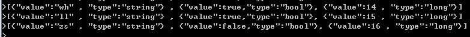
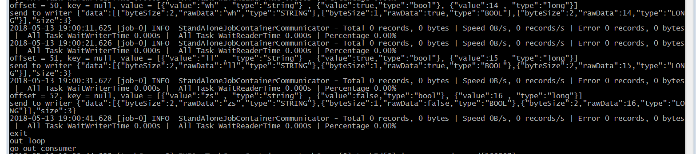
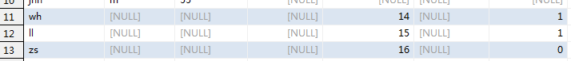
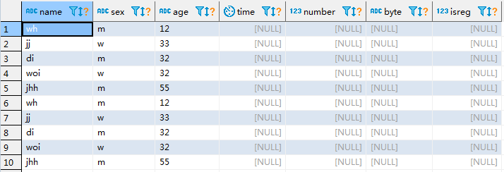
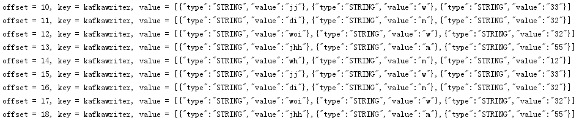
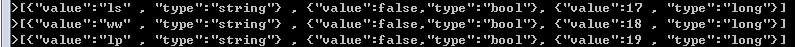

# DataX -- Kafka插件

datax处理kafka流数据

开发了新的插件 

**streamkafkareader**，用来从kafka通道中消费数据，读取到datax中。

**streamkafkawriter**，用来将datax读取的数据发送kafka通道中。

由此可以实现其他数据源（如mysql等关系型数据库，hdfs等文件系统）与kafka流数据的相互转换。

# System Requirements

- Linux
- [JDK(1.6以上，推荐1.6) ](http://www.oracle.com/technetwork/cn/java/javase/downloads/index.html) 
- [Python(推荐Python2.6.X) ](https://www.python.org/downloads/)
- [Apache Maven 3.x](https://maven.apache.org/download.cgi) (Compile DataX)
- [Kafka 1.1.0](http://kafka.apache.org/downloads)

# Quick Start

* ### 工具部署 

  * 下载二进制文件[kafka_2.11-1.1.0.tgz](https://www.apache.org/dyn/closer.cgi?path=/kafka/1.1.0/kafka_2.11-1.1.0.tgz) ([asc](https://www.apache.org/dist/kafka/1.1.0/kafka_2.11-1.1.0.tgz.asc), [sha512](https://www.apache.org/dist/kafka/1.1.0/kafka_2.11-1.1.0.tgz.sha512))

    解压得到kafka_2.11-1.1.0文件夹，今天bin文件夹执行脚本，如果是windows系统，进入windows文件夹执行bat脚本。


- ### Kafka启动

以下为启动kafka流程，其中文件路径需根据情况调整。

> **Step 1: 启动服务器**
>
> **首先启动zookeeper**
>
> linux : zookeeper-server-start.sh config/zookeeper.properties
>
> windows : zookeeper-server-start.bat config/zookeeper.properties
>
> (远程启动的时候需要在后面加上一个 & 作为后台进程,然后断开和远程的链接)
>
> **接着启动kafka服务器**
>
> linux :  bin/kafka-server-start.sh config/server.properties
>
> windows : kafka-server-start.bat config/server.properties
>
> **Step 2: 创建 一个 topic**
>
> linux :  bin/kafka-topics.sh --create --zookeeper localhost:2181 --replication-factor 1 --partitions 1 --topic test
>
> windows : kafka-topics.bat --create --zookeeper localhost:2181 --replication-factor 1 --partitions 1 --topic test
>
> **查看topic**
>
> linux :  bin/kafka-topics.sh --list --zookeeper localhost:2181
>
> windows : kafka-topics.bat --list --zookeeper localhost:2181
>
> **Step 3: 启动一个生产者Send some messages**
>
> linux :  bin/kafka-console-producer.sh --broker-list localhost:9092 --topic test 
>
> windows : kafka-console-producer.bat --broker-list localhost:9092 --topic test This is a messageThis is another message
>
> **Step 4: 启动一个客户端(消费者)**
>
> \> bin/kafka-console-consumer.sh --zookeeper localhost:2181 --topic test --from-beginning
>
> windows :  kafka-console-consumer.bat --zookeeper localhost:2181 --topic test --from-beginning

至此，kafka启动完毕，应注意使用的topic，与之后的配置文件对应


- ### dataX job配置文件

  kafka参数解释

  reader

  >"topic" : "testdata",   // 要读取的topic
  >"groupid" : "datax",   // 读取使用的任务组
  >"servers" : "localhost:9092",    // 读取的kafka server地址

  writer (同上)

  > "topic" : "testdata2",
  >
  > "servers" : "localhost:9092",

  在从kafka中读取数据时，数据格式必须为以下json形式:

  > [{"value":"hadh5" , "type":"string"} , {"value":324 , "type":"long"}]

  ​

  ##### 1  从kafka中读取数据，写入mysql

  jobkafkatomysql.json

  ``` json
  {
      "job": {
          "setting": {
              "speed": {
                  "byte":10485760
              },
              "errorLimit": {
                  "record": 0,
                  "percentage": 0.02
              }
          },
          "content": [
              {
                  "reader": {
                      "name": "streamkafkareader",
                      "parameter": {					
  						"topic" : "testdata",
  						"groupid" : "datax",
  						"servers" : "localhost:9092",            
                      }
                  },
                  "writer": {
                      "name":"mysqlwriter",
                      "parameter":{
                          "column":[
  							"name",
                          	  "isreg",
  							"number"
                          ],
                          "connection":[
                              {
                                  "jdbcUrl":"jdbc:mysql://localhost:3306/test2",
                                  "table":[
                                      "testTable"
                                  ]
                              }
                          ],
                          "password":"root",
                          "username":"root"
  					}
  				}
              }
          ]
      }
  }
  ```

  ##### 2  从mysql中读取数据，写入kafka

  jobmysqltokafka.json

  ``` json
  {
      "job":{
          "content":[
              {
                  "reader":{
                      "name":"mysqlreader",
                      "parameter":{
                          "column":[
                              "name",
                              "sex",
                              "age"
                          ],
                          "connection":[
                              {
                                  "jdbcUrl":[
                                      "jdbc:mysql://localhost:3306/test"
                                  ],
                                  "table":[
                                      "testTable"
                                  ]
                              }
                          ],
                          "password":"root",
                          "username":"root"
                      }
                  },
                  "writer": {
                      "name": "streamkafkawriter",
                      "parameter": {
  						"topic" : "testdata2",
  						"servers" : "localhost:9092",
                          "print": true,
                          "encoding": "UTF-8"
                      }
                  }
              }
          ],
          "setting":{
              "speed":{
                  "channel":"1"
              }
          }
      }
  }
  ```

  ##### 3  从kafka中读取数据，写入kafka另外一个topic	
  jobkafka.json
  ``` json
  {
    "job": {
        "setting": {
            "speed": {
                "byte":10485760
            },
            "errorLimit": {
                "record": 0,
                "percentage": 0.02
            }
        },
        "content": [
            {
                "reader": {
                    "name": "streamkafkareader",
                    "parameter": {
  				
  					"topic" : "testdata",
  					"groupid" : "datax",
  					"servers" : "localhost:9092",
             
                    }
                },
                "writer": {
                    "name": "streamkafkawriter",
                    "parameter": {
  					"topic" : "testdata2",
  					"servers" : "localhost:9092",
                        "print": true,
                        "encoding": "UTF-8"
                    }
                }
            }
        ]
    }
  }
  ```


- ### 运行演示


在datax的bin目录下，使用命令行运行下列命令，json文件即为上面的三种配置文件

##### 1  从kafka中读取数据，写入mysql

执行以下命令后，会等待kafka通道中的数据，需要停止时，在命令行输入exit并回车，即停止从kafka读取数据

```shell
python datax.py jobkafkatomysql.json
```

使用命令行发送数据到kafka



datax控制台输入exit退出监听



数据写入mysql



##### 2  从mysql中读取数据，写入kafka

```shell
python datax.py jobmysqltokafka.json
```

mysql中原数据



写入kafka的数据



##### 3   从kafka中读取数据，写入kafka另外一个topic

```shell
python datax.py jobkafka.json
```

同理，这里需要使用exit停止kafka监听，此配置文件从topic（testdata）中读取数据，传入topic（testdata2）中。

向testdata中发送数据



从testdata2中接收数据


# 遗留问题

datax是用于离线数据同步的工具，kafka处理的是实时流数据，所以当以kafka作为数据源时，必须要等待kafkareader将需要的数据从kafka中读取完毕，才能使用writer插件写入要导入的数据库或文件系统。这里的暂时没有实现边读边写。


# Contact us

Google Groups: [DataX-user](https://github.com/alibaba/DataX)


